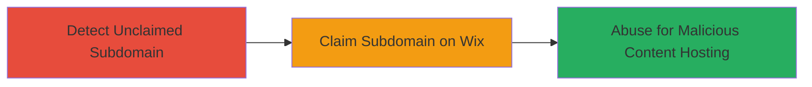

---

# Subdomain Takeover via Unclaimed Wix DNS Delegation

Multi-stage attack chain demonstrating a complete attack workflow for subdomain takeover on an unclaimed Wix-delegated subdomain.

## Chain Metrics Dashboard

| Metric | Value |
|--------|-------|
| Chain Status | Unverified |
| Total Steps | 2 |
| Execution Time | ~5 minutes |
| Skill Level | Beginner |
| Complexity | Low |
| Impact Level | High |

## Attack Flow Visualization



## Prerequisites & Requirements

### Required Tools

- Web browser or [[commands/curl-check-subdomain]]

### Target Environment

- Web platform with DNS-delegated subdomains to third-party services like Wix
- No special services or ports required beyond HTTP/HTTPS (ports 80/443)
- Internet access to resolve and visit subdomains

### Initial Access Requirements

- No credentials needed for detection
- Public network access to the target subdomain
- Wix account for claiming (free signup)

## Detailed Attack Procedures

### Step 1: Detect Unclaimed Subdomain
procedure: [[procedures/Detect-and-Claim-Unclaimed-Wix-Subdomain]]

**Objective**: Verify if the subdomain is delegated to Wix but unclaimed, confirming takeover availability.

**Instructions**: Use a web browser or execute [[commands/curl-check-subdomain]] to access the subdomain and inspect the response for Wix CDN indicators:

```bash
curl -I http://accessday.opn.ooo/
```

Look for headers or content indicating Wix infrastructure, such as "Server: openresty" or redirects to Wix pages stating the site is unclaimed.

**Expected Output**: HTTP response showing Wix CDN ownership, e.g., 301 redirect to a Wix claiming page or default Wix template.

**Success Indicators**:
- Response points to Wix infrastructure
- No custom content from the domain owner
- Availability message for claiming the site

### Step 2: Claim and Abuse Subdomain
procedure: [[procedures/Detect-and-Claim-Unclaimed-Wix-Subdomain]]

**Objective**: Claim control of the subdomain on Wix and set up malicious content.

**Instructions**: Navigate to the Wix claiming interface (inferred from detection step), sign up for a free Wix account, and connect the custom domain by verifying DNS records. Once claimed, upload phishing pages or malicious scripts via Wix's site builder.

**Expected Output**: Successful domain connection confirmation in Wix dashboard; subdomain now resolves to attacker-controlled content.

**Success Indicators**:
- Domain claimed and active under attacker Wix account
- Subdomain hosts custom (malicious) content
- DNS propagation confirms control (use dig or nslookup for validation)

## Attack Chain Summary

### Key Achievements

1. Identified unclaimed subdomain delegated to Wix
2. Claimed full control without owner intervention
3. Enabled hosting of phishing or malicious content under legitimate domain

## Technique & Tactic Coverage

### MITRE ATT&CK Techniques

- [[Exploit Public-Facing Application]]

### MITRE ATT&CK Tactics

- [[Initial Access]]

---

*Last updated: 2023-10-01T12:00:00Z*
