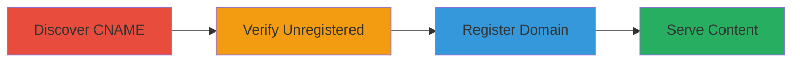

---
tags:
  - subdomain-takeover
  - fastly
  - dns
  - cdn
  - impersonation
  - phishing
type: attack_chain
tools: []
tactics:
  - '[[Reconnaissance]]'
  - '[[Initial Access]]'
commands:
  - '[[commands/dig-dns-lookup]]'
  - '[[commands/curl-access-url]]'
verified: false
platforms:
  - Web
submitted: true
complexity: medium
procedures:
  - '[[procedures/Discover-Unregistered-Subdomain-CNAME]]'
  - '[[procedures/Verify-Fastly-Unregistered-Status]]'
  - '[[procedures/Claim-Subdomain-in-Fastly]]'
  - '[[procedures/Serve-Custom-Content-on-Taken-Over-Subdomain]]'
step_count: 4
techniques:
  - '[[Scanning IP Blocks]]'
  - '[[Exploit Public-Facing Application]]'
description: >-
  Multi-stage attack exploiting an unregistered subdomain on Fastly CDN to take
  over a Mozilla domain and serve arbitrary content for impersonation.
skill_level: intermediate
impact_level: high
id: c7e5c208-1fdc-47e1-b618-b985b5b73f37
created_at: '2025-12-14T04:38:39.958Z'
updated_at: '2025-12-14T04:38:39.958Z'
validated: true
mitre_tactics:
  - '[[Reconnaissance]]'
  - '[[Initial Access]]'
mitre_techniques:
  - '[[Scanning IP Blocks]]'
  - '[[Exploit Public-Facing Application]]'
---
# Subdomain Takeover via Unregistered Fastly Domain on Mozilla Subdomain

Multi-stage attack chain demonstrating a complete subdomain takeover workflow on a Fastly-hosted Mozilla subdomain, enabling the serving of arbitrary content for malicious purposes.

## Chain Metrics Dashboard

| Metric | Value |
|--------|-------|
| Chain Status | Unverified |
| Total Steps | 4 |
| Execution Time | ~15 minutes |
| Skill Level | Intermediate |
| Complexity | Medium |
| Impact Level | High |

## Attack Flow Visualization



## Prerequisites & Requirements

### Required Tools

- Fastly account (free tier sufficient for registration)
- DNS lookup tool like dig
- Web browser or curl for verification

### Target Environment

- Web platform with DNS resolution
- Access to Fastly service for domain registration
- No special ports required beyond standard HTTP/HTTPS (80/443)

### Initial Access Requirements

- Public DNS access to query records
- Internet connectivity
- Fastly account credentials for claiming the domain

## Detailed Attack Procedures

### Step 1: Discover CNAME Record
procedure: [[procedures/Discover-Unregistered-Subdomain-CNAME]]

**Objective**: Identify the DNS configuration of the target subdomain to detect potential takeover vectors.

**Instructions**: Query the DNS records for the target subdomain using [[commands/dig-dns-lookup]] to reveal the CNAME pointing to a Fastly-hosted service.

```bash
dig CNAME addons-preview-cdn.mozilla.net
```

**Expected Output**: Resolution showing CNAME to addons.allizom.org, indicating Fastly hosting.

**Success Indicators**:
- CNAME record points to a third-party service like Fastly
- No A record or other ownership indicators

### Step 2: Verify Unregistered Status
procedure: [[procedures/Verify-Fastly-Unregistered-Status]]

**Objective**: Confirm that the subdomain is not claimed in the CDN provider's system, making it vulnerable to takeover.

**Instructions**: Attempt to access the subdomain directly using [[commands/curl-access-url]] to check for error responses from Fastly.

```bash
curl -I http://addons-preview-cdn.mozilla.net
```

**Expected Output**: HTTP response with Fastly's 'unknown domain' error (e.g., 404 or custom error page).

**Success Indicators**:
- Error message indicating unregistered domain in Fastly
- No legitimate content served

### Step 3: Register the Domain
procedure: [[procedures/Claim-Subdomain-in-Fastly]]

**Objective**: Claim control of the unowned subdomain within the attacker's Fastly account.

**Instructions**: Log in to your Fastly account dashboard, navigate to domain management, and add the target subdomain (addons-preview-cdn.mozilla.net) as a custom domain. Verify the addition succeeds without conflicts.

**Expected Output**: Successful domain registration confirmation in Fastly console.

**Success Indicators**:
- Domain appears in your Fastly account
- No errors during addition process

### Step 4: Serve Custom Content
procedure: [[procedures/Serve-Custom-Content-on-Taken-Over-Subdomain]]

**Objective**: Host arbitrary content on the taken-over subdomain to demonstrate control and potential for attacks like phishing.

**Instructions**: In your Fastly service configuration, upload or configure a simple HTML file as a proof-of-concept at a path like /haveanicetakeover-poc.html. Test access via browser or curl.

```bash
curl http://addons-preview-cdn.mozilla.net/haveanicetakeover-poc.html
```

**Expected Output**: Custom HTML content served from the Mozilla subdomain.

**Success Indicators**:
- Custom page loads successfully
- Content impersonates or demonstrates takeover

## Attack Chain Summary

### Key Achievements

1. Identified vulnerable DNS misconfiguration pointing to unclaimed Fastly domain
2. Verified and claimed the subdomain for control
3. Demonstrated ability to serve malicious content, enabling phishing and XSS
4. Highlighted risks of subdomain takeovers in CDN environments

## Technique & Tactic Coverage

### MITRE ATT&CK Techniques

- [[Scanning IP Blocks]]
- [[Exploit Public-Facing Application]]

### MITRE ATT&CK Tactics

- [[Reconnaissance]]
- [[Initial Access]]

---
*Last updated: 2023-10-01*
