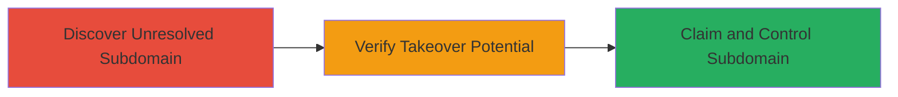

---
tags:
  - subdomain-takeover
  - dns
  - reconnaissance
type: attack_chain
tools:
  - '[[tools/Subjack]]'
tactics:
  - '[[Reconnaissance]]'
  - '[[Initial Access]]'
verified: false
platforms:
  - Web
submitted: true
complexity: medium
created_at: '2023-10-01T00:00:00Z'
procedures:
  - '[[procedures/Identify-Unresolved-Subdomains]]'
  - '[[procedures/Check-Subdomain-Takeover-Potential]]'
  - '[[procedures/Exploit-Subdomain-Takeover]]'
step_count: 3
techniques:
  - '[[Hardware]]'
  - '[[Exploit Public-Facing Application]]'
updated_at: '2025-12-14T03:16:20.696Z'
description: >-
  An attack chain exploiting an unresolved subdomain on werkenbijmcdonalds.nl,
  allowing potential takeover by registering the dangling service to host
  malicious content.
skill_level: intermediate
impact_level: high
id: 7bfd78c6-7f13-4773-807f-d2d6d4474642
validated: true
mitre_tactics:
  - '[[Reconnaissance]]'
  - '[[Initial Access]]'
mitre_techniques:
  - '[[Hardware]]'
  - '[[Exploit Public-Facing Application]]'
---
# Subdomain Takeover via Unresolved DNS Record on presentatie.werkenbijmcdonalds.nl

Multi-stage attack chain demonstrating a complete attack workflow targeting an unresolved subdomain for potential takeover.

## Chain Metrics Dashboard

| Metric | Value |
|--------|-------|
| Chain Status | Unverified |
| Total Steps | 3 |
| Execution Time | ~15 minutes |
| Skill Level | Intermediate |
| Complexity | Medium |
| Impact Level | High |

## Attack Flow Visualization



## Prerequisites & Requirements

### Required Tools

- [[tools/Subjack]]
- Standard DNS tools like dig

### Target Environment

- Web platform
- DNS resolution access
- No special ports required beyond standard DNS (53)

### Initial Access Requirements

- Public internet access
- No credentials needed for discovery phase
- Ability to register domains/services for exploitation

## Detailed Attack Procedures

### Step 1: Discover Unresolved Subdomain
procedure: [[procedures/Identify-Unresolved-Subdomains]]

**Objective**: Enumerate and identify subdomains that fail to resolve, indicating potential dangling DNS records.

**Instructions**: Start by performing a DNS lookup on the suspected subdomain using [[commands/dig-dns-lookup]] to check resolution:

```bash
dig presentatie.werkenbijmcdonalds.nl
```

If no A or CNAME record resolves, proceed to broader enumeration if needed.

**Expected Output**: NXDOMAIN or no answer section, confirming unresolved status.

**Success Indicators**:
- No IP address returned
- Subdomain fails to load in browser

### Step 2: Verify Takeover Potential
procedure: [[procedures/Check-Subdomain-Takeover-Potential]]

**Objective**: Determine if the unresolved subdomain can be taken over by checking for dangling pointers to claimable services.

**Instructions**: Use [[tools/Subjack]] to scan for known takeover fingerprints:

```bash
subjack -w subdomains.txt -t 100 -o results.json -ssl
```

Focus on the target: presentatie.werkenbijmcdonalds.nl.

**Expected Output**: Report indicating vulnerable providers like GitHub or Heroku if applicable.

**Success Indicators**:
- Tool flags the subdomain as vulnerable
- CNAME points to unused service

### Step 3: Claim and Control Subdomain
procedure: [[procedures/Exploit-Subdomain-Takeover]]

**Objective**: Register the dangling service to gain control and host malicious content.

**Instructions**: If a vulnerable provider is identified (e.g., unused AWS S3 bucket), create an account and claim the subdomain via the provider's dashboard. Then, update DNS if needed or host phishing content.

**Expected Output**: Successful subdomain resolution to attacker-controlled content.

**Success Indicators**:
- Subdomain now points to attacker server
- Access logs show traffic to malicious page

## Attack Chain Summary

### Key Achievements

1. Identified unresolved subdomain presentatie.werkenbijmcdonalds.nl
2. Verified potential for takeover due to dangling DNS
3. Gained control to host unauthorized content

## Technique & Tactic Coverage

### MITRE ATT&CK Techniques

- [[Hardware]]
- [[Exploit Public-Facing Application]]

### MITRE ATT&CK Tactics

- [[Reconnaissance]]
- [[Initial Access]]

---
*Last updated: 2023-10-01T00:00:00Z*
