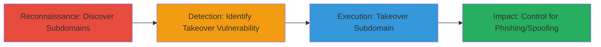

# Subdomain Takeover via Unused AWS S3 Bucket

Multi-stage attack chain demonstrating subdomain takeover through an unused AWS S3 bucket misconfiguration, enabling control for phishing, content spoofing, or reputation damage.

## Chain Metrics Dashboard

| Metric | Value |
|--------|-------|
| Chain Status | Unverified |
| Total Steps | 3 |
| Execution Time | ~15 minutes |
| Skill Level | Intermediate |
| Complexity | Medium |
| Impact Level | High |

## Attack Flow Visualization



## Prerequisites & Requirements

### Required Tools

- No specific tools required; manual inspection or basic DNS tools like dig or nslookup.

### Target Environment

- Web platform with AWS cloud services.
- Exposed subdomains configured to AWS S3.
- Network access to resolve DNS and interact with AWS services.

### Initial Access Requirements

- Public internet access for DNS queries.
- No prior credentials needed; exploits public misconfiguration.

## Detailed Attack Procedures

### Step 1: Discover and Enumerate Subdomains for Misconfigurations
procedure: [[procedures/Discover-and-Enumerate-Subdomains-for-Misconfigurations]]

**Objective**: Identify subdomains during reconnaissance that may point to cloud services like AWS S3.

**Instructions**: During bug hunting on a related target, perform DNS enumeration to find subdomains. Use manual checks or tools to resolve subdomains and inspect their CNAME records for pointers to unused cloud resources.

For example, query DNS for subdomains:

```bash
nslookup -type=CNAME subdomain.target.com
```

Inspect if it points to an S3 endpoint like `bucket.s3.amazonaws.com`.

**Expected Output**: CNAME record revealing S3 bucket association.

**Success Indicators**:
- Subdomain identified pointing to AWS S3.
- Bucket appears unused based on 404 or access denied responses.

### Step 2: Detect Subdomain Takeover Vulnerability
procedure: [[procedures/Detect-Subdomain-Takeover-Vulnerability]]

**Objective**: Confirm the subdomain is vulnerable to takeover due to an unused and unclaimed S3 bucket.

**Instructions**: Verify the S3 bucket status by attempting access. Check for error messages indicating the bucket is not configured or owned.

Attempt to access the bucket URL:

```bash
curl https://bucket-name.s3.amazonaws.com
```

Look for AWS error codes like 'NoSuchBucket' or access denied without ownership.

**Expected Output**: Error response confirming bucket is dangling and takeover-eligible.

**Success Indicators**:
- Bucket returns unused status.
- No active content or ownership detected.

### Step 3: Execute Subdomain Takeover via S3
procedure: [[procedures/Execute-Subdomain-Takeover-via-S3]]

**Objective**: Claim control of the subdomain by registering the unused S3 bucket.

**Instructions**: Use AWS credentials (if available via free tier or own account) to create and claim the bucket, then configure it to serve custom content, demonstrating control.

Create the bucket via AWS CLI (assuming AWS CLI installed and configured):

```bash
aws s3 mb s3://bucket-name --region us-east-1
```

Upload a test file to prove control:

```bash
aws s3 cp index.html s3://bucket-name/
```

Verify by accessing the subdomain, which now resolves to your content.

**Expected Output**: Subdomain loads custom content hosted on the taken-over bucket.

**Success Indicators**:
- Subdomain under attacker control.
- Potential for phishing or spoofing confirmed.

## Attack Chain Summary

### Key Achievements

1. Discovered misconfigured subdomain during reconnaissance.
2. Identified and validated takeover vulnerability in unused S3 bucket.
3. Successfully took over the subdomain for malicious use.

## Technique & Tactic Coverage

### MITRE ATT&CK Techniques

- [[Gather Victim Host Information]] Gather Victim Host Information
- [[Exploit Public-Facing Application]] Exploit Public-Facing Application

### MITRE ATT&CK Tactics

- [[Reconnaissance]] Reconnaissance
- [[Initial Access]] Initial Access

---
*Last updated: 2023-10-01T00:00:00Z*
