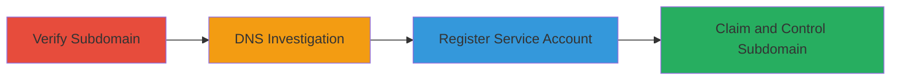

---
tags:
  - subdomain-takeover
  - dns
  - cname
  - misconfiguration
type: attack_chain
tools:
  - '[[tools/dig]]'
tactics:
  - '[[Reconnaissance]]'
  - '[[Initial Access]]'
verified: false
platforms:
  - Web
  - DNS
submitted: true
created_at: '2023-10-01T00:00:00Z'
procedures:
  - '[[procedures/Verify-Subdomain-Accessibility]]'
  - '[[procedures/Query-DNS-Records-with-Dig]]'
  - '[[procedures/Register-Account-on-Brandpad]]'
  - '[[procedures/Claim-Subdomain-via-CNAME]]'
step_count: 4
techniques:
  - '[[Gather Victim Host Information]]'
  - '[[Exploit Public-Facing Application]]'
updated_at: '2025-12-14T04:38:39.879Z'
description: >-
  A multi-stage attack exploiting a dangling DNS CNAME record on brand.zen.ly
  pointing to an unused Brandpad.io service, allowing full subdomain control for
  phishing, malware, and other attacks.
id: a7df68ad-fc36-46d7-bb1c-f69f9ae299ca
validated: true
mitre_tactics:
  - '[[Reconnaissance]]'
  - '[[Initial Access]]'
mitre_techniques:
  - '[[Gather Victim Host Information]]'
  - '[[Exploit Public-Facing Application]]'
---
# Subdomain Takeover via Unused CNAME to Brandpad.io

Multi-stage attack chain demonstrating a complete subdomain takeover workflow by exploiting a dangling DNS CNAME record.

## Chain Metrics Dashboard

| Metric | Value |
|--------|-------|
| Chain Status | Unverified |
| Total Steps | 4 |
| Execution Time | ~10 minutes |
| Skill Level | Intermediate |
| Complexity | Medium |
| Impact Level | High |

## Attack Flow Visualization



## Prerequisites & Requirements

### Required Tools

- [[tools/dig]]

### Target Environment

- Web browser for accessing subdomains
- DNS resolution access
- No special credentials initially required

### Initial Access Requirements

- Public internet access to the target subdomain
- Ability to register on third-party services like Brandpad.io

## Detailed Attack Procedures

### Step 1: Verify Subdomain Accessibility
procedure: [[procedures/Verify-Subdomain-Accessibility]]

**Objective**: Confirm the subdomain is misconfigured by checking its HTTP response.

**Instructions**: Open a web browser and navigate to the target subdomain URL.

**Expected Output**: A 'Not Found' error page indicating the service is unavailable.

**Success Indicators**:
- HTTP 404 or similar error displayed
- No legitimate content served

### Step 2: DNS Investigation
procedure: [[procedures/Query-DNS-Records-with-Dig]]

**Objective**: Identify the DNS configuration, specifically any dangling CNAME records pointing to unused services.

**Instructions**: Use [[commands/dig-dns-lookup]] to query the DNS records:

```bash
dig brand.zen.ly
```

**Expected Output**: DNS response showing CNAME brand.zen.ly. 255 IN CNAME brandpad.io.

**Success Indicators**:
- CNAME record points to an external, unused service like brandpad.io
- TTL and other records confirm the misconfiguration

### Step 3: Register Service Account
procedure: [[procedures/Register-Account-on-Brandpad]]

**Objective**: Gain access to the external service to prepare for subdomain claiming.

**Instructions**: Visit Brandpad.io and create a new account using standard registration form.

**Expected Output**: Successful account creation with login credentials.

**Success Indicators**:
- Account dashboard accessible
- Option to manage custom domains visible

### Step 4: Claim and Control Subdomain
procedure: [[procedures/Claim-Subdomain-via-CNAME]]

**Objective**: Take control of the subdomain by adding the dangling CNAME in the service dashboard.

**Instructions**: In the Brandpad dashboard, add a new CNAME record for brand.zen.ly and verify control.

**Expected Output**: Subdomain now serves content from your Brandpad account; video proof or screenshot confirms.

**Success Indicators**:
- Custom content loads on brand.zen.ly
- DNS propagation confirms control (re-run dig to verify)

## Attack Chain Summary

### Key Achievements

1. Identified dangling CNAME misconfiguration
2. Registered and claimed the subdomain without authentication
3. Gained full control for potential phishing, XSS, or malware hosting

## Technique & Tactic Coverage

### MITRE ATT&CK Techniques

- [[Gather Victim Host Information]] Gather Victim Host Information
- [[Exploit Public-Facing Application]] Exploit Public-Facing Application

### MITRE ATT&CK Tactics

- [[Reconnaissance]] Reconnaissance
- [[Initial Access]] Initial Access

---
*Last updated: 2023-10-01T00:00:00Z*
