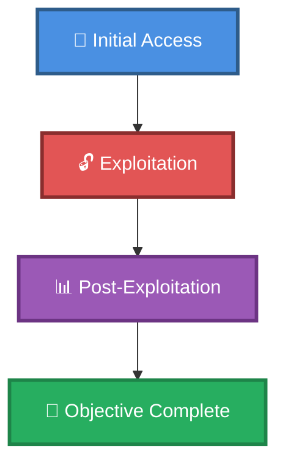

# 🎯 Test

> **Enhanced Attack Chain Dashboard**

---

## 📊 Chain Metrics Dashboard

| Metric | Value |
|--------|-------|
| **Chain Status** | ⚠️ **UNVERIFIED** |
| **Total Steps** | `2` |
| **Execution Time** | ~30 minutes - 1 hour |
| **Skill Level** | 🟢 Beginner-Intermediate |
| **Complexity** | Low |
| **Impact Level** | 🟡 **MEDIUM** |

---

## 🎭 Attack Flow Visualization



---

## 🛠️ Prerequisites & Requirements

### Required Tools
```bash path=null start=null
# Tools will be listed here based on procedures
```

### Target Environment
- ✅ Network connectivity to target

### Initial Access Requirements
- 🔓 Requirements based on first step of chain
- 🔓 See detailed procedures below

---

## 🔬 Detailed Attack Procedures

### **[Step 1]** Sniff Unencrypted LDAP Queries via the Loopback

**Progress:** `█████░░░░░` 50% | **Risk:** 🟢 Low

**Procedure:** [[Sniff Unencrypted LDAP Queries via the Loopback]]

> 📝 **Objective:** Some versions of LDAP send unencrypted queries over the loopback address. If an attacker is able to sniff traffic locally while LDAP requests are being generated, it may be possible to intercept plaintext credentials.

**Expected Output:**
- Refer to procedure documentation for details

**Success Indicators:** ✅ Objective achieved

---

### **[Step 2]** Sniff Unencrypted LDAP Queries via the Loopback

**Progress:** `██████████` 100% | **Risk:** 🟢 Low

**Procedure:** [[Sniff Unencrypted LDAP Queries via the Loopback]]

> 📝 **Objective:** Some versions of LDAP send unencrypted queries over the loopback address. If an attacker is able to sniff traffic locally while LDAP requests are being generated, it may be possible to intercept plaintext credentials.

**Expected Output:**
- Refer to procedure documentation for details

**Success Indicators:** ✅ Objective achieved

---

## 🎯 Attack Chain Summary

### Key Achievements
- ✅ Sniff Unencrypted LDAP Queries via the Loopback

---

## 📈 Technique & Tactic Coverage

---

**Last Updated:** 2023-05-29T16:48:53.162677+00:00 | **Chain Version:** 2.0 Enhanced | **Status:** ⚠️ Draft
