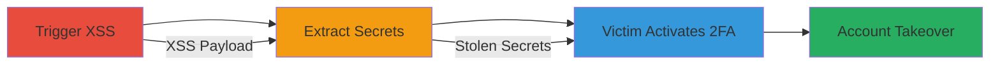

# Theft of Pre-Generated 2FA Secrets and Backup Codes via XSS in HackerOne Authentication Page

Multi-stage attack chain demonstrating how an attacker can steal pre-generated 2FA secrets and backup codes from HackerOne's authentication edit page using XSS, enabling full account takeover once the victim activates 2FA.

## Chain Metrics Dashboard

| Metric | Value |
|--------|-------|
| Chain Status | Unverified |
| Total Steps | 3 |
| Execution Time | ~5 minutes |
| Skill Level | Intermediate |
| Complexity | Medium |
| Impact Level | High |

## Attack Flow Visualization



## Prerequisites & Requirements

### Required Tools

- [[tools/jQuery]]

### Target Environment

- Web platform (HackerOne application)
- Services: TOTP (2FA) authentication
- Tech stack: Ruby on Rails (inferred)
- Network access: Victim's browser session on https://hackerone.com

### Initial Access Requirements

- Valid XSS vulnerability in the HackerOne domain
- Victim interaction (e.g., clicking malicious link)
- Attacker's control over XSS payload delivery

## Detailed Attack Procedures

### Step 1: Trigger XSS in Victim's HackerOne Session
procedure: [[procedures/Trigger-XSS-in-Victims-HackerOne-Session]]

**Objective**: Gain script execution in the victim's authenticated session on HackerOne to access sensitive DOM elements.

**Instructions**: Deliver an XSS payload via a malicious link or injected content that executes JavaScript in the HackerOne domain. For example, host a phishing page that tricks the victim into clicking a link leading to https://hackerone.com with an XSS vector.

**Expected Output**: JavaScript console logs confirming execution in the victim's session.

**Success Indicators**:
- Script executes without errors in browser dev tools
- Victim remains authenticated on HackerOne

### Step 2: Extract 2FA Secrets Using XSS Payload
procedure: [[procedures/Extract-2FA-Secrets-Using-XSS-Payload]]

**Objective**: Fetch the authentication edit page via AJAX and parse the DOM to steal pre-generated 2FA secrets and backup codes.

**Instructions**: Once XSS is active, inject a script using [[commands/extract-2fa-backup-code-jquery]] to GET the page at https://hackerone.com/settings/authentication/edit and extract values from elements like #regenerate-backup-codes-authentication-modal li. Exfiltrate the data to an attacker-controlled server.

```javascript
$.get('https://hackerone.com/settings/authentication/edit').then(function(html){ console.log($(html).find('#regenerate-backup-codes-authentication-modal li:first').text()) })
```

**Expected Output**: Logs showing backup codes like '37d4 f16d ad0e a6b2' or the TOTP secret key.

**Success Indicators**:
- Extracted secrets match across multiple fetches (persistence confirmed)
- No regeneration on page reload

### Step 3: Activate Stolen 2FA Secrets via Victim Action
procedure: [[procedures/Activate-Stolen-2FA-Secrets-via-Victim-Action]]

**Objective**: Wait for or induce the victim to enable/regenerate 2FA, activating the pre-generated secrets already stolen by the attacker.

**Instructions**: Monitor victim behavior; the stolen secrets persist until confirmation. If needed, use social engineering to prompt the victim to visit the authentication page and confirm 2FA setup.

**Expected Output**: Attacker can now use stolen secrets/codes to authenticate as the victim post-activation.

**Success Indicators**:
- Victim confirms 2FA enablement
- Attacker tests access using extracted codes without victim's knowledge

## Attack Chain Summary

### Key Achievements

1. Successful XSS execution in authenticated session
2. Theft of persistent pre-generated 2FA secrets and backup codes
3. Full account takeover capability once 2FA is activated

## Technique & Tactic Coverage

### MITRE ATT&CK Techniques

- [[JavaScript]]
- [[Unsecured Credentials]]
- [[Automated Collection]]

### MITRE ATT&CK Tactics

- [[Initial Access]]
- [[Execution]]
- [[Collection]]

---
*Last updated: 2023-10-01T12:00:00Z*
