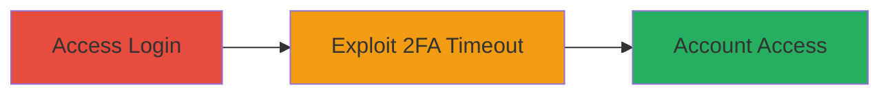

# TikTok 2FA Bypass via Rapid Incorrect Code Submission

Multi-stage attack chain demonstrating a complete attack workflow exploiting a vulnerability in TikTok's Two-Step Verification process.

## Chain Metrics Dashboard

| Metric | Value |
|--------|-------|
| Chain Status | Unverified |
| Total Steps | 2 |
| Execution Time | ~5 minutes |
| Skill Level | Intermediate |
| Complexity | Medium |
| Impact Level | Medium |

## Attack Flow Visualization

## Prerequisites & Requirements

### Required Tools

- None (manual interaction via browser or app)

### Target Environment

- TikTok web platform or Android app
- Active internet connection
- Known target email/password or phone number/code

### Initial Access Requirements

- Valid primary credentials (email/password or phone/code)
- No prior account access needed beyond credentials
- Ability to submit requests rapidly (manual or scripted)

## Detailed Attack Procedures

### Step 1: Access Login Interface
procedure: [[procedures/Access-TikTok-Login-Interface]]

**Objective**: Initiate the authentication process to reach the Two-Step Verification stage using known primary credentials.

**Instructions**: Open the TikTok login page in a web browser or launch the Android app. Enter the target's known email and password, or phone number and code, to proceed to the 2FA prompt.

**Expected Output**: The interface displays the 2FA code entry field.

**Success Indicators**:
- Login form accepts primary credentials
- 2FA verification screen appears

### Step 2: Exploit 2FA Timeout with Bruteforce
procedure: [[procedures/Exploit-TikTok-2FA-Timeout-with-Bruteforce]]

**Objective**: Bypass 2FA by submitting multiple incorrect codes in quick succession to exploit the random timeout flaw.

**Instructions**: At the 2FA prompt, rapidly enter and submit invalid codes (e.g., sequential numbers like 000000, 000001) multiple times without waiting for timeouts. The vulnerability allows inconsistent enforcement, potentially skipping verification after several attempts.

**Expected Output**: Successful login to the target account without a valid 2FA code.

**Success Indicators**:
- Account dashboard loads
- Unauthorized access granted

## Attack Chain Summary

### Key Achievements

1. Reached 2FA stage with valid primary credentials
2. Bypassed 2FA via rapid invalid submissions exploiting timeout randomness
3. Gained full account access

## Technique & Tactic Coverage

### MITRE ATT&CK Techniques

- [[Brute Force]] Brute Force
- [[Valid Accounts]] Valid Accounts

### MITRE ATT&CK Tactics

- [[Initial Access]] Initial Access

---
*Last updated: 2023-10-01T12:00:00Z*
