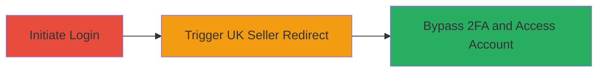

---
tags:
  - 2fa-bypass
  - auth-bypass
  - tiktok
  - web-auth
type: attack_chain
tools: []
tactics:
  - '[[Initial Access]]'
verified: false
platforms:
  - Web
submitted: true
complexity: medium
created_at: '2023-10-01T00:00:00Z'
procedures:
  - '[[procedures/Bypass-TikTok-2FA-via-UK-Seller-URL-Redirect]]'
step_count: 1
techniques:
  - '[[Valid Accounts]]'
updated_at: '2025-12-14T17:24:48.477Z'
description: >-
  A medium-severity authentication bypass vulnerability in TikTok's login flow
  allowing 2FA circumvention through improper handling of redirects from the UK
  TikTok Seller URL.
skill_level: intermediate
impact_level: medium
id: 0729e527-fd93-48a9-8386-eef61540f011
validated: true
mitre_tactics:
  - '[[Initial Access]]'
mitre_techniques:
  - '[[Valid Accounts]]'
---
# TikTok 2FA Bypass via UK Seller URL Redirect

Multi-stage attack chain demonstrating a complete attack workflow.

## Chain Metrics Dashboard

| Metric | Value |
|--------|-------|
| Chain Status | Unverified |
| Total Steps | 1 |
| Execution Time | ~5 minutes |
| Skill Level | Intermediate |
| Complexity | Medium |
| Impact Level | Medium |

## Attack Flow Visualization

## Prerequisites & Requirements

### Required Tools

- Web browser (e.g., Chrome or Firefox with developer tools)

### Target Environment

- TikTok web application
- Access to UK TikTok Seller URL (https://seller-uk.tiktok.com/ or similar regional variant)
- No specific ports or services beyond standard HTTPS (443)

### Initial Access Requirements

- Valid TikTok username and password
- No prior 2FA completion required for the target account
- Network access to TikTok domains

## Detailed Attack Procedures

### Step 1: Trigger 2FA Bypass Redirect
procedure: [[procedures/Bypass-TikTok-2FA-via-UK-Seller-URL-Redirect]]

**Objective**: Exploit improper authorization in the login redirect flow to bypass 2FA verification and gain unauthorized account access.

**Instructions**: Begin the standard TikTok login process using the target credentials. During the authentication flow, when prompted for 2FA, interrupt by navigating to or redirecting through the UK TikTok Seller URL (e.g., https://seller-uk.tiktok.com/login). This redirect fails to enforce 2FA completion due to flawed authorization checks, allowing direct access to the account dashboard without verifying the 2FA code.

**Expected Output**: Successful login to the TikTok account without entering the 2FA code, granting full access to user data and features.

**Success Indicators**:
- Account dashboard loads without 2FA prompt
- Unauthorized access confirmed by viewing private content or performing account actions

## Attack Chain Summary

### Key Achievements

1. Circumvented 2FA protection in TikTok's authentication system
2. Achieved unauthorized access to user accounts via redirect manipulation
3. Demonstrated medium-impact vulnerability resolvable through improved authorization enforcement

## Technique & Tactic Coverage

### MITRE ATT&CK Techniques

- [[Valid Accounts]]

### MITRE ATT&CK Tactics

- [[Initial Access]]

---
*Last updated: 2023-10-01T00:00:00Z*
