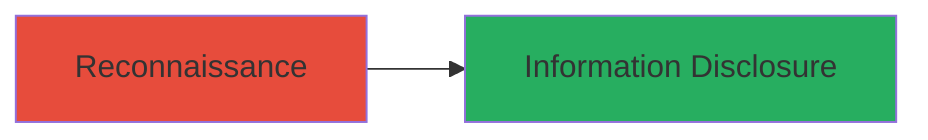

# TikTok Account Creation Date Information Disclosure

Multi-stage attack chain demonstrating a complete attack workflow.

## Chain Metrics Dashboard

| Metric | Value |
|--------|-------|
| Chain Status | Unverified |
| Total Steps | 1 |
| Execution Time | ~1 minutes |
| Skill Level | Beginner |
| Complexity | Low |
| Impact Level | Low |

## Attack Flow Visualization



## Prerequisites & Requirements

### Required Tools

- None (uses standard web browser or HTTP client)

### Target Environment

- Target Platform: Web (TikTok website or API)
- Required services/ports: HTTPS on port 443
- Network access requirements: Internet access to TikTok domain

### Initial Access Requirements

- Credential requirements: None (unauthenticated access)
- Network position: External attacker
- Prior access needed: None

## Detailed Attack Procedures

### Step 1: Retrieve Account Creation Date
procedure: [[procedures/Retrieve-TikTok-Account-Creation-Date-Without-Auth]]

**Objective**: Access and extract the creation date of a target TikTok user's account without authentication, disclosing sensitive metadata for profiling.

**Instructions**: Navigate to the target user's TikTok profile page using a web browser. Inspect the network requests or page source to identify the API endpoint that returns user metadata, including the creation date. Use a tool like browser developer tools to capture the response containing the account creation timestamp.

For automated retrieval, send an HTTP GET request to the inferred profile API endpoint (e.g., via curl):

```bash
curl -s "https://www.tiktok.com/@username/profile" | grep -o 'creation_date:\"[^\"]*\"'
```

**Expected Output**: JSON or HTML snippet revealing the account creation date, such as "2020-01-15T00:00:00Z".

**Success Indicators**:
- Account creation date retrieved without login prompt
- Metadata parsed successfully, confirming disclosure

## Attack Chain Summary

### Key Achievements

1. Unauthorized access to private user metadata
2. Enabled enumeration of account ages for profiling
3. Demonstrated privacy violation in TikTok's access controls

## Technique & Tactic Coverage

### MITRE ATT&CK Techniques

- [[Employee Names]]

### MITRE ATT&CK Tactics

- [[Reconnaissance]]

---
*Last updated: 2023-10-01T00:00:00Z*
