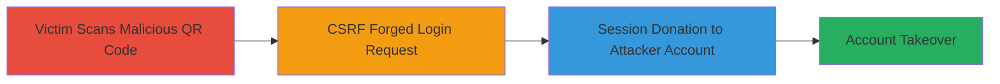

# TikTok CSRF Session Donation via QR Code Login

Multi-stage attack chain demonstrating a complete attack workflow exploiting a CSRF vulnerability in TikTok's QR code login feature to achieve session donation and unauthorized account access.

## Chain Metrics Dashboard

| Metric | Value |
|--------|-------|
| Chain Status | Unverified |
| Total Steps | 1 |
| Execution Time | ~5 minutes |
| Skill Level | Basic |
| Complexity | Low |
| Impact Level | Medium |

## Attack Flow Visualization



## Prerequisites & Requirements

### Required Tools

- None (uses standard web browser or QR code generator)

### Target Environment

- TikTok mobile app (iOS/Android)
- Web browser for hosting malicious page
- Network access to TikTok's login endpoints

### Initial Access Requirements

- Victim must scan the attacker's malicious QR code (e.g., via social engineering)
- No prior credentials needed for attacker
- Attacker must have a TikTok account to donate session to

## Detailed Attack Procedures

### Step 1: Force Authentication via Malicious QR Code
procedure: [[procedures/Exploit-TikTok-QR-Code-Login-CSRF]]

**Objective**: Trick the victim into scanning a QR code that triggers a CSRF-protected login request, donating their session to the attacker's account without further interaction.

**Instructions**: Generate a malicious QR code encoding a URL to an attacker-controlled page that automatically submits a forged login request to TikTok's QR code endpoint. Host the page on a server (e.g., using a simple HTML form with auto-submit JavaScript). Distribute the QR code to the victim via email, messaging, or physical means. When scanned in the TikTok app, it initiates the login flow without CSRF validation, logging the victim into the attacker's account.

For simulation/testing, use a tool like curl to forge the request directly (note: this requires inspecting TikTok's endpoints via browser dev tools):

```bash
curl -X POST 'https://www.tiktok.com/login/qr' \
  -H 'Content-Type: application/x-www-form-urlencoded' \
  -d 'account_id=attacker_account_id&session_token=attacker_token&csrf_bypass=true' \
  --referer 'https://attacker-site.com/malicious-page'
```

**Expected Output**: The TikTok app logs the victim into the specified attacker account, with session cookies transferred.

**Success Indicators**:
- Victim's TikTok session is now authenticated as the attacker's account
- Attacker can access victim's data or perform actions on their behalf
- No CSRF token validation error in network logs

## Attack Chain Summary

### Key Achievements

1. Bypassed CSRF protection in QR code login to forge authentication requests
2. Achieved session donation leading to unauthorized account access
3. Demonstrated low-interaction account takeover via QR code scanning

## Technique & Tactic Coverage

### MITRE ATT&CK Techniques

- [[Drive-by Compromise]]
- [[Valid Accounts]]

### MITRE ATT&CK Tactics

- [[Initial Access]]

---
*Last updated: 2023-10-01T00:00:00Z*
