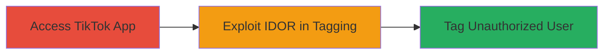

---
tags:
  - idor
  - tiktok
  - mobile
  - authorization-bypass
  - privacy-violation
type: attack_chain
tools: []
tactics:
  - '[[Initial Access]]'
commands: []
platforms:
  - Mobile App
  - iOS
  - Android
complexity: low
procedures:
  - '[[procedures/Exploit-IDOR-in-TikTok-Tagged-People]]'
step_count: 1
techniques:
  - '[[Exploit Public-Facing Application]]'
description: >-
  Exploitation of an Insecure Direct Object Reference (IDOR) vulnerability in
  the TikTok mobile app's Tagged People feature, enabling unauthorized tagging
  of any user on videos owned by others, leading to potential privacy violations
  and misinformation.
skill_level: intermediate
impact_level: medium
id: 7ee6317f-38d0-4631-bb9e-92aa5fec98ac
created_at: '2025-12-14T17:25:34.510Z'
updated_at: '2025-12-14T17:25:34.510Z'
verified: false
validated: true
submitted: true
mitre_tactics:
  - '[[Initial Access]]'
mitre_techniques:
  - '[[Exploit Public-Facing Application]]'
---
# TikTok IDOR Allowing Unauthorized User Tagging on Videos

Multi-stage attack chain demonstrating a complete attack workflow.

## Chain Metrics Dashboard

| Metric | Value |
|--------|-------|
| Chain Status | Unverified |
| Total Steps | 1 |
| Execution Time | ~5 minutes |
| Skill Level | Intermediate |
| Complexity | Low |
| Impact Level | Medium |

## Attack Flow Visualization

## Prerequisites & Requirements

### Required Tools

- TikTok mobile app installed on iOS or Android device

### Target Environment

- Target OS/Platform: iOS or Android
- Required services/ports: Internet access for app connectivity
- Network access requirements: Valid TikTok account with login credentials

### Initial Access Requirements

- Credential requirements: Authenticated TikTok user account
- Network position: Standard internet connection
- Prior access needed: Ability to view and interact with public videos

## Detailed Attack Procedures

### Step 1: Exploit IDOR in Tagged People Feature
procedure: [[procedures/Exploit-IDOR-in-TikTok-Tagged-People]]

**Objective**: Demonstrate unauthorized access to tagging functionality on videos not owned by the attacker, allowing addition of tags to other users' content.

**Instructions**: Launch the TikTok app and log in with a valid account. Navigate to a video uploaded by another user that does not belong to you. Attempt to access the tagging interface by selecting the video and trying to add a tag. Due to the IDOR vulnerability, the app fails to properly validate ownership or authorization, permitting the selection and addition of any user's tag to the video's metadata.

**Expected Output**: The tag is successfully added to the video, visible in the Tagged People section, without any error or restriction.

**Success Indicators**:
- Tag appears on the target video for the unauthorized user
- No authorization error is triggered during the tagging process

## Attack Chain Summary

### Key Achievements

1. Successful unauthorized modification of video metadata
2. Potential exposure of privacy through unwanted associations
3. Demonstration of IDOR leading to misinformation risks

## Technique & Tactic Coverage

### MITRE ATT&CK Techniques

- [[Exploit Public-Facing Application]]

### MITRE ATT&CK Tactics

- [[Initial Access]]

---
*Last updated: 2023-10-01*
