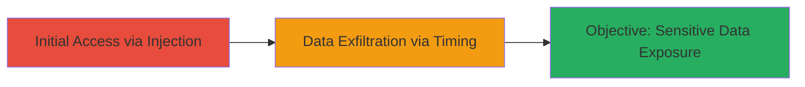

# Time-Based Blind SQL Injection in Login Endpoint to Expose Sensitive Data

Multi-stage attack chain demonstrating exploitation of a time-based blind SQL injection vulnerability in a web login endpoint to potentially expose sensitive data from a MySQL backend.

## Chain Metrics Dashboard

| Metric | Value |
|--------|-------|
| Chain Status | Unverified |
| Total Steps | 1 |
| Execution Time | ~30 minutes |
| Skill Level | Intermediate |
| Complexity | Medium |
| Impact Level | High |

## Attack Flow Visualization



## Prerequisites & Requirements

### Required Tools

- [[tools/sqlmap]]

### Target Environment

- Web platform with MySQL backend
- Exposed login endpoint (e.g., GET parameter 'codigo')
- No authentication required for initial injection testing

### Initial Access Requirements

- Public network access to the target URL
- No prior credentials needed
- Basic understanding of SQL syntax and timing attacks

## Detailed Attack Procedures

### Step 1: Exploit SQL Injection Vulnerability
procedure: [[procedures/Exploit-Time-Based-Blind-MySQL-SQL-Injection]]

**Objective**: Inject payloads into the 'codigo' parameter to confirm the vulnerability and extract data via response time delays.

**Instructions**: Begin by testing for time-based delays using a SLEEP function in the payload. Send requests to the login endpoint and measure response times. If delays occur only with the payload, the injection is confirmed. Proceed to extract data character-by-character using conditional timing.

Use [[commands/curl-timing-payload]] to test a basic delay:

```bash
curl -w "%{time_total}s" "https://desafio5estrelas.com/login?codigo=1' AND SLEEP(5)-- - "
```

For data extraction, craft payloads to check boolean conditions on database contents, iterating over possible values.

**Expected Output**: Response time exceeding 5 seconds for successful payloads, indicating injection success.

**Success Indicators**:
- Delayed responses (e.g., >5s) on injected payloads
- Ability to infer database schema or user data through timed queries

## Attack Chain Summary

### Key Achievements

1. Confirmed time-based blind SQLi in 'codigo' parameter
2. Potential exposure of sensitive Uber-related data from MySQL backend
3. Demonstrated high-impact vulnerability leading to $2,500 bounty

## Technique & Tactic Coverage

### MITRE ATT&CK Techniques

- [[Exploit Public-Facing Application]]

### MITRE ATT&CK Tactics

- [[Initial Access]]
- [[Collection]]

---
*Last updated: 2023-10-01T12:00:00Z*
