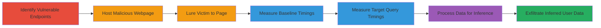

# Timing-Based Side-Channel Attack on HackerOne JSON Endpoints to Infer Private User Data

This attack chain exploits the absence of CSRF protection on HackerOne's JSON API endpoints, enabling a timing-based side-channel attack. An attacker hosts a malicious webpage that uses the browser's Resource Timing API to measure response times from cross-origin requests to these endpoints. By luring a logged-in victim to the page, the attacker establishes baseline connection speeds and compares them against variable queries to infer sensitive data, such as the number of triaged, new, or closed reports, and even recent report IDs. The attack reveals private user activity without direct authentication, relying on variations in response sizes due to data volume and server processing times under gzip compression.

## Chain Metrics Dashboard

| Metric | Value |
|--------|-------|
| Chain Status | Unverified |
| Total Steps | 6 |
| Execution Time | ~5-10 minutes |
| Skill Level | Intermediate |
| Complexity | Medium |
| Impact Level | High |

## Attack Flow Visualization



## Prerequisites & Requirements

### Required Tools

- [[tools/Resource-Timing-API]]
- [[tools/Browser-Console]]
- [[tools/PHP]]

### Target Environment

- Web platform with modern browsers supporting Resource Timing API
- HackerOne platform (Ruby on Rails backend with PostgreSQL)
- Attacker-controlled web server for hosting PHP scripts

### Initial Access Requirements

- No direct credentials needed; relies on victim being logged into HackerOne
- Victim must visit attacker-controlled page (e.g., via phishing)
- Network access to HackerOne endpoints (public-facing)

## Detailed Attack Procedures

### Step 1: Identify Vulnerable Endpoints
procedure: [[procedures/Identify-Vulnerable-HackerOne-Endpoints]]

**Objective**: Locate JSON endpoints on HackerOne that lack CSRF protection and exhibit variable response times based on query results.

**Instructions**: Review HackerOne's API documentation and test endpoints like `/bugs.json` and `/programs/search.json` for unauthenticated GET requests. Confirm consistent small responses (e.g., ~750 bytes for empty queries) versus variable sizes.

**Expected Output**: List of vulnerable endpoints with parameters like `text_query`, `substates[]`, and expected response size variations.

**Success Indicators**:
- Endpoints return 200 OK without CSRF tokens
- Response times differ based on data volume

### Step 2: Host Attacker-Controlled Webpage
procedure: [[procedures/Host-Attacker-Webpage-for-Timing-Measurement]]

**Objective**: Create a webpage that loads resources from HackerOne endpoints via `` tags to enable cross-origin timing measurements.

**Instructions**: Develop an HTML page with JavaScript using [[commands/calculate-load-times-js]] to measure timings. Embed `` tags sourcing from target endpoints.

**Expected Output**: Webpage that triggers requests and logs timings in the browser console.

**Success Indicators**:
- Page loads without errors
- Resource Timing API captures entries

### Step 3: Lure Victim to Attacker Page
procedure: [[procedures/Lure-Victim-to-Attacker-Page]]

**Objective**: Trick a logged-in HackerOne user into visiting the malicious page, allowing browser to make requests on their behalf.

**Instructions**: Distribute the page URL via phishing email or social engineering. When loaded, the victim's browser fetches endpoints cross-origin.

**Expected Output**: Victim's browser executes requests; successful 200 responses enable timing capture.

**Success Indicators**:
- Victim visits page
- No CORS blocks on responses

### Step 4: Measure Baseline Load Times
procedure: [[procedures/Measure-Baseline-Load-Times]]

**Objective**: Establish the victim's connection speed using consistent-response endpoints to normalize variable timings.

**Instructions**: Use [[commands/generate-programs-baseline-php]] and [[commands/generate-bugs-baseline-php]] to create multiple `` tags for parallel loads. Run [[commands/calculate-load-times-js]] in console to average timings.

```php
<?php for ($i=0;$i<30;$i++){ echo '</img>'; } ?>
```

```php
<?php for ($i=0;$i<30;$i++){ echo ''; } ?>
```

**Expected Output**: Averaged timings (e.g., console logs of ~50-100ms per resource).

**Success Indicators**:
- Consistent baselines for empty (~750 bytes) and fixed (~9200 bytes) responses
- No caching interference

### Step 5: Measure Load Times for Target Queries
procedure: [[procedures/Measure-Target-Query-Load-Times]]

**Objective**: Probe variable queries to detect differences in response times indicative of data presence.

**Instructions**: Modify `` src to target queries like `/bugs.json?text_query=3480&substates%5B%5D=new`. Compare against baselines using [[commands/calculate-load-times-js]]. Iterate to guess report IDs.

**Expected Output**: Timings showing variations (e.g., longer for more records).

**Success Indicators**:
- Timing deltas correlate with estimated record counts
- Inference of report numbers (e.g., 5 new reports)

### Step 6: Process Timings for Precise Inference
procedure: [[procedures/Process-Timings-for-Data-Inference]]

**Objective**: Analyze collected timings server-side to estimate response sizes and derive sensitive data.

**Instructions**: Collect timings via JS and send to attacker server. Use [[commands/miner-php-process]] to cluster data, remove outliers, and calculate records (e.g., size / 185 bytes per record).

**Expected Output**: Inferred data like "User has 3 triaged reports" or recent IDs.

**Success Indicators**:
- Accurate profiling of user activity
- Exfiltration of private details

## Attack Chain Summary

### Key Achievements

1. Unauthorized inference of private HackerOne report counts and statuses
2. Demonstration of CSRF absence enabling cross-site timing leaks
3. Scalable to other unprotected JSON APIs for user profiling

## Technique & Tactic Coverage

### MITRE ATT&CK Techniques

- [[Drive-by Compromise]] Drive-by Compromise
- [[JavaScript]] JavaScript
- [[Automated Collection]] Automated Collection

### MITRE ATT&CK Tactics

- [[Initial Access]] Initial Access
- [[Collection]] Collection

---
*Last updated: 2023-10-01T00:00:00Z*
