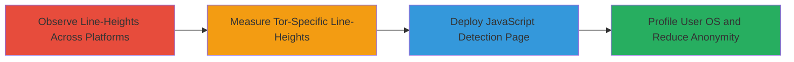

# Tor Browser OS Fingerprinting via CSS Line-Height

Multi-stage attack chain demonstrating a complete attack workflow for identifying the operating system of Tor Browser users via inconsistencies in CSS line-height properties.

## Chain Metrics Dashboard

| Metric | Value |
|--------|-------|
| Chain Status | Unverified |
| Total Steps | 3 |
| Execution Time | ~5 minutes |
| Skill Level | Novice |
| Complexity | Low |
| Impact Level | Medium |

## Attack Flow Visualization

## Prerequisites & Requirements

### Required Tools

- Web browser for testing (e.g., Chrome, Firefox)
- JavaScript development environment

### Target Environment

- Tor Browser on Linux, Windows, or macOS
- Web-accessible demonstration page

### Initial Access Requirements

- No credentials required
- Victim must visit the attacker's web page using Tor Browser
- Network access to host the detection page

## Detailed Attack Procedures

### Step 1: Observe Default CSS Line-Heights Across Browsers and Platforms
procedure: [[procedures/Observe-Default-CSS-Line-Heights-Across-Browsers-and-Platforms]]

**Objective**: Identify variations in default CSS line-height properties across different browsers and operating systems to establish baseline differences.

**Instructions**: Open various browsers on multiple platforms and inspect the computed line-height for elements with 'normal' line-height. Note values like 18px for Safari on Mac, 19px for Firefox on Linux, 19.2px for Chrome on Windows, and 20px for Firefox on Windows.

**Expected Output**: Documented list of line-height values per browser-platform combination.

**Success Indicators**:
- Consistent differences observed (e.g., 19px on Linux vs. 19.2px on Windows)
- Baseline established for Tor Browser inheritance

### Step 2: Measure Tor Browser Line-Heights on Different Platforms
procedure: [[procedures/Measure-Tor-Browser-Line-Heights-on-Different-Platforms]]

**Objective**: Confirm that Tor Browser inherits platform-specific line-height defaults, creating fingerprintable inconsistencies.

**Instructions**: Install and run Tor Browser on Linux, Windows, and macOS. Create a simple HTML page with text elements set to 'normal' line-height and use browser developer tools to measure the computed value. Record: 19px on Linux, 19.2px on Windows, 19.5167px on macOS.

**Expected Output**: Measured line-height values specific to Tor Browser on each OS.

**Success Indicators**:
- Variations confirmed matching platform defaults
- No uniform override by Tor Browser detected

### Step 3: Deploy JavaScript Detection Page
procedure: [[procedures/Detect-Platform-Using-JavaScript-Line-Height-Measurement]]

**Objective**: Implement and host a web page that uses JavaScript to measure line-height and infer the user's OS when Tor Browser is in use.

**Instructions**: Develop an HTML page with a div containing text, then use JavaScript's getComputedStyle to retrieve the line-height. Compare the value to known Tor Browser baselines to detect OS. Host the page on a web server accessible via Tor.

**Expected Output**: JavaScript alert or log identifying the OS (e.g., "Detected: Windows").

**Success Indicators**:
- Script accurately distinguishes between OSes
- Works specifically when Tor Browser is detected (e.g., via navigator.userAgent check)

## Attack Chain Summary

### Key Achievements

1. Established platform-specific line-height baselines across browsers.
2. Verified Tor Browser's failure to uniformize line-height, enabling OS detection.
3. Created a deployable JavaScript proof-of-concept for real-time fingerprinting.

## Technique & Tactic Coverage

### MITRE ATT&CK Techniques

- [[System Information Discovery]] System Information Discovery

### MITRE ATT&CK Tactics

- [[Discovery]] Discovery

---
*Last updated: 2023-10-01T00:00:00Z*
