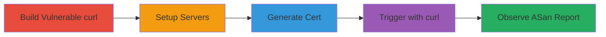

---
tags:
  - curl
  - vulnerability
  - buffer-overread
  - cookie-handling
  - asan
  - reproduction
type: attack_chain
tools:
  - '[[tools/Git]]'
  - '[[tools/Clang]]'
  - '[[tools/Make]]'
  - '[[tools/OpenSSL]]'
  - '[[tools/Python3]]'
  - '[[tools/Curl]]'
  - '[[tools/AddressSanitizer]]'
tactics:
  - '[[Execution]]'
verified: false
platforms:
  - Linux
submitted: true
complexity: medium
created_at: '2023-10-01T00:00:00Z'
procedures:
  - '[[procedures/Clone-and-Build-curl-with-AddressSanitizer]]'
  - '[[procedures/Generate-Self-Signed-Certificate-for-HTTPS-Server]]'
  - '[[procedures/Launch-HTTPS-and-HTTP-Servers-for-Cookie-Reproduction]]'
  - '[[procedures/Execute-curl-to-Trigger-Vulnerability]]'
  - '[[procedures/Observe-AddressSanitizer-Report]]'
step_count: 5
techniques:
  - '[[Exploitation for Client Execution]]'
updated_at: '2025-12-14T17:26:22.117Z'
description: >-
  Reproduce CVE-2025-9086, an out-of-bounds read in curl's cookie handling when
  replacing a secure cookie with an empty path using a non-secure one, leading
  to potential cookie override in mixed protocol scenarios.
skill_level: intermediate
impact_level: low
id: 12bd1257-68bd-44f1-95e8-20dbbe5edf59
validated: true
mitre_tactics:
  - '[[Execution]]'
mitre_techniques:
  - '[[Exploitation for Client Execution]]'
---
# Trigger Out-of-Bounds Read in curl Cookie Handling via Mixed HTTP/HTTPS Replacement

Multi-stage reproduction chain for CVE-2025-9086, demonstrating an out-of-bounds read in lib/cookie.c when a secure cookie with an empty path (sanitized from '/') is replaced by a non-secure cookie. Discovered via code review by Google Big Sleep team, it involves custom servers setting cookies through redirects. Impact is negligible—no memory leak—but could allow rare cookie overrides in MITM scenarios with mixed HTTP/HTTPS access, potentially causing session issues.

## Chain Metrics Dashboard

| Metric | Value |
|--------|-------|
| Chain Status | Unverified |
| Total Steps | 5 |
| Execution Time | ~15 minutes |
| Skill Level | Intermediate |
| Complexity | Medium |
| Impact Level | Low |

## Attack Flow Visualization



## Prerequisites & Requirements

### Required Tools

- [[tools/Git]]
- [[tools/Clang]]
- [[tools/Make]]
- [[tools/OpenSSL]]
- [[tools/Python3]]
- [[tools/Curl]]
- [[tools/AddressSanitizer]]

### Target Environment

- Linux OS
- Ports 9443 (HTTPS) and 9080 (HTTP) available
- Network access to localhost/hostname

### Initial Access Requirements

- Local machine with build tools
- No credentials needed
- Root not required

## Detailed Attack Procedures

### Step 1: Clone and Build curl with AddressSanitizer
procedure: [[procedures/Clone-and-Build-curl-with-AddressSanitizer]]

**Objective**: Obtain and compile curl source with memory sanitization to detect the out-of-bounds read.

**Instructions**: Clone the repository using [[commands/git-clone-curl]]:

```bash
git clone https://github.com/curl/curl
```

Then navigate with [[commands/cd-curl]]:

```bash
cd curl
```

Set compilers with [[commands/export-cc-clang]] and [[commands/export-cxx-clang++]]:

```bash
export CC=clang
export CXX=clang++
```

Enable ASan flags using [[commands/export-cflags-asan]], [[commands/export-cxxflags-asan]], and [[commands/export-ldflags-asan]]:

```bash
export CFLAGS="-fsanitize=address"
export CXXFLAGS="-fsanitize=address"
export LDFLAGS="-fsanitize=address"
```

Configure with [[commands/configure-curl]]:

```bash
./configure --with-openssl --disable-shared --enable-debug --enable-maintainer-mode
```

Build using [[commands/make-parallel]]:

```bash
make -j$(nproc)
```

**Expected Output**: Compiled curl binary in src/curl with ASan enabled.

**Success Indicators**:
- No build errors
- src/curl executable present

### Step 2: Generate Self-Signed Certificate for HTTPS Server
generate: [[procedures/Generate-Self-Signed-Certificate-for-HTTPS-Server]]

**Objective**: Create a certificate and key for the HTTPS server to set secure cookies.

**Instructions**: Run [[commands/openssl-generate-cert]]:

```bash
openssl req -x509 -newkey rsa:4096 -keyout key.pem -out cert.pem -sha256 -days 1 -nodes -subj "/C=XX/ST=StateName/L=CityName/O=CompanyName/OU=CompanySectionName/CN=CommonNameOrHostname"
```

**Expected Output**: key.pem and cert.pem files generated.

**Success Indicators**:
- Certificate files exist
- Valid for 1 day with RSA 4096-bit key

### Step 3: Launch HTTPS and HTTP Servers for Cookie Reproduction
procedure: [[procedures/Launch-HTTPS-and-HTTP-Servers-for-Cookie-Reproduction]]

**Objective**: Start servers to simulate the cookie setting scenario: HTTPS sets secure cookie with path=/ and redirects to HTTP which sets non-secure cookie with path=/foo/.

**Instructions**: Execute [[commands/python3-server-py]]:

```bash
python3 server.py
```

**Expected Output**: HTTPS server on port 9443 and HTTP on 9080 running.

**Success Indicators**:
- Servers listening on specified ports
- No Python errors

### Step 4: Execute curl to Trigger the Vulnerability
procedure: [[procedures/Execute-curl-to-Trigger-Vulnerability]]

**Objective**: Use curl to follow the redirect, process cookies, and trigger the out-of-bounds read in replace_existing function.

**Instructions**: Run [[commands/curl-trigger-vuln]]:

```bash
./src/curl --insecure -c cookies -vv -L https://$(hostname):9443
```

**Expected Output**: Verbose output showing redirect and cookie handling; ASan detects heap-buffer-overflow.

**Success Indicators**:
- Redirect followed
- Cookies saved to file
- Vulnerability triggered (ASan report in next step)

### Step 5: Observe AddressSanitizer Report
procedure: [[procedures/Observe-AddressSanitizer-Report]]

**Objective**: Review the ASan output for confirmation of the buffer over-read.

**Instructions**: Monitor console output from previous curl execution; no additional command needed.

**Expected Output**: ASan report indicating heap-buffer-overflow READ of size 1 at 0x60b000000010 (or similar) in strchr(clist->spath + 1, '/') at lib/cookie.c:39.

**Success Indicators**:
- Overflow detected in cookie replacement
- No crash, but invalid read beyond NUL terminator

## Attack Chain Summary

### Key Achievements

1. Successful build of sanitized curl
2. Reproduction of OOB read via cookie path sanitization
3. Confirmation of negligible impact with potential for cookie override

## Technique & Tactic Coverage

### MITRE ATT&CK Techniques

- [[Exploitation for Client Execution]] Exploitation for Client or Server Software Execution

### MITRE ATT&CK Tactics

- [[Execution]] Execution

---

*Last updated: 2023-10-01T00:00:00Z*
