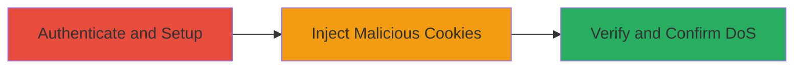

# Tumblr API Denial of Service via OAuth Cookie Manipulation

Multi-stage attack chain demonstrating a complete workflow to exploit cookie manipulation in Tumblr's OAuth API endpoint, leading to denial of service by setting invalid, long-expiring cookies that block API authorization.

## Chain Metrics Dashboard

| Metric | Value |
|--------|-------|
| Chain Status | Unverified |
| Total Steps | 6 |
| Execution Time | ~5 minutes |
| Skill Level | Intermediate |
| Complexity | Low |
| Impact Level | High |

## Attack Flow Visualization

## Prerequisites & Requirements

### Required Tools

- Web browser (e.g., Chrome, Firefox)

### Target Environment

- Tumblr web platform
- Access to https://www.tumblr.com/
- No specific ports; standard HTTPS (443)

### Initial Access Requirements

- Valid Tumblr user credentials
- Network access to tumblr.com
- No prior access needed beyond account

## Detailed Attack Procedures

### Step 1: Authenticate to Tumblr
procedure: [[procedures/Authenticate-to-Tumblr]]

**Objective**: Establish a valid session on Tumblr to access OAuth features.

**Instructions**: Open a web browser and navigate to the Tumblr login page. Enter your credentials to authenticate.

**Expected Output**: Successful login, redirect to dashboard.

**Success Indicators**:
- User is logged in and can access account settings.
- No existing oa-consumer_key or oa_consumer_secret cookies (check via browser dev tools).

### Step 2: Create OAuth Application
procedure: [[procedures/Create-OAuth-Application]]

**Objective**: Set up a new OAuth app to prepare for API connection testing.

**Instructions**: Navigate to the OAuth apps section and create a new application with arbitrary details.

**Expected Output**: New app listed in the dashboard.

**Success Indicators**:
- Application created successfully.
- No interference from pre-existing OAuth cookies.

### Step 3: Inject Malicious Cookies
procedure: [[procedures/Inject-Malicious-Cookies]]

**Objective**: Exploit the vulnerable endpoint to set malformed cookies that cause DoS.

**Instructions**: Visit the crafted URL in the browser to inject invalid cookie values with excessive expiration.

**Expected Output**: Cookies oa-consumer_key and oa_consumer_secret updated to 'x' with domain tumblr.com and Max-Age=1000000000000000000000.

**Success Indicators**:
- Cookies modified (verify in browser dev tools: Application > Cookies).
- No errors on page load.

### Step 4: Verify API Connection Attempt
procedure: [[procedures/Verify-API-Connection-Attempt]]

**Objective**: Test initial API connection to observe partial functionality before full DoS confirmation.

**Instructions**: Return to OAuth apps and attempt to explore/connect to the API.

**Expected Output**: Redirect to authorization page, but no immediate failure.

**Success Indicators**:
- Authorization prompt appears.
- Session remains active.

### Step 5: Refresh Session via Logout and Login
procedure: [[procedures/Refresh-Session-via-Logout-Login]]

**Objective**: Refresh the session to ensure the injected cookies persist across logins.

**Instructions**: Log out of Tumblr and log back in using the same credentials.

**Expected Output**: Re-authenticated session with persisted malformed cookies.

**Success Indicators**:
- Login successful.
- Malformed cookies still present in dev tools after refresh.

### Step 6: Confirm DoS on Reconnection
procedure: [[procedures/Confirm-DoS-on-Reconnection]]

**Objective**: Demonstrate the denial of service by failing to reconnect to the API.

**Instructions**: Attempt to connect to the created application again via Explore API.

**Expected Output**: Connection fails due to malformed cookies preventing authorization.

**Success Indicators**:
- Error or failure in API authorization.
- API access blocked until manual cookie deletion.

## Attack Chain Summary

### Key Achievements

1. Successful injection of invalid OAuth cookies via unvalidated parameters.
2. Persistent DoS on Tumblr API access requiring manual intervention.
3. Exploitation of cookie attributes like domain and Max-Age without sanitization.

## Technique & Tactic Coverage

### MITRE ATT&CK Techniques

- [[Endpoint Denial of Service]] Endpoint Denial of Service
- [[Exploit Public-Facing Application]] Exploit Public-Facing Application

### MITRE ATT&CK Tactics

- [[Impact]] Impact

---

*Last updated: 2024-10-01T00:00:00Z*
