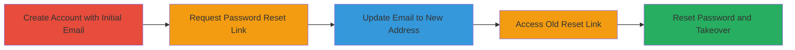

---
tags:
  - account-takeover
  - auth-bypass
  - password-reset
  - twitter
type: attack_chain
tools: []
tactics:
  - '[[Initial Access]]'
commands: []
platforms:
  - Web
complexity: medium
procedures:
  - '[[procedures/Create-Twitter-Account-with-Initial-Email]]'
  - '[[procedures/Request-Password-Reset-Link-Without-Using-It]]'
  - '[[procedures/Update-Account-Email-to-New-Address]]'
  - '[[procedures/Access-Old-Password-Reset-Link]]'
  - '[[procedures/Reset-Password-Using-Old-Link]]'
step_count: 5
techniques:
  - '[[Valid Accounts]]'
description: >-
  A multi-stage attack exploiting a flaw in Twitter's password reset mechanism
  where reset links to old emails remain valid post-email update, enabling
  account takeover.
skill_level: intermediate
impact_level: high
id: ff68a82a-bafa-4c12-82a9-b149b295e398
created_at: '2025-12-14T17:33:06.131Z'
updated_at: '2025-12-14T17:33:06.131Z'
verified: false
validated: true
submitted: true
mitre_tactics:
  - '[[Initial Access]]'
mitre_techniques:
  - '[[Valid Accounts]]'
---
# Twitter Account Takeover via Persistent Password Reset Links After Email Change

Multi-stage attack chain demonstrating a complete attack workflow exploiting Twitter's password reset flaw.

## Chain Metrics Dashboard

| Metric | Value |
|--------|-------|
| Chain Status | Unverified |
| Total Steps | 5 |
| Execution Time | ~10 minutes |
| Skill Level | Intermediate |
| Complexity | Medium |
| Impact Level | High |

## Attack Flow Visualization

## Prerequisites & Requirements

### Required Tools

- Web browser (e.g., Chrome or Firefox)

### Target Environment

- Twitter web platform
- Access to two email accounts (initial and new)

### Initial Access Requirements

- No prior credentials needed; starts with account creation
- Internet access

## Detailed Attack Procedures

### Step 1: Create Account with Initial Email
procedure: [[procedures/Create-Twitter-Account-with-Initial-Email]]

**Objective**: Establish a test account using an initial email address to simulate the victim's setup.

**Instructions**: Navigate to Twitter's registration page and create a new account using the email address abcd@x.com. Complete the registration process by providing a username, password, and verifying the email if prompted.

**Expected Output**: Successful account creation with access to the dashboard.

**Success Indicators**:
- Confirmation email received at abcd@x.com
- Ability to log in with the created credentials

### Step 2: Request Password Reset Link
procedure: [[procedures/Request-Password-Reset-Link-Without-Using-It]]

**Objective**: Generate a password reset link sent to the initial email without completing the reset.

**Instructions**: Log out of the account, then initiate the password reset flow by entering the username or email abcd@x.com on the login page. Receive the reset link via email but do not click it yet.

**Expected Output**: Email containing a password reset link for the account.

**Success Indicators**:
- Reset email arrives in abcd@x.com inbox
- Link is valid and unexpired (typically 1 hour)

### Step 3: Update Email to New Address
procedure: [[procedures/Update-Account-Email-to-New-Address]]

**Objective**: Change the account's associated email to a new one, simulating the victim updating contact info.

**Instructions**: Log back in using the existing password, go to account settings, and update the email from abcd@x.com to efgh@x.com. Verify the new email by clicking the confirmation link sent to efgh@x.com.

**Expected Output**: Account email successfully updated and verified.

**Success Indicators**:
- New email confirmation received at efgh@x.com
- Settings reflect the updated email address

### Step 4: Access Old Password Reset Link
procedure: [[procedures/Access-Old-Password-Reset-Link]]

**Objective**: Attempt to use the previously generated reset link from the old email.

**Instructions**: Log out again, then open the password reset link received earlier in the abcd@x.com inbox and navigate to the reset page.

**Expected Output**: Access to the password reset form despite the email change.

**Success Indicators**:
- Reset page loads without errors
- Form allows password entry

### Step 5: Reset Password and Takeover
procedure: [[procedures/Reset-Password-Using-Old-Link]]

**Objective**: Complete the password reset to gain control of the account now tied to the new email.

**Instructions**: Enter a new password in the reset form and submit. Log in with the new password to confirm control.

**Expected Output**: Password successfully changed; login works with new credentials.

**Success Indicators**:
- Password update confirmation
- Full account access without needing the old email

## Attack Chain Summary

### Key Achievements

1. Demonstrated persistence of reset tokens across email changes
2. Enabled takeover via old email access
3. Highlighted auth bypass in reset mechanism

## Technique & Tactic Coverage

### MITRE ATT&CK Techniques

- [[Valid Accounts]]

### MITRE ATT&CK Tactics

- [[Initial Access]]

---
*Last updated: 2023-10-01*
