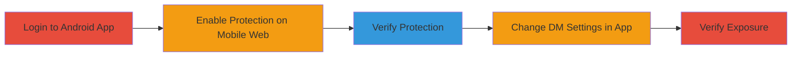

# Twitter Android App Overrides Protected Tweets via Direct Messages Settings Change

Multi-stage attack chain demonstrating a complete attack workflow.

## Chain Metrics Dashboard

| Metric | Value |
|--------|-------|
| Chain Status | Unverified |
| Total Steps | 5 |
| Execution Time | ~5 minutes |
| Skill Level | Beginner |
| Complexity | Low |
| Impact Level | High |

## Attack Flow Visualization

## Prerequisites & Requirements

### Required Tools

- Twitter Android App (latest version at time of discovery)
- Web browser for mobile.twitter.com

### Target Environment

- Twitter account with public tweets initially
- Android device with Twitter app installed
- Internet access for app and web

### Initial Access Requirements

- Valid Twitter credentials
- No prior access needed beyond account ownership
- Ability to log in on both app and web

## Detailed Attack Procedures

### Step 1: Login to Twitter Android App
procedure: [[procedures/Set-Protected-Tweets-via-Mobile-Web]]

**Objective**: Gain access to the account on the Android app to prepare for setting changes.

**Instructions**: Open the Twitter Android app and log in using valid credentials for an account with unprotected (public) tweets.

**Expected Output**: Successful authentication, displaying the home timeline with public tweets visible.

**Success Indicators**:
- App logs in without errors
- Tweets are visible as public

### Step 2: Enable Protected Tweets on Mobile Web
procedure: [[procedures/Set-Protected-Tweets-via-Mobile-Web]]

**Objective**: Protect the tweets using the mobile web interface to set up the vulnerability condition.

**Instructions**: Open a mobile browser, navigate to mobile.twitter.com, log in with the same credentials, go to Settings > Privacy and safety > Audience and tagging, and enable 'Protect your Tweets'.

**Expected Output**: Confirmation that tweets are now protected; only approved followers can see them.

**Success Indicators**:
- Setting toggled on
- Profile indicates protected status

### Step 3: Verify Protected Status
procedure: [[procedures/Verify-Tweet-Protection-Status]]

**Objective**: Confirm that the protection is active across interfaces.

**Instructions**: Check the account on mobile web or Android app; attempt to view tweets from a non-follower account or incognito mode to ensure they are not visible.

**Expected Output**: Tweets hidden from non-followers.

**Success Indicators**:
- Non-followers cannot see tweets
- App or web shows protected indicator

### Step 4: Change Direct Messages Settings in Android App
procedure: [[procedures/Override-Protection-by-Changing-DM-Settings-in-Android-App]]

**Objective**: Trigger the override by modifying DM settings, unprotected tweets without notification.

**Instructions**: In the Twitter Android app, navigate to the Direct Messages tab, tap the gear icon for settings, and toggle options such as 'Receive message requests' or 'Show read receipts'.

**Expected Output**: Settings change applied; no warning about tweet protection.

**Success Indicators**:
- DM setting toggled successfully
- No immediate change in tweet visibility notice

### Step 5: Verify Tweets Are Now Unprotected
procedure: [[procedures/Verify-Tweet-Protection-Status]]

**Objective**: Confirm the privacy violation by checking tweet visibility post-change.

**Instructions**: Refresh the app or web interface, then view the account from a non-follower perspective to see if tweets are now public.

**Expected Output**: Tweets visible to the public again.

**Success Indicators**:
- Protected status removed
- Tweets accessible without following

## Attack Chain Summary

### Key Achievements

1. Successfully enabled tweet protection via web
2. Overrode protection through app DM settings change
3. Exposed private tweets publicly without user awareness

## Technique & Tactic Coverage

### MITRE ATT&CK Techniques

- [[Disable or Modify Tools]]

### MITRE ATT&CK Tactics

- [[Collection]]

---

*Last updated: 2023-10-01T00:00:00Z*
