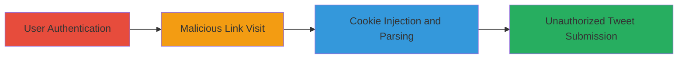

---
tags:
  - csrf
  - bypass
  - cookie-injection
  - web-vulnerability
  - twitter
type: attack_chain
tools:
  - '[[tools/Google-Chrome]]'
tactics:
  - '[[Initial Access]]'
verified: false
platforms:
  - Web
submitted: true
created_at: '2023-10-01T00:00:00Z'
procedures:
  - '[[procedures/Establish-User-Authentication-on-Twitter]]'
  - '[[procedures/Inject-Fake-CSRF-Token-via-Malicious-Referer]]'
  - '[[procedures/Exploit-Cookie-Parsing-on-Mobile-Twitter]]'
  - '[[procedures/Submit-Unauthorized-Tweet-with-Fake-Token]]'
step_count: 4
techniques:
  - '[[Exploit Public-Facing Application]]'
  - '[[Drive-by Compromise]]'
updated_at: '2025-12-14T17:27:29.195Z'
description: >-
  A multi-stage attack exploiting CSRF protection on Twitter by injecting a fake
  token into the Google Analytics __utmz cookie using controlled Referer headers
  and web server parsing quirks.
id: b9d550ec-dba6-4b7d-8140-3a2e73865d3e
validated: true
mitre_tactics:
  - '[[Initial Access]]'
mitre_techniques:
  - '[[Exploit Public-Facing Application]]'
  - '[[Drive-by Compromise]]'
---
# Twitter CSRF Bypass via Google Analytics Cookie Injection

Multi-stage attack chain demonstrating a CSRF protection bypass on Twitter's mobile site by injecting a fake CSRF token into the persistent Google Analytics __utmz cookie. The attack leverages user-controlled Referer headers, browser cookie attribute handling in Chrome, and web server parsing of commas/spaces as delimiters to forge a valid-looking token, enabling unauthorized tweet posting.

## Chain Metrics Dashboard

| Metric | Value |
|--------|-------|
| Chain Status | Unverified |
| Total Steps | 4 |
| Execution Time | ~5 minutes |
| Skill Level | Intermediate |
| Complexity | Medium |
| Impact Level | High |

## Attack Flow Visualization

## Prerequisites & Requirements

### Required Tools

- [[tools/Google-Chrome]]

### Target Environment

- Web platform
- Twitter services (twitter.com, translate.twitter.com, mobile.twitter.com)
- Google Analytics integration on translate.twitter.com

### Initial Access Requirements

- Victim must be authenticated on twitter.com
- Social engineering to trick victim into clicking a malicious link
- No special credentials beyond victim session

## Detailed Attack Procedures

### Step 1: User Authentication
procedure: [[procedures/Establish-User-Authentication-on-Twitter]]

**Objective**: Establish a valid session on twitter.com to enable subsequent exploitation on subdomains.

**Instructions**: Direct the target user to authenticate normally via the standard login process on twitter.com. No special commands are needed; this relies on the victim's voluntary login.

**Expected Output**: Active session cookie established, allowing access to protected endpoints like mobile.twitter.com.

**Success Indicators**:
- User is logged in and can access twitter.com dashboard
- Session persists across subdomains like translate.twitter.com

### Step 2: Malicious Link Visit
procedure: [[procedures/Inject-Fake-CSRF-Token-via-Malicious-Referer]]

**Objective**: Trick the user into visiting a controlled link that sets a malicious __utmz cookie on translate.twitter.com with an injected fake CSRF token.

**Instructions**: Host a malicious page or link (e.g., http://blackfan.ru/r/,m5_csrf_tkn=x,;domain=.twitter.com;path=/;... ) that redirects to http://translate.twitter.com/ with a forged Referer header. Use multiple 'path=' attributes to override the domain to .twitter.com in Chrome, exploiting Google Analytics to set __utmz=90378079.1401435337.1.1.utmcsr=bf.am|utmccn=(referral)|utmcmd=referral|utmcct=/r/,m5_csrf_tkn=x,.

**Expected Output**: __utmz cookie set with injected value, persisting for 6 months.

**Success Indicators**:
- Cookie inspector shows __utmz with comma-separated injection
- No errors on translate.twitter.com load

### Step 3: Cookie Parsing Exploitation
procedure: [[procedures/Exploit-Cookie-Parsing-on-Mobile-Twitter]]

**Objective**: Access mobile.twitter.com where the server misparses the injected __utmz cookie as separate cookies, creating a fake m5_csrf_tkn.

**Instructions**: Navigate the authenticated user to mobile.twitter.com. The web server parses the comma in utmcct=/r/,m5_csrf_tkn=x, as a delimiter, treating it as m5_csrf_tkn=x since no prior __utmz exists on the subdomain.

**Expected Output**: Server accepts m5_csrf_tkn=x as a valid CSRF token.

**Success Indicators**:
- No CSRF validation errors on page load
- Fake token is present in request headers

### Step 4: Unauthorized Tweet Submission
procedure: [[procedures/Submit-Unauthorized-Tweet-with-Fake-Token]]

**Objective**: Submit a compose tweet form using the fake token to post unauthorized content.

**Instructions**: On mobile.twitter.com, fill and submit the tweet form with m5_csrf_tkn=x. Use a PoC like http://blackfan.ru/twitterbugbounty/485d0a1204ff970e702aabb5f0379d73_tweet.html to automate, posting content like 'wut -.-'.

**Expected Output**: Tweet successfully posted without valid CSRF token.

**Success Indicators**:
- Tweet appears in user's timeline
- No rejection due to CSRF failure

## Attack Chain Summary

### Key Achievements

1. Bypassed cookie-based CSRF protection using persistent analytics cookie
2. Exploited browser and server parsing differences for token injection
3. Enabled unauthorized state-changing actions on behalf of the user

## Technique & Tactic Coverage

### MITRE ATT&CK Techniques

- [[Exploit Public-Facing Application]]
- [[Drive-by Compromise]]

### MITRE ATT&CK Tactics

- [[Initial Access]]

---

*Last updated: 2023-10-01T00:00:00Z*
