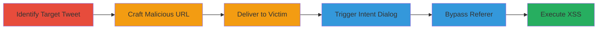

---
tags:
  - xss
  - twitter
  - referer-injection
  - javascript-execution
  - social-engineering
type: attack_chain
tools:
  - '[[tools/twitterdetect]]'
tactics:
  - '[[Initial Access]]'
  - '[[Execution]]'
  - '[[Collection]]'
verified: false
platforms:
  - Web
submitted: true
complexity: medium
created_at: '2023-10-01T00:00:00Z'
procedures:
  - '[[procedures/Identify-Target-Tweet-for-XSS]]'
  - '[[procedures/Craft-Malicious-Twitter-Intent-URL]]'
  - '[[procedures/Deliver-XSS-Payload-via-Social-Engineering]]'
  - '[[procedures/Trigger-Twitter-Intent-Dialog]]'
  - '[[procedures/Bypass-Referer-Restrictions-with-Intent]]'
  - '[[procedures/Execute-Injected-XSS-Payload]]'
step_count: 6
techniques:
  - '[[JavaScript]]'
  - '[[T1566.001]]'
updated_at: '2025-12-14T17:28:20.501Z'
description: >-
  Multi-stage XSS attack exploiting unescaped original_referer parameter in
  Twitter's /intent/favorite endpoint to inject malicious HTML attributes and
  execute JavaScript in the victim's browser.
skill_level: intermediate
impact_level: high
id: 4856a0ec-9c1a-4e2a-b199-29e0ace992a8
validated: true
mitre_tactics:
  - '[[Initial Access]]'
  - '[[Execution]]'
  - '[[Collection]]'
mitre_techniques:
  - '[[JavaScript]]'
  - '[[T1566.001]]'
---
# Twitter Intent Favorite XSS via Unescaped Referer Parameter

Multi-stage attack chain demonstrating a complete XSS workflow exploiting Twitter's /intent/favorite functionality.

## Chain Metrics Dashboard

| Metric | Value |
|--------|-------|
| Chain Status | Unverified |
| Total Steps | 6 |
| Execution Time | ~5 minutes |
| Skill Level | Intermediate |
| Complexity | Medium |
| Impact Level | High |

## Attack Flow Visualization

## Prerequisites & Requirements

### Required Tools

- [[tools/twitterdetect]] (for related username probing context)

### Target Environment

- Web platform
- Access to Twitter (now X) platform
- Victim must be authenticated on Twitter and follow the target user

### Initial Access Requirements

- No prior credentials needed for attacker
- Victim's Twitter session
- Ability to send messages/links to victim (e.g., email, chat)

## Detailed Attack Procedures

### Step 1: Identify Target Tweet
procedure: [[procedures/Identify-Target-Tweet-for-XSS]]

**Objective**: Select a tweet that the victim follows but has not favorited to ensure interaction.

**Instructions**: Research the victim's followed accounts and identify a specific tweet ID (e.g., 440322224407314432) where the victim follows the author but the tweet remains unfavorited. Use Twitter's search or API if available to confirm.

**Expected Output**: Confirmed tweet ID ready for payload crafting.

**Success Indicators**:
- Tweet ID identified
- Victim's follow status verified

### Step 2: Craft Malicious URL
procedure: [[procedures/Craft-Malicious-Twitter-Intent-URL]]

**Objective**: Inject XSS payload into the original_referer parameter to embed malicious HTML attributes.

**Instructions**: Construct the URL with the payload: https://twitter.com/intent/favorite?original_referer=%20style%3Dfont-size%3A1000%3Bonautocompleteerror%3Dalert(0)%20onblur%3Dalert(0)%20onerror%3Dalert(0)%20...&tweet_id=440322224407314432. Include multiple event handlers like onmouseover, onfocus, etc., set to alert(0) for testing.

**Expected Output**: Fully formed malicious URL with encoded payload.

**Success Indicators**:
- Payload encodes correctly without breaking URL
- Attributes like style and on* handlers are injectable

### Step 3: Deliver Payload
procedure: [[procedures/Deliver-XSS-Payload-via-Social-Engineering]]

**Objective**: Trick the victim into clicking the malicious link.

**Instructions**: Send the URL to the victim via a message, e.g., "Please favorite this interesting tweet: [malicious URL]". Use social engineering to encourage clicking, such as claiming it's a must-see update.

**Expected Output**: Victim receives and clicks the link.

**Success Indicators**:
- Victim interacts with the message
- Link is accessed

### Step 4: Trigger Intent Dialog
procedure: [[procedures/Trigger-Twitter-Intent-Dialog]]

**Objective**: Open Twitter's favorite intent page to process the referer.

**Instructions**: Upon clicking, the URL loads Twitter's /intent/favorite page, displaying a dialog with a 'Favorite' button. The original_referer payload is placed in a hidden input: <input type='hidden' name='referer' value='/intent/favorite?original_referer=[payload]&tweet_id=...'>. Twitter skips processing unless Referer is from twitter.com.

**Expected Output**: Intent dialog appears without immediate execution.

**Success Indicators**:
- Dialog loads successfully
- Hidden input contains payload

### Step 5: Bypass Referer Restrictions
procedure: [[procedures/Bypass-Referer-Restrictions-with-Intent]]

**Objective**: Set the proper Referer header using the intent functionality to enable payload processing.

**Instructions**: The victim interacts with the intent (e.g., views the dialog), then clicks the 'Return to previous site' link. This reloads the page with Referer: twitter.com, bypassing t.co link shortening interference and allowing original_referer to be inserted into the DOM.

**Expected Output**: Page reloads with Twitter as Referer.

**Success Indicators**:
- Referer header is set to twitter.com
- Payload is processed

### Step 6: Execute Injected Payload
procedure: [[procedures/Execute-Injected-XSS-Payload]]

**Objective**: Trigger JavaScript execution via injected attributes.

**Instructions**: On reload, the payload injects into the page DOM, applying styles (e.g., font-size:1000px) and event handlers (e.g., onmouseover=alert(0)). Victim interaction (hover, focus, etc.) executes the JavaScript, such as alert(0) for proof-of-concept, or more malicious code for session hijacking.

**Expected Output**: Arbitrary JavaScript runs in victim's browser.

**Success Indicators**:
- Visual changes (e.g., oversized text)
- Alert or other JS execution observed

## Attack Chain Summary

### Key Achievements

1. Bypassed Referer checks using double intent invocation
2. Injected HTML attributes directly into Twitter's DOM
3. Achieved client-side JavaScript execution for potential session theft

## Technique & Tactic Coverage

### MITRE ATT&CK Techniques

- [[JavaScript]]
- [[T1566.001]]

### MITRE ATT&CK Tactics

- [[Initial Access]]
- [[Execution]]
- [[Collection]]

---
*Last updated: 2023-10-01T00:00:00Z*
