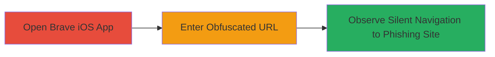

# URI Obfuscation Phishing Attack in Brave iOS App

Multi-stage attack chain demonstrating a complete attack workflow exploiting URI obfuscation in the Brave iOS browser to facilitate phishing.

## Chain Metrics Dashboard

| Metric | Value |
|--------|-------|
| Chain Status | Unverified |
| Total Steps | 3 |
| Execution Time | ~1 minute |
| Skill Level | Beginner |
| Complexity | Low |
| Impact Level | High |

## Attack Flow Visualization

## Prerequisites & Requirements

### Required Tools

- None (manual testing on iOS device)

### Target Environment

- iOS device (iPhone or iPad)
- Brave browser app installed
- No specific services or ports required

### Initial Access Requirements

- Physical access to the iOS device or user interaction to enter the URL
- No credentials or prior network access needed

## Detailed Attack Procedures

### Step 1: Launch Brave iOS Browser
procedure: [[procedures/Exploit-URI-Obfuscation-in-Brave-iOS]]

**Objective**: Open the vulnerable Brave app to prepare for URL input.

**Instructions**: Manually launch the Brave web browser application from the iOS home screen.

**Expected Output**: Brave browser opens to its default page or new tab.

**Success Indicators**:
- App launches successfully without errors
- Address bar is visible and ready for input

### Step 2: Input Obfuscated URL
procedure: [[procedures/Exploit-URI-Obfuscation-in-Brave-iOS]]

**Objective**: Enter a malformed URL that obfuscates the true destination using a trusted domain.

**Instructions**: In the browser's address bar, type the obfuscated URL such as `http://www.brave.com@fb.com`. The `@` symbol causes the UIWebView to interpret `www.brave.com` as a username and load `fb.com` as the host.

**Expected Output**: The URL appears to reference brave.com, but no immediate loading occurs until submission.

**Success Indicators**:
- URL is accepted in the address bar without parsing errors
- No warnings displayed during input

### Step 3: Navigate and Verify Silent Redirection
procedure: [[procedures/Exploit-URI-Obfuscation-in-Brave-iOS]]

**Objective**: Trigger navigation to confirm the vulnerability allows access to the unintended site without alerts.

**Instructions**: Press the go button or enter key to navigate. Observe the page load.

**Expected Output**: The fb.com (or target phishing site) loads fully, with no pop-ups, warnings, or indications of the true destination.

**Success Indicators**:
- Target site (e.g., fb.com) loads without user awareness of obfuscation
- Address bar may still suggest or display elements of the trusted domain

## Attack Chain Summary

### Key Achievements

1. Successfully obfuscated a malicious URL to bypass user suspicion using a trusted domain.
2. Demonstrated silent navigation to phishing site without any browser warnings.
3. Highlighted the risk of UIWebView's URL parsing in mobile apps enabling phishing attacks.

## Technique & Tactic Coverage

### MITRE ATT&CK Techniques

- [[Phishing]] Phishing
- [[T1566.002]] Spearphishing Link

### MITRE ATT&CK Tactics

- [[Initial Access]] Initial Access

---
*Last updated: 2023-10-01T00:00:00Z*
