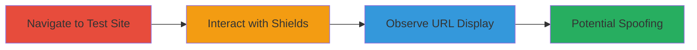

---
tags:
  - url-spoofing
  - ui-vulnerability
  - brave-browser
  - android
type: attack_chain
tools: []
tactics:
  - '[[Initial Access]]'
verified: false
platforms:
  - Android
  - Mobile Browser
submitted: true
complexity: low
created_at: '2023-10-01T00:00:00Z'
procedures:
  - '[[procedures/Navigate-to-Long-Subdomain-Test-Site-in-Brave-Android]]'
  - '[[procedures/Interact-with-Brave-Shields-Feature]]'
  - '[[procedures/Observe-URL-Display-in-Shields-UI]]'
step_count: 3
techniques:
  - '[[Phishing]]'
updated_at: '2025-12-14T17:24:44.981Z'
description: >-
  Demonstrates a UI vulnerability in Brave Browser for Android where long
  subdomains are not properly elided in the Shields popup, potentially enabling
  URL spoofing and user confusion during security feature interactions.
skill_level: beginner
impact_level: medium
id: b1ce4577-e525-4fa3-a62c-00330cb6f2be
validated: true
mitre_tactics:
  - '[[Initial Access]]'
mitre_techniques:
  - '[[Phishing]]'
---
# URL Confusion via Incorrect Subdomain Eliding in Brave Shields on Android

Multi-stage attack chain demonstrating a complete attack workflow.

The vulnerability exploits a flaw in Brave Browser's Android implementation where long subdomains in URLs are not truncated from the front in the Shields popup UI, violating Chromium's security guidelines. This can confuse users about the actual domain when toggling Shields, potentially leading to spoofing attacks where malicious sites mimic trusted ones. The chain uses a test site to replicate the issue, highlighting risks in UI elements like Shields and possibly Brave Rewards.

## Chain Metrics Dashboard

| Metric | Value |
|--------|-------|
| Chain Status | Unverified |
| Total Steps | 3 |
| Execution Time | ~2 minutes |
| Skill Level | Beginner |
| Complexity | Low |
| Impact Level | Medium |

## Attack Flow Visualization

## Prerequisites & Requirements

### Required Tools

- Brave Browser for Android (version 1.62.165 or similar, based on Chromium M121)

### Target Environment

- Android device with Brave Browser installed
- Internet access to load test sites
- No specific services or ports required

### Initial Access Requirements

- Physical access to Android device
- No credentials needed
- Browser must be updated to affected version

## Detailed Attack Procedures

### Step 1: Navigate to Test Site
procedure: [[procedures/Navigate-to-Long-Subdomain-Test-Site-in-Brave-Android]]

**Objective**: Load a website with an extended subdomain to set up the demonstration of the eliding flaw.

**Instructions**: Open Brave Browser on Android and enter the URL of a test site featuring a long subdomain, such as https://long-extended-subdomain-name-containing-many-letters-and-dashes.badssl.com/. The page should load without errors, displaying content from the badssl.com test domain.

**Expected Output**: The full URL appears in the omnibox, showing the extended subdomain without truncation.

**Success Indicators**:
- Page loads successfully
- Omnibox displays the complete long subdomain

### Step 2: Interact with Shields Feature
procedure: [[procedures/Interact-with-Brave-Shields-Feature]]

**Objective**: Trigger the Shields popup to expose the UI where URL eliding should occur but fails.

**Instructions**: With the test site loaded, tap the Brave Shields icon (lion icon) in the URL bar or omnibox to open the Shields popup. Toggle the Shields setting on or off for the site to observe the URL rendering in the UI.

**Expected Output**: Shields popup appears, allowing enable/disable of features like ad-blocking or tracking protection.

**Success Indicators**:
- Shields icon is tappable
- Popup opens without crashing
- URL is visible in the popup context

### Step 3: Observe URL Display
procedure: [[procedures/Observe-URL-Display-in-Shields-UI]]

**Objective**: Verify the vulnerability by noting the lack of front truncation for long subdomains, leading to potential confusion.

**Instructions**: In the open Shields popup, examine how the site's URL is displayed. Compare mentally or screenshot to note that the long subdomain is not elided from the front, unlike in desktop Brave versions.

**Expected Output**: The URL shows the full extended subdomain, potentially obscuring the real domain (badssl.com) and confusing the user about the site's identity.

**Success Indicators**:
- Long subdomain is fully visible without truncation
- User can be misled about the domain when deciding on Shields settings

## Attack Chain Summary

### Key Achievements

1. Successfully loaded a test site with extended subdomain in Brave Android.
2. Accessed the Shields UI to interact with security features.
3. Demonstrated URL confusion due to improper eliding, highlighting spoofing risk.

## Technique & Tactic Coverage

### MITRE ATT&CK Techniques

- [[Phishing]]

### MITRE ATT&CK Tactics

- [[Initial Access]]

---

*Last updated: 2023-10-01T00:00:00Z*
