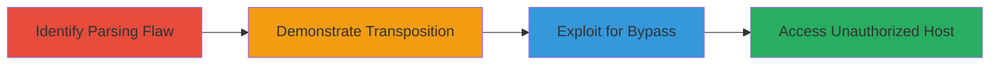

# URL Filter Bypass via Percent-Encoded Host Transposition in curl

Multi-stage attack chain demonstrating exploitation of CVE-2022-27780 in curl's URL parser. This vulnerability allows percent-encoded URL separators (e.g., %2F for '/') to be accepted in the host name, which are decoded and transposed into the path, altering the effective URL and host. Discovered by Axel Chong on April 28, 2022, it stems from a commit in curl 7.80.0 adding percent-encoded host support without validating decoded separators. The chain enables bypassing host-based URL filters, checks, and access controls in applications using libcurl, potentially leading to unauthorized access though no public exploits were known at disclosure.

## Chain Metrics Dashboard

| Metric | Value |
|--------|-------|
| Chain Status | Unverified |
| Total Steps | 3 |
| Execution Time | ~5 minutes |
| Skill Level | Intermediate |
| Complexity | Medium |
| Impact Level | High |

## Attack Flow Visualization



## Prerequisites & Requirements

### Required Tools

- [[tools/curl]]
- [[tools/libcurl]]

### Target Environment

- Applications or services using vulnerable curl/libcurl versions (7.80.0 to 7.83.0)
- URL parsing components in web apps, proxies, or clients
- No specific ports or services required; targets libcurl-integrated software

### Initial Access Requirements

- Access to a system with vulnerable curl installed
- Knowledge of target URL filters or access controls
- No credentials needed for demonstration; real exploits require context in target app

## Detailed Attack Procedures

### Step 1: Identify Parsing Flaw
procedure: [[procedures/Identify-curl-URL-Parsing-Flaw]]

**Objective**: Analyze curl's URL parser to confirm acceptance of percent-encoded separators in the host name without validation.

**Instructions**: Review curl source code or documentation for commit 9a8564a920188e, which added percent-encoded host support. Test basic parsing behavior using [[commands/curl-parse-test]] to verify decoding of %2F in host.

```bash
curl -v "http://example.com%2Ftest" --trace-ascii -
```

**Expected Output**: Trace shows host parsed as "example.com/test" instead of rejecting invalid host.

**Success Indicators**:
- Parser decodes %2F without error
- No rejection of separator in host

### Step 2: Demonstrate Transposition
procedure: [[procedures/Demonstrate-URL-Host-Transposition]]

**Objective**: Show how input URL with encoded separator transposes to alter the effective host and path.

**Instructions**: Craft a malformed URL like http://example.com%2F127.0.0.1/ and parse it with [[commands/curl-transpose-demo]] to observe the transposition.

```bash
curl -v "http://example.com%2F127.0.0.1/" --trace-ascii - > trace.txt
cat trace.txt | grep "Effective URL"
```

**Expected Output**: Parsed as http://example.com/127.0.0.1/, with host becoming example.com and path incorporating the decoded IP.

**Success Indicators**:
- URL host altered post-decoding
- Effective URL differs from input

### Step 3: Exploit for Bypass
procedure: [[procedures/Exploit-URL-for-Filter-Bypass]]

**Objective**: Use transposed URL to evade host-based filters in libcurl-using applications.

**Instructions**: In a target app with URL validation, submit the malformed URL via [[commands/curl-bypass-exploit]] to access restricted hosts like internal IPs.

```bash
curl -v "http://allowedhost.com%2Finternal.service/secret" -H "Host: allowedhost.com"
```

**Expected Output**: Request reaches internal.service despite filter blocking direct internal access.

**Success Indicators**:
- Filter bypassed
- Unauthorized host accessed

## Attack Chain Summary

### Key Achievements

1. Confirmed curl's improper validation of percent-encoded hosts
2. Demonstrated URL transposition altering effective host
3. Enabled practical bypass of URL access controls

## Technique & Tactic Coverage

### MITRE ATT&CK Techniques

- [[Exploit Public-Facing Application]]

### MITRE ATT&CK Tactics

- [[Initial Access]]

---
*Last updated: 2023-10-01T00:00:00Z*
