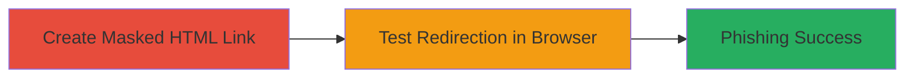

# URL Masking in Brave Browser for Phishing Redirection

Multi-stage attack chain demonstrating a complete attack workflow exploiting URL masking in the Brave browser to trick users into visiting malicious sites disguised as legitimate ones.

## Chain Metrics Dashboard

| Metric | Value |
|--------|-------|
| Chain Status | Unverified |
| Total Steps | 2 |
| Execution Time | ~2 minutes |
| Skill Level | Beginner |
| Complexity | Low |
| Impact Level | Medium |

## Attack Flow Visualization



## Prerequisites & Requirements

### Required Tools

- Text editor (e.g., Notepad++ or VS Code)
- Web browser (Brave on Windows)

### Target Environment

- Brave browser version based on Chromium/Muon 2.0.19
- Windows platform
- Local file access or web hosting for HTML file

### Initial Access Requirements

- No credentials required
- Local machine access
- Ability to host or open HTML files

## Detailed Attack Procedures

### Step 1: Create Masked HTML Link
procedure: [[procedures/Craft-URL-Masking-HTML]]

**Objective**: Craft an HTML file with a link that visually spoofs a legitimate URL in the browser status bar while redirecting to a malicious site.

**Instructions**: Use a text editor to create an HTML file named `click.html` with the following content, where the link text and title attribute trick the status bar into showing `google.com`, but the `href` points to a malicious domain like `datarift.blogspot.in`:

```html
<!DOCTYPE html>
<html>
<head><title>Spoof Test</title></head>
<body>
<a href="http://datarift.blogspot.in" onmouseover="window.status='http://google.com';return true" onmouseout="window.status=''">Click here for Google</a>
</body>
</html>
```

Save the file locally or upload it to a web server (e.g., http://hackies.in/click.html).

**Expected Output**: A valid HTML file ready for testing.

**Success Indicators**:
- HTML file created without syntax errors
- Link href is malicious domain, but title suggests legitimate site

### Step 2: Test Phishing Redirection
procedure: [[procedures/Test-Phishing-Redirection]]

**Objective**: Open the HTML file in Brave browser and verify the masking by hovering and clicking the link, confirming redirection to the malicious site despite the status bar display.

**Instructions**: Open the `click.html` file in Brave browser either locally (file:// path) or via hosted URL (e.g., http://hackies.in/click.html). Hover over the link to observe the status bar showing `http://google.com`, then click to confirm navigation to `datarift.blogspot.in`.

**Expected Output**: Browser status bar displays spoofed URL on hover; actual navigation redirects to malicious site.

**Success Indicators**:
- Status bar shows `google.com` on mouseover
- Click results in redirection to unintended malicious domain
- No warnings or blocks from browser

## Attack Chain Summary

### Key Achievements

1. Successful creation of spoofed HTML link exploiting browser status bar behavior
2. Demonstration of phishing potential by misleading users on link destination
3. Confirmation of vulnerability similar to other Chromium-based browsers like Chrome

## Technique & Tactic Coverage

### MITRE ATT&CK Techniques

- [[Phishing]] Phishing
- [[T1566.002]] Spearphishing Link

### MITRE ATT&CK Tactics

- [[Initial Access]] Initial Access

---
*Last updated: 2023-10-01T00:00:00Z*
