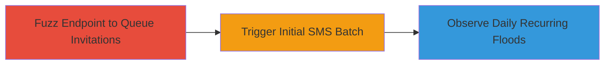

# Uber Driver Referral SMS Flooding via Unverified Invitations

Multi-stage attack chain demonstrating abuse of Uber's driver referral API to flood a target phone number with persistent SMS spam, exploiting lack of sender verification and inadequate rate limiting.

## Chain Metrics Dashboard

| Metric | Value |
|--------|-------|
| Chain Status | Unverified |
| Total Steps | 3 |
| Execution Time | ~5 minutes |
| Skill Level | Intermediate |
| Complexity | Medium |
| Impact Level | High |

## Attack Flow Visualization



## Prerequisites & Requirements

### Required Tools

- [[tools/OWASP-ZAP]]

### Target Environment

- Web platform with access to Uber's partners portal (https://partners.uber.com)
- No specific ports required; HTTP/HTTPS access
- Network access to send POST requests to the referral endpoint

### Initial Access Requirements

- Unverified or fake Uber partner account (no authentication bypass needed; system allows unverified users)
- Valid CSRF token from the referrals dashboard
- Target phone number in international format (e.g., +1XXXXXXXXXX)

## Detailed Attack Procedures

### Step 1: Queue SMS Invitations via Endpoint Fuzzing
procedure: [[procedures/Queue-SMS-Invitations-via-Endpoint-Fuzzing]]

**Objective**: Rapidly send multiple POST requests to the driver_invitations endpoint to queue a large number of SMS invitations for the target phone number, bypassing rate limits through fuzzing.

**Instructions**: Use OWASP ZAP to fuzz the endpoint with 10,000 requests containing the same target phone number in the JSON payload. Configure the fuzzer to vary minimal parameters while repeating the 'mobiles' array.

First, set up the request in ZAP and launch the fuzzer using [[commands/zap-fuzz-endpoint]]:

```bash
# In OWASP ZAP: Navigate to the Sites pane, right-click the /driver_invitations endpoint, select Attack > Fuzzer
# Payload: Repeat {"mobiles":["+████████"]} 10,000 times with fixed other fields
```

**Expected Output**: Successful HTTP 200 responses for each request, queuing invitations without immediate SMS send.

**Success Indicators**:
- 10,000 requests processed without errors
- No rate limiting blocks observed

### Step 2: Trigger Initial SMS Send
procedure: [[procedures/Trigger-Initial-SMS-Send]]

**Objective**: Exceed the soft rate limit threshold to initiate the first batch of SMS messages, which split into multiple parts due to message length.

**Instructions**: After fuzzing, send approximately 20 additional targeted requests to cross the threshold. Use [[commands/send-uber-invitation-post]] to simulate this manually if needed for verification.

```bash
curl -X POST https://partners.uber.com/driver_invitations \
  -H "Content-Type: application/json" \
  -H "X-Requested-With: XMLHttpRequest" \
  -H "Referer: https://partners.uber.com/referrals/" \
  -b "Cookie: XXXXXXXXXXXXXXXXXXXXXXXXXXXXXXXXXXXXXXXXXXXXXXXXXXXXXXXXXXXXXXXXXXXXXXXXXXXXXXXXXXXXXXXXXXXXXXXX" \
  -d '{"_csrf_token":"1464319290-01-TE_leQUArIag4-5PKfW4wUkBccZdc_thW8kqNBmFFu4=","emails":[],"mobiles":["+████████"],"source":"dashboard"}'
```

Repeat 20 times to trigger the send.

**Expected Output**: HTTP success response; initial SMS batch (60 messages due to splitting) sent to target.

**Success Indicators**:
- Target receives first flood of 60 SMS parts
- No immediate stop mechanism triggered

### Step 3: Observe Daily Recurring SMS Floods
procedure: [[procedures/Observe-Daily-Recurring-SMS-Floods]]

**Objective**: Monitor the system's daily retry mechanism, which re-sends queued undelivered messages, perpetuating the spam without user intervention.

**Instructions**: Wait for the next day (e.g., 9:30 AM IST) and observe the target phone for recurring batches. No active commands needed; the system automates retries. To stop, reply 'STOP' to an SMS or contact Uber support.

**Expected Output**: Daily 60 SMS floods starting the following day, continuing indefinitely.

**Success Indicators**:
- Persistent daily SMS spam observed
- Floods halt only on manual opt-out or support intervention

## Attack Chain Summary

### Key Achievements

1. Queued 10,000+ invitations without verification
2. Induced initial and recurring SMS floods for harassment
3. Demonstrated potential for legal/privacy violations via DND non-compliance

## Technique & Tactic Coverage

### MITRE ATT&CK Techniques

- [[Exploit Public-Facing Application]]

### MITRE ATT&CK Tactics

- [[Impact]]

---
*Last updated: 2023-10-01T00:00:00Z*
