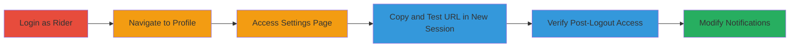

---
tags:
  - auth-bypass
  - web
  - uber
  - url-token
  - notification-settings
type: attack_chain
tools: []
tactics:
  - '[[Initial Access]]'
verified: false
platforms:
  - Web
submitted: true
complexity: low
created_at: '2023-10-01T00:00:00Z'
procedures:
  - '[[procedures/Log-in-to-Uber-as-Rider]]'
  - '[[procedures/Navigate-to-User-Profile]]'
  - '[[procedures/Access-Email-Subscription-Settings]]'
  - '[[procedures/Copy-and-Test-URL-in-New-Browser]]'
  - '[[procedures/Verify-Access-After-Logout]]'
step_count: 5
techniques:
  - '[[Valid Accounts]]'
updated_at: '2025-12-14T17:31:10.996Z'
description: >-
  Multi-stage attack demonstrating authentication bypass on Uber's notification
  settings page using a non-expiring URL token, allowing unauthorized
  modification of user preferences.
skill_level: beginner
impact_level: medium
id: 4ad481e8-06f4-4e45-8be5-b73343797cc0
validated: true
mitre_tactics:
  - '[[Initial Access]]'
mitre_techniques:
  - '[[Valid Accounts]]'
---
# Uber Notification Settings Authentication Bypass via Persistent URL Token

Multi-stage attack chain demonstrating a complete attack workflow exploiting improper authentication on Uber's email subscription settings page. The vulnerability stems from reliance on a long random token in the URL that does not expire after logout or password changes, enabling an attacker with the URL to modify victim notification preferences indefinitely.

## Chain Metrics Dashboard

| Metric | Value |
|--------|-------|
| Chain Status | Unverified |
| Total Steps | 5 |
| Execution Time | ~5 minutes |
| Skill Level | Beginner |
| Complexity | Low |
| Impact Level | Medium |

## Attack Flow Visualization

## Prerequisites & Requirements

### Required Tools

- Web browser (e.g., Chrome, Firefox)
- Incognito/private browsing mode

### Target Environment

- Uber web application
- Access to a rider account credentials
- No special services or ports required beyond standard HTTPS (443)

### Initial Access Requirements

- Valid Uber rider account credentials
- Direct network access to uber.com
- No prior compromise needed, but shared/compromised device increases URL acquisition risk

## Detailed Attack Procedures

### Step 1: Log in as Rider
procedure: [[procedures/Log-in-to-Uber-as-Rider]]

**Objective**: Gain authenticated access to the Uber web application as a rider user to reach protected pages.

**Instructions**: Open a web browser and navigate to the Uber login page. Enter valid rider credentials to authenticate.

**Expected Output**: Successful login, redirect to the user dashboard.

**Success Indicators**:
- User profile accessible
- Session cookies established

### Step 2: Navigate to User Profile
procedure: [[procedures/Navigate-to-User-Profile]]

**Objective**: Access the profile section containing links to sensitive settings like notifications.

**Instructions**: From the dashboard, click on the user avatar or profile icon in the top-right corner to open the profile menu.

**Expected Output**: Profile page loads with options for account settings.

**Success Indicators**:
- Profile menu visible
- Links to privacy and notification settings present

### Step 3: Access Email Subscription Settings
procedure: [[procedures/Access-Email-Subscription-Settings]]

**Objective**: Reach the notification settings page protected by the vulnerable URL token mechanism.

**Instructions**: In the profile menu, select "Privacy and sharing" or directly "Manage your email subscription settings" to load the page.

**Expected Output**: Notification preferences page displays with options to toggle email subscriptions.

**Success Indicators**:
- Page URL contains a long random token (e.g., uber.com/.../token=abc123...)
- Settings editable within the session

### Step 4: Copy and Test URL in New Browser
procedure: [[procedures/Copy-and-Test-URL-in-New-Browser]]

**Objective**: Extract the URL token and verify it grants access without authentication in a fresh session.

**Instructions**: Copy the full URL from the address bar. Open an incognito window or different browser, paste the URL, and load it. Interact with settings to confirm editability.

**Expected Output**: Page loads fully, allowing changes to notification toggles without login prompt.

**Success Indicators**:
- No authentication required
- Changes can be saved

### Step 5: Verify Access After Logout
procedure: [[procedures/Verify-Access-After-Logout]]

**Objective**: Confirm the token's persistence even after session termination or account changes.

**Instructions**: Log out from the original session. Optionally change the account password. Reload the copied URL in the new browser and attempt to modify settings again.

**Expected Output**: Page remains accessible and functional post-logout.

**Success Indicators**:
- Settings modifiable without re-authentication
- Token validity unaffected by logout or password reset

## Attack Chain Summary

### Key Achievements

1. Bypassed authentication using a persistent URL token
2. Demonstrated indefinite access to sensitive user settings
3. Highlighted risks from URL sharing on compromised devices

## Technique & Tactic Coverage

### MITRE ATT&CK Techniques

- [[Valid Accounts]]

### MITRE ATT&CK Tactics

- [[Initial Access]]

---
*Last updated: 2023-10-01T00:00:00Z*
