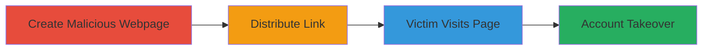

---
tags:
  - csrf
  - account-takeover
  - web
  - django
type: attack_chain
tools: []
tactics:
  - '[[Initial Access]]'
  - '[[Impact]]'
verified: false
platforms:
  - Web
submitted: true
complexity: medium
created_at: '2023-10-01T00:00:00Z'
procedures:
  - '[[procedures/Create-Malicious-CSRF-Webpage]]'
  - '[[procedures/Distribute-CSRF-Exploit-Link]]'
  - '[[procedures/Trigger-CSRF-Account-Takeover]]'
step_count: 3
techniques:
  - '[[Drive-by Compromise]]'
  - '[[Exploit Public-Facing Application]]'
updated_at: '2025-12-14T17:27:30.078Z'
description: >-
  A multi-stage attack exploiting a CSRF vulnerability in the Django RESTful API
  on account.ubnt.com to achieve full account takeover across Ubiquiti's
  ecosystem.
skill_level: intermediate
impact_level: high
id: 5778839e-f7f2-4a4f-8c02-96e51d4bc484
validated: true
mitre_tactics:
  - '[[Initial Access]]'
  - '[[Impact]]'
mitre_techniques:
  - '[[Drive-by Compromise]]'
  - '[[Exploit Public-Facing Application]]'
---
# Ubiquiti Account Takeover via CSRF Exploitation

Multi-stage attack chain demonstrating a complete attack workflow exploiting CSRF in Ubiquiti's account management API.

## Chain Metrics Dashboard

| Metric | Value |
|--------|-------|
| Chain Status | Unverified |
| Total Steps | 3 |
| Execution Time | ~5 minutes |
| Skill Level | Intermediate |
| Complexity | Medium |
| Impact Level | High |

## Attack Flow Visualization

## Prerequisites & Requirements

### Required Tools

- None (uses basic HTML and browser)

### Target Environment

- Web platform
- Django RESTful API on account.ubnt.com
- No specific ports; standard HTTPS (443)

### Initial Access Requirements

- Victim must be authenticated (logged in) to account.ubnt.com in their browser session
- Attacker needs a way to lure the victim (e.g., phishing email or social engineering)
- No prior access to victim's account required

## Detailed Attack Procedures

### Step 1: Create Malicious Webpage
procedure: [[procedures/Create-Malicious-CSRF-Webpage]]

**Objective**: Develop an HTML page that automatically submits forged POST requests to the vulnerable API endpoints to change the victim's password and user details.

**Instructions**: Create an HTML file named `exploit_csrf_poc.html` with a form or JavaScript that targets the Django API endpoints for password and user info changes. The form should auto-submit without user interaction, exploiting the lack of CSRF tokens.

**Expected Output**: A functional HTML file ready for hosting or distribution.

**Success Indicators**:
- HTML file loads without errors
- Form submission targets correct API endpoints (e.g., `/api/change-password/` and `/api/update-user/`)

### Step 2: Distribute Malicious Link
procedure: [[procedures/Distribute-CSRF-Exploit-Link]]

**Objective**: Deliver the malicious webpage to the victim via a link, ensuring they visit it while logged into account.ubnt.com.

**Instructions**: Host the HTML file on a server or use a file-sharing method, then send the link to the victim through email, messaging, or social engineering tactics. Ensure the link appears legitimate to encourage clicking.

**Expected Output**: Victim receives and clicks the link.

**Success Indicators**:
- Link is accessible and loads the malicious page
- Victim is confirmed to be logged in (via social engineering or observation)

### Step 3: Trigger Unauthorized Actions
procedure: [[procedures/Trigger-CSRF-Account-Takeover]]

**Objective**: When the victim visits the page, execute the forged requests to takeover the account by changing password and details.

**Instructions**: Upon page load, the embedded form or script submits POST requests to the API, altering the victim's password, name, and email. Monitor for success by attempting login with the new credentials.

**Expected Output**: Victim's account details updated; attacker gains access using new password.

**Success Indicators**:
- API requests succeed without CSRF token validation
- Attacker logs into account.ubnt.com and linked services (e.g., community.ubnt.com, store.ubnt.com)
- Full ecosystem takeover confirmed

## Attack Chain Summary

### Key Achievements

1. Bypassed CSRF protections in Django API for unauthorized state changes
2. Achieved complete account takeover without direct credential theft
3. Impacted multiple Ubiquiti services due to shared authentication

## Technique & Tactic Coverage

### MITRE ATT&CK Techniques

- [[Drive-by Compromise]]
- [[Exploit Public-Facing Application]]

### MITRE ATT&CK Tactics

- [[Initial Access]]
- [[Impact]]

---
*Last updated: 2023-10-01T00:00:00Z*
