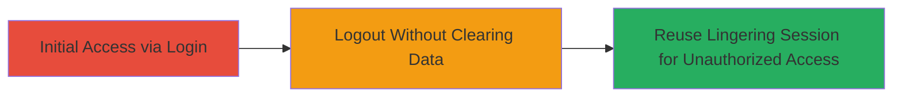

# Udemy Improper Authentication Clearance Leading to Unauthorized Session Access

Multi-stage attack chain demonstrating a complete attack workflow exploiting authentication persistence after logout on Udemy's platform.

## Chain Metrics Dashboard

| Metric | Value |
|--------|-------|
| Chain Status | Unverified |
| Total Steps | 1 |
| Execution Time | ~5 minutes |
| Skill Level | Beginner |
| Complexity | Low |
| Impact Level | High |

## Attack Flow Visualization



## Prerequisites & Requirements

### Required Tools

- Browser developer tools or proxy like Burp Suite for session inspection

### Target Environment

- Udemy web application
- Active user account for initial login
- Network access to https://www.udemy.com

### Initial Access Requirements

- Valid credentials for target account
- Direct internet access to the platform
- No prior session hijacking needed, but shared environment (e.g., public computer) increases risk

## Detailed Attack Procedures

### Step 1: Exploit Persistent Authentication After Logout
procedure: [[procedures/Exploit-Persistent-Authentication-Tokens-After-Logout]]

**Objective**: Gain unauthorized access to a user's account by reusing authentication tokens that persist after logout.

**Instructions**: Log in to the Udemy account using valid credentials. Perform a logout action, but inspect the session cookies or tokens (e.g., via browser dev tools or [[commands/curl-session-test]]). Attempt to access protected resources like user profile or course data using the uncleared token without re-authenticating.

For example, capture the session cookie during login:

```bash
curl -c cookies.txt -d "email=user@example.com&password=pass" https://www.udemy.com/login/
```

Then simulate logout:

```bash
curl -b cookies.txt -X POST https://www.udemy.com/logout/
```

Reuse the cookie to access a protected endpoint:

```bash
curl -b cookies.txt https://www.udemy.com/user/profile/
```

**Expected Output**: Successful access to user data without prompting for login, indicating persistent authentication.

**Success Indicators**:
- Response contains user-specific data (e.g., profile info, enrolled courses)
- No 401/403 authentication error
- Token remains valid post-logout

## Attack Chain Summary

### Key Achievements

1. Bypassed logout mechanism to maintain session validity
2. Accessed sensitive user information without re-authentication
3. Demonstrated risk of account takeover in shared or compromised environments

## Technique & Tactic Coverage

### MITRE ATT&CK Techniques

- [[Valid Accounts]] Valid Accounts
- [[Unsecured Credentials]] Unsecured Credentials

### MITRE ATT&CK Tactics

- [[Initial Access]] Initial Access

---
*Last updated: 2023-10-01T00:00:00Z*
