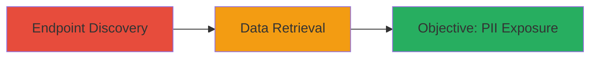

---
tags:
  - unauthenticated-access
  - information-disclosure
  - api
  - pii
type: attack_chain
tools: []
tactics:
  - '[[Initial Access]]'
  - '[[Collection]]'
verified: false
platforms:
  - Web
  - API
submitted: true
complexity: low
created_at: '2023-10-01T00:00:00Z'
procedures:
  - '[[procedures/Discover-and-Access-Unauthenticated-API-Endpoint]]'
step_count: 1
techniques:
  - '[[Exploit Public-Facing Application]]'
updated_at: '2025-12-14T17:32:48.430Z'
description: >-
  Attack chain demonstrating discovery and exploitation of an unauthenticated
  API endpoint exposing employee personally identifiable information (PII)
  related to work scheduling in the Starbucks China system.
skill_level: beginner
impact_level: high
id: aaecc199-edd9-4521-9c91-3d615d0f6f35
validated: true
mitre_tactics:
  - '[[Initial Access]]'
  - '[[Collection]]'
mitre_techniques:
  - '[[Exploit Public-Facing Application]]'
---
# Unauthenticated API Access to Employee PII in Starbucks China Scheduling System

Multi-stage attack chain demonstrating a complete attack workflow.

## Chain Metrics Dashboard

| Metric | Value |
|--------|-------|
| Chain Status | Unverified |
| Total Steps | 1 |
| Execution Time | ~5 minutes |
| Skill Level | Beginner |
| Complexity | Low |
| Impact Level | High |

## Attack Flow Visualization



## Prerequisites & Requirements

### Required Tools

- None (uses standard HTTP client like curl or browser)

### Target Environment

- Web-based API endpoint
- No specific ports required (standard HTTPS/80 or 443)
- Public internet access to the target domain

### Initial Access Requirements

- No credentials required
- Direct network access to the public-facing API
- No prior access needed

## Detailed Attack Procedures

### Step 1: Endpoint Discovery and Exploitation
procedure: [[procedures/Discover-and-Access-Unauthenticated-API-Endpoint]]

**Objective**: Identify and access an unauthenticated API endpoint to retrieve sensitive employee PII, such as work leave dates.

**Instructions**: Begin by exploring the target's API endpoints using a browser developer tools or an HTTP client. Send a request to suspected scheduling-related paths without authentication headers. Use [[commands/curl-retrieve-api-data]] to test the endpoint:

```bash
curl -X GET "https://api.example-starbucks-china.com/scheduling/leave?employee_id=123" -H "User-Agent: Mozilla/5.0"
```

If the endpoint responds with data, it confirms the lack of authentication. Parse the response for PII details like employee names, IDs, and leave dates.

**Expected Output**: JSON response containing employee scheduling data, e.g., {"employee_id": "123", "leave_dates": ["2023-10-15", "2023-10-16"], "name": "John Doe"}.

**Success Indicators**:
- HTTP 200 response without authentication prompt
- Retrieval of PII data in the response body
- No error messages related to access denial

## Attack Chain Summary

### Key Achievements

1. Discovered unauthenticated API endpoint through endpoint exploration
2. Retrieved sensitive employee PII including work leave dates
3. Demonstrated critical information disclosure impacting employee privacy

## Technique & Tactic Coverage

### MITRE ATT&CK Techniques

- [[Exploit Public-Facing Application]]

### MITRE ATT&CK Tactics

- [[Initial Access]]
- [[Collection]]

---
*Last updated: 2023-10-01T00:00:00Z*
