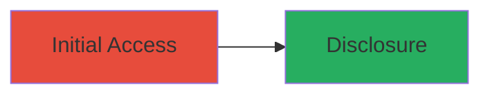

# Unauthenticated Access Control Bypass in WordPress 4.9.40 Leading to Private Post Disclosure

Multi-stage attack chain demonstrating a complete attack workflow.

## Chain Metrics Dashboard

| Metric | Value |
|--------|-------|
| Chain Status | Unverified |
| Total Steps | 1 |
| Execution Time | ~1 minutes |
| Skill Level | Beginner |
| Complexity | Low |
| Impact Level | Low |

## Attack Flow Visualization



## Prerequisites & Requirements

### Required Tools

- None required (uses standard HTTP requests)

### Target Environment

- Target OS/Platform: Web
- Required services/ports: HTTP/HTTPS on port 80/443
- Network access requirements: Direct internet access to the target WordPress site

### Initial Access Requirements

- Credential requirements: None (unauthenticated)
- Network position: External attacker
- Prior access needed: None

## Detailed Attack Procedures

### Step 1: Exploit Access Bypass
procedure: [[procedures/Exploit-WordPress-Private-Post-Access-Bypass]]

**Objective**: Bypass authentication to access and disclose private WordPress posts.

**Instructions**: Identify a private post ID (e.g., via enumeration or known IDs) and directly request the post URL using [[commands/curl-access-private-post]]:

```bash
curl -s "https://target.com/?p=123" | grep -i "private content"
```

Verify the response contains private post data without requiring login.

**Expected Output**: HTML response including the full content of the private post.

**Success Indicators**:
- Unauthorized access to post content
- No redirect to login page
- Disclosure of sensitive private information

## Attack Chain Summary

### Key Achievements

1. Successful unauthenticated access to private posts
2. Disclosure of potentially sensitive content
3. Demonstration of authorization flaw in outdated WordPress

## Technique & Tactic Coverage

### MITRE ATT&CK Techniques

- [[Exploit Public-Facing Application]]

### MITRE ATT&CK Tactics

- [[Initial Access]]

---
*Last updated: 2023-10-01T12:00:00Z*
