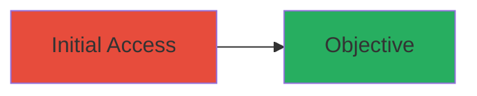

# Unauthenticated Access to Exposed Shopify Admin Panel

Multi-stage attack chain demonstrating a complete attack workflow.

## Chain Metrics Dashboard

| Metric | Value |
|--------|-------|
| Chain Status | Unverified |
| Total Steps | 1 |
| Execution Time | ~1 minute |
| Skill Level | Beginner |
| Complexity | Low |
| Impact Level | Low |

## Attack Flow Visualization



## Prerequisites & Requirements

### Required Tools

- Web browser or [[commands/curl-access-admin]]

### Target Environment

- Web platform
- Accessible URL: https://plus-website.shopifycloud.com/admin.php?_page=1
- No special services or ports required beyond standard HTTP/HTTPS

### Initial Access Requirements

- Public network access to the target URL
- No credentials needed
- No prior access required

## Detailed Attack Procedures

### Step 1: Access Admin Panel Without Authentication
procedure: [[procedures/Access-Exposed-Admin-Panel-Without-Authentication]]

**Objective**: Gain unauthenticated read access to the admin interface and view limited partner profile information.

**Instructions**: Navigate directly to the exposed admin panel URL using a web browser or curl. This bypasses authentication checks for viewing the interface.

Use [[commands/curl-access-admin]] to fetch the page:

```bash
curl -i 'https://plus-website.shopifycloud.com/admin.php?_page=1'
```

Alternatively, open the URL in a browser to render the admin interface.

**Expected Output**: HTTP response rendering the admin panel, displaying partner profile details on the root page without login prompts.

**Success Indicators**:
- Admin interface loads without authentication redirect
- Partner profile information visible (e.g., names, basic details)
- Attempts to interact (e.g., edit) redirect to login, confirming read-only access

## Attack Chain Summary

### Key Achievements

1. Successful unauthenticated access to admin panel
2. Exposure of sensitive partner profile data
3. Confirmation of low-impact read-only vulnerability

## Technique & Tactic Coverage

### MITRE ATT&CK Techniques

- [[Exploit Public-Facing Application]]

### MITRE ATT&CK Tactics

- [[Initial Access]]

---
*Last updated: 2023-10-01T00:00:00Z*
