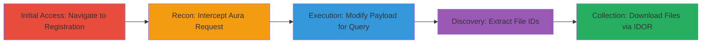

# Unauthenticated Access to Sensitive Salesforce Files via BAC and IDOR

Multi-stage attack chain demonstrating exploitation of improper access controls in a Salesforce Experience Cloud instance to unauthenticatedly access and download sensitive candidate files like resumes and transcripts containing PII.

## Chain Metrics Dashboard

| Metric | Value |
|--------|-------|
| Chain Status | Unverified |
| Total Steps | 5 |
| Execution Time | ~10 minutes |
| Skill Level | Intermediate |
| Complexity | Medium |
| Impact Level | High |

## Attack Flow Visualization

## Prerequisites & Requirements

### Required Tools

- [[tools/Burp-Suite]]

### Target Environment

- Salesforce Experience Cloud/Community site
- Web browser for initial navigation
- No authentication required
- Network access to the public-facing Salesforce instance

### Initial Access Requirements

- No credentials needed (unauthenticated attack)
- Direct internet access to the target URL
- No prior access required

## Detailed Attack Procedures

### Step 1: Access Registration Page
procedure: [[procedures/Access-Salesforce-Registration-Page]]

**Objective**: Load the registration page to trigger the initial Aura framework requests without authentication.

**Instructions**: Open a web browser and navigate to the target's registration endpoint. This loads the page and initiates relevant Salesforce Aura requests that can be intercepted.

**Expected Output**: The registration page loads, and network requests to /aura endpoint are observable in browser dev tools or proxy.

**Success Indicators**:
- Page loads successfully without login prompt
- POST requests to /s/sfsites/aura are initiated

### Step 2: Intercept Aura Request with Burp Suite
procedure: [[procedures/Intercept-Modify-Aura-Request-Burp]]

**Objective**: Capture the legitimate POST request to the Aura endpoint for modification.

**Instructions**: Configure Burp Suite as a proxy for your browser. Navigate to the registration page again if needed, and intercept the POST request to /s/sfsites/aura?r=1&aura.ApexAction.execute=1, which invokes RegistrationCtrl.getFileUploadRecord. Forward it to Repeater for analysis and modification.

**Expected Output**: Intercepted request visible in Burp Repeater, including headers (e.g., Cookie, User-Agent) and the message payload with Aura actions.

**Success Indicators**:
- Request captured without errors
- Payload shows original Aura action for file upload record retrieval

### Step 3: Modify Payload to Query ContentDocument Records
procedure: [[procedures/Query-ContentDocument-Records-Aura]]

**Objective**: Craft a malicious Aura payload to unauthenticatedly query up to 2000 ContentDocument records, bypassing access controls.

**Instructions**: In Burp Repeater, alter the 'message' parameter in the POST body to invoke 'serviceComponent://ui.force.components.controllers.lists.selectableListDataProvider.SelectableListDataProviderController/ACTION$getItems' with parameters: entityNameOrId set to 'ContentDocument', pageSize: 2000, currentPage: 0. Remove or spoof any authentication tokens if present, then send the modified request.

**Expected Output**: Server responds with JSON containing an array of ContentDocument records, including file IDs and metadata.

**Success Indicators**:
- Response includes file records without authentication errors
- Up to 2000 records returned, indicating mass enumeration

### Step 4: Extract ContentDocument ID from Response
procedure: [[procedures/Extract-ContentDocument-ID-Response]]

**Objective**: Parse the query response to obtain specific file IDs for targeted downloads.

**Instructions**: Review the JSON response from the modified Aura query. Locate the 'items' array and extract a ContentDocument ID, such as '069830000028KJdAAM', which represents a file upload record.

**Expected Output**: Valid 18-character Salesforce ID extracted from the response JSON.

**Success Indicators**:
- ID format matches Salesforce standard (e.g., starts with 069 for ContentDocument)
- No access denied errors in response

### Step 5: Download File Using Extracted ID
procedure: [[procedures/Download-File-Using-IDOR]]

**Objective**: Use the IDOR vulnerability to directly download the sensitive file without authentication.

**Instructions**: Construct the download URL using the extracted ID: https://[instance].experience.[domain]/sfsites/c/sfc/servlet.shepherd/document/download/[ID]. Access this URL in a browser or via a tool like curl to retrieve the file (e.g., candidate resume). Repeat for other IDs to download multiple files.

**Expected Output**: Binary file download (e.g., PDF resume) containing PII.

**Success Indicators**:
- File downloads successfully without login
- Content reveals sensitive data like names, contact info, transcripts

## Attack Chain Summary

### Key Achievements

1. Bypassed authentication to query thousands of ContentDocument records via misconfigured Aura endpoint.
2. Exploited IDOR to directly download PII-laden files without validation.
3. Demonstrated large-scale data breach potential in Salesforce Experience Cloud.

## Technique & Tactic Coverage

### MITRE ATT&CK Techniques

- [[Exploit Public-Facing Application]] Exploit Public-Facing Application
- [[Valid Accounts]] Valid Accounts

### MITRE ATT&CK Tactics

- [[Initial Access]] Initial Access
- [[Collection]] Collection

---

*Last updated: 2023-10-01T00:00:00Z*
