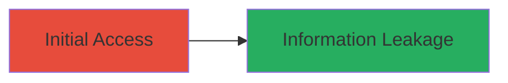

---
tags:
  - authentication-bypass
  - information-disclosure
  - web
type: attack_chain
tools:
  - '[[tools/curl]]'
tactics:
  - '[[Initial Access]]'
commands:
  - '[[commands/curl-fetch-exposed-file]]'
platforms:
  - Web
complexity: low
procedures:
  - '[[procedures/Access-Exposed-JavaScript-File-Without-Authentication]]'
step_count: 1
techniques:
  - '[[Exploit Public-Facing Application]]'
description: >-
  Exploiting improper authentication on Uber's staging server to access
  sensitive configuration and source code files without SSO login
skill_level: beginner
impact_level: medium
id: a6da0e20-f25b-48d6-8101-db2b42caf622
created_at: '2025-12-13T01:28:49.195Z'
updated_at: '2025-12-13T01:28:49.195Z'
verified: false
validated: true
submitted: true
mitre_tactics:
  - '[[Initial Access]]'
mitre_techniques:
  - '[[Exploit Public-Facing Application]]'
---
# Unauthenticated Access to Uber Internal Configuration Files

Multi-stage attack chain demonstrating a complete attack workflow.

## Chain Metrics Dashboard

| Metric | Value |
|--------|-------|
| Chain Status | Unverified |
| Total Steps | 1 |
| Execution Time | ~1 minutes |
| Skill Level | Beginner |
| Complexity | Low |
| Impact Level | Medium |

## Attack Flow Visualization



## Prerequisites & Requirements

### Required Tools

- [[tools/curl]]

### Target Environment

- Target OS/Platform: Web
- Required services/ports: HTTPS on uchat-staging.uberinternal.com
- Network access requirements: Public internet access to the target URL

### Initial Access Requirements

- Credential requirements: None
- Network position: External
- Prior access needed: None

## Detailed Attack Procedures

### Step 1: Access Exposed JavaScript File
procedure: [[procedures/Access-Exposed-JavaScript-File-Without-Authentication]]

**Objective**: Directly access the publicly exposed JavaScript file to leak internal configuration and source code due to missing authentication enforcement.

**Instructions**: Use [[commands/curl-fetch-exposed-file]] to retrieve the file contents:

```bash
curl https://uchat-staging.uberinternal.com/static/main.740f5a0b92c00e72e2e1.js
```

**Expected Output**: The contents of the JavaScript file, including sensitive configuration details and source code.

**Success Indicators**:
- File contents are downloaded without authentication prompt
- Internal system names and configurations are visible in the output

## Attack Chain Summary

### Key Achievements

1. Gained unauthenticated access to internal files
2. Leaked configuration and source code
3. Demonstrated server misconfiguration impact

## Technique & Tactic Coverage

### MITRE ATT&CK Techniques

- [[Exploit Public-Facing Application]]

### MITRE ATT&CK Tactics

- [[Initial Access]]

*Last updated: [TIMESTAMP]*
