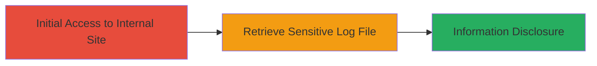

---
tags:
  - information-disclosure
  - auth-bypass
  - oracle
  - web
type: attack_chain
tools: []
tactics:
  - '[[Initial Access]]'
  - '[[Discovery]]'
commands: []
verified: false
platforms:
  - Web
submitted: true
complexity: low
created_at: '2023-10-01T00:00:00Z'
procedures:
  - '[[procedures/Access-Internal-Site-Without-Authentication]]'
  - '[[procedures/Retrieve-SQLNet-Log-File]]'
step_count: 2
techniques:
  - '[[Exploit Public-Facing Application]]'
  - '[[File and Directory Discovery]]'
updated_at: '2025-12-14T17:26:21.953Z'
description: >-
  A multi-step attack exploiting missing authentication on Uber's internal lab
  site to access and disclose sensitive network details from a SQLNet log file.
skill_level: beginner
impact_level: high
id: 91dcb1e7-6b42-491e-83ff-b1a8d34b5a4b
validated: true
mitre_tactics:
  - '[[Initial Access]]'
  - '[[Discovery]]'
mitre_techniques:
  - '[[Exploit Public-Facing Application]]'
  - '[[File and Directory Discovery]]'
---
# Unauthenticated Access to Uber Internal Pages Disclosing Sensitive SQLNet Log Information

Multi-stage attack chain demonstrating a complete attack workflow exploiting broken access controls on an internal web application to disclose sensitive internal network information.

## Chain Metrics Dashboard

| Metric | Value |
|--------|-------|
| Chain Status | Unverified |
| Total Steps | 2 |
| Execution Time | ~1 minutes |
| Skill Level | Beginner |
| Complexity | Low |
| Impact Level | High |

## Attack Flow Visualization



## Prerequisites & Requirements

### Required Tools

- None (browser or basic HTTP client sufficient)

### Target Environment

- Web platform
- Oracle database services
- Internal network exposure via public-facing misconfiguration

### Initial Access Requirements

- No credentials required
- Public internet access to the target URL
- No prior access needed

## Detailed Attack Procedures

### Step 1: Initial Access
procedure: [[procedures/Access-Internal-Site-Without-Authentication]]

**Objective**: Gain unauthorized entry to the internal site intended for authenticated users only, bypassing authentication enforcement.

**Instructions**: Open a web browser or use a tool like curl to navigate to the target site https://lab.usuppliers.uber.com without providing any credentials. The site should load internal pages directly due to the lack of authentication checks.

For verification using curl:

```bash
curl -i https://lab.usuppliers.uber.com
```

**Expected Output**: HTTP 200 response with the site's internal content, confirming unauthenticated access.

**Success Indicators**:
- Site loads without prompting for login
- Internal pages are visible

### Step 2: Execution
procedure: [[procedures/Retrieve-SQLNet-Log-File]]

**Objective**: Access and extract sensitive information from the publicly exposed SQLNet log file, revealing internal network details.

**Instructions**: From the accessed site, navigate to the specific log file path /OA_HTML/bin/sqlnet.log. Use a browser to directly visit https://lab.usuppliers.uber.com/OA_HTML/bin/sqlnet.log or curl for retrieval.

```bash
curl https://lab.usuppliers.uber.com/OA_HTML/bin/sqlnet.log
```

Review the contents for disclosed data such as IP addresses, hostnames, and usernames.

**Expected Output**: Raw log file content containing sensitive internal Uber information, including IP addresses (e.g., 10.x.x.x ranges), hostnames, and at least one internal username.

**Success Indicators**:
- Log file downloads or displays without errors
- Sensitive data like IPs and usernames visible in the output

## Attack Chain Summary

### Key Achievements

1. Bypassed authentication on an internal Uber lab site
2. Accessed a sensitive SQLNet log file publicly
3. Disclosed internal network details including IPs, hostnames, and a username

## Technique & Tactic Coverage

### MITRE ATT&CK Techniques

- [[Exploit Public-Facing Application]]
- [[File and Directory Discovery]]

### MITRE ATT&CK Tactics

- [[Initial Access]]
- [[Discovery]]

---
*Last updated: 2023-10-01T00:00:00Z*
