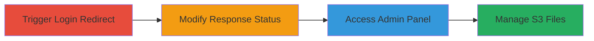

---
tags:
  - ear
  - auth-bypass
  - s3-upload
  - improper-access-control
type: attack_chain
tools:
  - '[[tools/Burp-Suite]]'
tactics:
  - '[[Initial Access]]'
verified: false
platforms:
  - Web
  - AWS
submitted: true
complexity: medium
created_at: '2023-10-01T00:00:00Z'
procedures:
  - '[[procedures/Trigger-Authentication-Redirect]]'
  - '[[procedures/Modify-Redirect-Response-with-Burp-Suite]]'
  - '[[procedures/Exploit-Admin-Panel-for-S3-File-Management]]'
step_count: 3
techniques:
  - '[[Exploit Public-Facing Application]]'
updated_at: '2025-12-14T17:30:18.080Z'
description: >-
  This attack chain exploits an Execution after Redirect (EAR) vulnerability in
  the authentication mechanism to gain unauthenticated access to the admin
  panel, enabling full management of S3-stored files including upload,
  modification, and deletion.
skill_level: intermediate
impact_level: high
id: 3ff9cefc-cd3d-4333-bb2f-189469dc0ebf
validated: true
mitre_tactics:
  - '[[Initial Access]]'
mitre_techniques:
  - '[[Exploit Public-Facing Application]]'
---
# Unauthenticated Admin Access via Execution after Redirect to Manage S3 Files

Multi-stage attack chain demonstrating a complete attack workflow exploiting an EAR vulnerability to bypass authentication and manage sensitive S3 files.

## Chain Metrics Dashboard

| Metric | Value |
|--------|-------|
| Chain Status | Unverified |
| Total Steps | 3 |
| Execution Time | ~5 minutes |
| Skill Level | Intermediate |
| Complexity | Medium |
| Impact Level | High |

## Attack Flow Visualization

## Prerequisites & Requirements

### Required Tools

- [[tools/Burp-Suite]]

### Target Environment

- Web application using PHP backend
- AWS S3 for file storage
- Exposed admin endpoints over HTTPS
- No specific ports required beyond standard 443

### Initial Access Requirements

- Network access to the target web application (e.g., https://target.com)
- No credentials needed
- Proxy setup for traffic interception (e.g., Burp Suite)

## Detailed Attack Procedures

### Step 1: Trigger Authentication Redirect
procedure: [[procedures/Trigger-Authentication-Redirect]]

**Objective**: Initiate the login process to trigger the vulnerable redirect response containing the admin panel HTML.

**Instructions**: Navigate to the main application page and interact with the login entry point to generate the redirect.

**Expected Output**: A 302 redirect response that includes the full admin panel HTML in the body.

**Success Indicators**:
- HTTP POST request sent to authentication endpoint
- Redirect chain observed (e.g., to admin panel URL)

### Step 2: Modify Redirect Response with Burp Suite
procedure: [[procedures/Modify-Redirect-Response-with-Burp-Suite]]

**Objective**: Intercept the redirect and alter the status code to reveal and access the protected admin panel content.

**Instructions**: Configure Burp Suite as a proxy, intercept the response, and change the status from 302 to 200 OK to load the admin HTML.

**Expected Output**: Full admin panel HTML rendered in the browser, exposing links to upload, verify, add, and delete functions.

**Success Indicators**:
- Status code successfully modified
- Admin panel elements visible (e.g., file management links)

### Step 3: Exploit Admin Panel for S3 File Management
procedure: [[procedures/Exploit-Admin-Panel-for-S3-File-Management]]

**Objective**: Use the exposed admin functions to perform unauthorized operations on S3 files, such as uploading arbitrary content.

**Instructions**: Navigate to admin endpoints like s3html.php and submit file upload requests without authentication.

**Expected Output**: Successful upload confirmation with S3 object URL.

**Success Indicators**:
- File uploaded to S3 without session cookies
- Response includes S3 storage details

## Attack Chain Summary

### Key Achievements

1. Bypassed authentication via EAR manipulation
2. Gained full unauthenticated access to admin panel
3. Enabled arbitrary S3 file operations, risking data compromise

## Technique & Tactic Coverage

### MITRE ATT&CK Techniques

- [[Exploit Public-Facing Application]]

### MITRE ATT&CK Tactics

- [[Initial Access]]

---

*Last updated: 2023-10-01T00:00:00Z*
