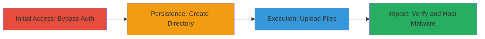

# Unauthenticated Arbitrary File Upload in FileCloud via Public Mode Bypass

## Overview

This attack chain demonstrates a vulnerability in a FileCloud-based web application where improper access control allows unauthenticated users to access a file management endpoint using a 'public' mode parameter and a specific hash fragment. By navigating to a manipulated URL, attackers can bypass authentication, create directories, and upload arbitrary files, including executables. This enables hosting malware or conducting social engineering attacks leveraging the trusted .mil domain. A partial remediation later blocked uploads but preserved read access, allowing continued public file retrieval.

## Chain Metrics Dashboard

| Metric | Value |
|--------|-------|
| Chain Status | Unverified |
| Total Steps | 4 |
| Execution Time | ~5 minutes |
| Skill Level | Beginner |
| Complexity | Low |
| Impact Level | High |

## Attack Flow Visualization

## Prerequisites & Requirements

### Required Tools

- Web browser (e.g., Chrome, Firefox)

### Target Environment

- FileCloud web application
- Accessible via HTTPS on port 443
- Shared directory endpoint exposed

### Initial Access Requirements

- No credentials required
- Direct network access to the target URL (e.g., https://target.mil)
- No prior access needed

## Detailed Attack Procedures

### Step 1: Access Vulnerable Endpoint
procedure: [[procedures/Access-FileCloud-Public-Mode-Endpoint]]

**Objective**: Bypass authentication to access the file management interface in public mode.

**Instructions**: Open a web browser and navigate to the manipulated URL targeting the shared directory.

**Expected Output**: The FileCloud UI loads without prompting for login, displaying the shared folder contents.

**Success Indicators**:
- UI accessible without authentication
- Shared directory (e.g., /SHARED/rpchllmd/CSAT) visible

### Step 2: Create Subdirectory
procedure: [[procedures/Create-Subdirectory-in-Shared-Folder]]

**Objective**: Establish persistence by creating a new directory for file storage without authentication.

**Instructions**: In the FileCloud file explorer UI, use the 'New Folder' option to create a subdirectory within the shared path.

**Expected Output**: New folder appears in the UI and is immediately usable.

**Success Indicators**:
- Directory creation succeeds without errors
- Folder listed in the shared directory

### Step 3: Upload Arbitrary Files
procedure: [[procedures/Upload-Arbitrary-Files-to-FileCloud]]

**Objective**: Upload files, including potentially malicious executables, to the server.

**Instructions**: Use the UI upload feature to select and upload test files like images (.jpg) or executables (.exe, e.g., putty.exe) to the new subdirectory.

**Expected Output**: Files upload successfully and appear in the directory listing.

**Success Indicators**:
- Upload completes without validation errors
- Files visible in UI post-upload

### Step 4: Verify Public Access
procedure: [[procedures/Verify-Public-Access-to-Uploaded-Files]]

**Objective**: Confirm that uploaded files are publicly accessible and hosted on the trusted domain.

**Instructions**: Navigate to the direct URL of an uploaded file or refresh the directory to check accessibility without authentication. Note any post-remediation behavior where uploads fail but reads persist.

**Expected Output**: Files downloadable via direct links on the .mil domain.

**Success Indicators**:
- Files accessible without login
- Direct links functional for download

## Attack Chain Summary

### Key Achievements

1. Bypassed authentication to access file management
2. Created directories and uploaded arbitrary files including executables
3. Hosted content publicly on a trusted .mil domain for potential malware distribution or social engineering
4. Demonstrated partial remediation impact, retaining read access

## Technique & Tactic Coverage

### MITRE ATT&CK Techniques

- [[Exploit Public-Facing Application]] Exploit Public-Facing Application
- [[Remote File Copy]] Ingress Tool Transfer

### MITRE ATT&CK Tactics

- [[Initial Access]] Initial Access
- [[Execution]] Execution

---
*Last updated: 2023-10-01T00:00:00Z*
