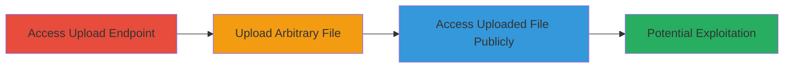

# Unauthenticated Arbitrary File Upload on DoD Website Enabling Public File Access and Potential RCE

Multi-stage attack chain demonstrating exploitation of an unsafe file upload endpoint on a U.S. Department of Defense website, allowing unauthenticated users to upload and publicly access arbitrary files, which can lead to stored XSS, hosting malicious content, or remote code execution via uploaded scripts.

## Chain Metrics Dashboard

| Metric | Value |
|--------|-------|
| Chain Status | Unverified |
| Total Steps | 3 |
| Execution Time | ~2 minutes |
| Skill Level | Beginner |
| Complexity | Low |
| Impact Level | High |

## Attack Flow Visualization



## Prerequisites & Requirements

### Required Tools

- Web browser (e.g., Firefox or Chrome)
- Optional: [[tools/curl]] for scripted uploads

### Target Environment

- Web platform with PHP backend
- Exposed upload endpoint at /upload.php
- No authentication required

### Initial Access Requirements

- Public internet access to the target URL (https://█████████/upload.php)
- No credentials needed
- Direct network access to the web server

## Detailed Attack Procedures

### Step 1: Access the Upload Endpoint
procedure: [[procedures/Access-Upload-Endpoint]]

**Objective**: Locate and interact with the vulnerable unauthenticated upload form to confirm accessibility.

**Instructions**: Open a web browser and navigate to the upload endpoint. Verify the presence of an upload form without any login prompts.

**Expected Output**: A web page displaying an upload form, indicating no authentication is required.

**Success Indicators**:
- Page loads without redirect to login
- Upload form fields (e.g., file input) are visible and functional

### Step 2: Upload a Test File
procedure: [[procedures/Upload-Arbitrary-File]]

**Objective**: Submit an arbitrary file to the endpoint to test for successful storage without validation.

**Instructions**: Prepare a simple test file (e.g., a text file named 'delete.me' containing 'test file'). Use the browser's upload form to submit it. Alternatively, for automation, use curl if the form uses multipart encoding:

```bash
curl -X POST -F "file=@delete.me" https://█████████/upload.php
```

Monitor for a success message confirming the upload.

**Expected Output**: Success message from the server, such as "File uploaded successfully."

**Success Indicators**:
- No error messages about authentication or file type
- Confirmation of upload completion

### Step 3: Access the Uploaded File Publicly
procedure: [[procedures/Access-Uploaded-File-Publicly]]

**Objective**: Retrieve the uploaded file via a predictable public URL to demonstrate lack of access controls.

**Instructions**: Construct the predictable URL based on the filename (e.g., /delete.me) and visit it in the browser. If using curl:

```bash
curl https://█████████/delete.me
```

Verify the file contents are displayed publicly.

**Expected Output**: The contents of the uploaded file (e.g., 'test file') are served directly without restrictions.

**Success Indicators**:
- File contents accessible without authentication
- No 404 or access denied errors

## Attack Chain Summary

### Key Achievements

1. Confirmed unauthenticated access to file upload functionality
2. Successfully stored arbitrary files on the server
3. Demonstrated public readability of uploaded files, enabling further exploits like XSS or RCE

## Technique & Tactic Coverage

### MITRE ATT&CK Techniques

- [[Exploit Public-Facing Application]] Exploit Public-Facing Application
- [[Remote File Copy]] Ingress Tool Transfer

### MITRE ATT&CK Tactics

- [[Initial Access]] Initial Access
- [[Execution]] Execution

---
*Last updated: 2023-10-01T00:00:00Z*
