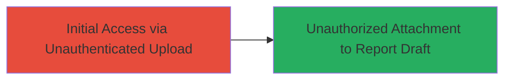

# Unauthenticated Attachment Upload to Unauthorized Report Drafts on HackerOne

Multi-stage attack chain demonstrating a complete attack workflow exploiting an authentication bypass in HackerOne's attachment upload feature.

## Chain Metrics Dashboard

| Metric | Value |
|--------|-------|
| Chain Status | Unverified |
| Total Steps | 1 |
| Execution Time | ~1 minute |
| Skill Level | Beginner |
| Complexity | Low |
| Impact Level | Medium |

## Attack Flow Visualization



## Prerequisites & Requirements

### Required Tools

- None (uses standard HTTP client like curl)

### Target Environment

- Web platform (HackerOne application)
- Access to the /attachments endpoint
- No authentication required

### Initial Access Requirements

- Public internet access to HackerOne
- No credentials needed due to bypass
- Knowledge of target report draft ID (inferred as most recently updated)

## Detailed Attack Procedures

### Step 1: Exploit Authentication Bypass for Attachment Upload
procedure: [[procedures/Exploit-Unauthenticated-Attachment-Upload]]

**Objective**: Upload an attachment to another user's most recently updated report draft without authentication, potentially modifying report integrity.

**Instructions**: Prepare a file for upload and send a specially crafted HTTP POST request to the /attachments endpoint using [[commands/curl-unauth-attachment-upload]] to target the unauthorized report draft. The endpoint lacks proper auth checks, allowing attachment to the last updated draft.

```bash
curl -X POST https://hackerone.com/attachments \
  -F "attachment=@malicious_file.txt" \
  -F "report_id=LAST_UPDATED_DRAFT_ID" \
  --header "Content-Type: multipart/form-data"
```

**Expected Output**: HTTP 200 or 201 response confirming successful upload, with attachment linked to the target draft.

**Success Indicators**:
- Attachment appears in the unauthorized report draft
- No authentication prompt or error during request
- Server response includes attachment metadata or ID
